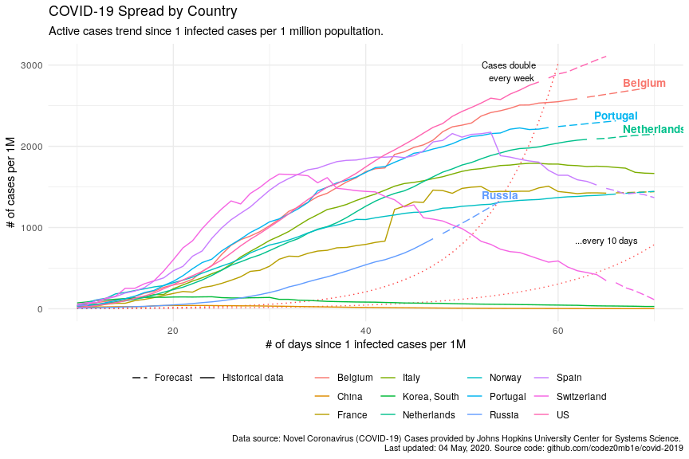

# Coronavirus Disease Analytics

**Analysing COVID-19 (2019-nCoV) disease**.

## Worldwide spread over time

## Steps

#### 1. Load datasets

Upload the latest datasets:

`. ../data/download-data.sh`

#### 2. EDA and visualization

- [EDA and visualization](src/covid-19-eda.Rmd) (**[report](src/covid-19-eda.md)**)
- [COVID YAAA! or Yet Another Analyze Attempt ](src/covid-19-yaaa.Rmd) (**[report](src/covid-19-yaaa.md)**)

#### 3. Forecasting

Kernels:

- [Sberbank COVID-19 forecasting](src/sberbank-covid-forecasting.R) 

Forecasting methods:

- [x] Previous value (naive approach)
- [x] Indicators: simple moving average (SMA), exponential moving average (EMA), double EMA
- [x] ARIMA, ETS
- [x] [Prophet](https://facebook.github.io/prophet/) 
- [ ] Linear models: linear regression, Quasi-Poisson regression 
- [ ] Decision trees: boosting
- [ ] Neural networks: LSTM, AR RNN
- [ ] [SIR model](https://www.kaggle.com/jordimas/differential-evolution-to-fit-covid-19-sir-model)

## References

#### Basics, Research Papers

1. [**Coronavirus disease outbreak**](https://www.who.int/emergencies/diseases/novel-coronavirus-2019/), World Health Organization.
1. [Coronavirus Disease 2019](https://en.wikipedia.org/wiki/Coronavirus_disease_2019), Wikipedia.
1. [Here’s what coronavirus does to the body](https://www.nationalgeographic.com/science/2020/02/here-is-what-coronavirus-does-to-the-body/), nationalgeographic.com.
1. [COVID-19 SARS-CoV-2 preprints from medRxiv and bioRxiv](https://connect.medrxiv.org/relate/content/181), medrxiv.

#### Datasets

1. [**COVID-19 Data Repository by Johns Hopkins CSSE**](https://github.com/CSSEGISandData/COVID-19), GitHub.
1. [Novel Corona Virus 2019 Dataset](https://www.kaggle.com/sudalairajkumar/novel-corona-virus-2019-dataset), Kaggle.
1. [Coronavirus disease (COVID-2019) situation reports](https://www.who.int/emergencies/diseases/novel-coronavirus-2019/situation-reports), World Health Organization.
1. [COVID-19 Open Research Dataset (CORD-19)](https://www.kaggle.com/allen-institute-for-ai/CORD-19-research-challenge), Kaggle.
1. [COVID-19 Complete Dataset (Updated every 24hrs)](https://www.kaggle.com/imdevskp/corona-virus-report), Kaggle.
1. [#covid19 tag](https://www.kaggle.com/tags/covid19), Kaggle.

#### Analytics, Dashboards, Maps

1. [**An interactive visualization of the exponential spread of COVID-19**](http://91-divoc.com/pages/covid-visualization/), 91-DIVOC.
1. Tomas Pueyo. [Coronavirus: Why You Must Act Now](https://medium.com/@tomaspueyo/coronavirus-act-today-or-people-will-die-f4d3d9cd99ca), Medium.
1. [COVID-19 Cases Map](https://yandex.ru/web-maps/covid19), Yandex.
1. [COVID-19 Animated Spread Map](https://www.healthmap.org/covid-19/), healthmap.org.
1. [COVID-19 Cases Metrics](https://www.worldometers.info/coronavirus/), worldometers.info.
1. [Coronavirus tracked: the latest figures as the pandemic spreads](https://www.ft.com/coronavirus-latest), Financial Times.
1. [Understanding and tracking our progress against COVID-19](https://app.powerbi.com/view?r=eyJrIjoiM2Q1M2YxMmMtYzBkMC00YWI0LWE2ODMtZGFhZmM4OTNiYzcxIiwidCI6ImMxMzZlZWMwLWZlOTItNDVlMC1iZWFlLTQ2OTg0OTczZTIzMiIsImMiOjF9), Microsoft.

#### Timeline

1. [Timeline of the 2019–20 coronavirus pandemic](https://en.wikipedia.org/wiki/Timeline_of_the_2019%E2%80%9320_coronavirus_pandemic), Wikipedia.
2. Huang C., Wang Y., et. al. [Timeline of the coronavirus onset](https://els-jbs-prod-cdn.literatumonline.com/pb/assets/raw/Lancet/infographics/coronavirus/Coronavirus_MedianTimeline_Infographic-1584612208650.jpg), The Lancet.

#### Simulations

1. Harry Stevens. [These simulations show how to flatten the coronavirus growth curve](https://www.washingtonpost.com/graphics/2020/world/corona-simulator/), Washington Post.
1. Kevin Simler. [COVID-2019 spread simulation](https://www.meltingasphalt.com/interactive/outbreak/), Melting Asphalt.

#### Forecasting, Competitions

1. The COVID-19 Vulnerability Index: [post](https://closedloop.ai/open-source-data-science-to-fight-covid-19-corona-virus/), [research paper](https://arxiv.org/abs/2003.07347), [source code](https://github.com/closedloop-ai/cv19index), ClosedLoop.ai.
1. **COVID19 Global Forecasting**: [week 1](https://www.kaggle.com/c/covid19-global-forecasting-week-1), [week 2](https://www.kaggle.com/c/covid19-global-forecasting-week-2), [week 3](https://www.kaggle.com/c/covid19-global-forecasting-week-3), [week 4](https://www.kaggle.com/c/covid19-global-forecasting-week-4), and [week 5](https://www.kaggle.com/c/covid19-global-forecasting-week-5), Kaggle. 
1. [Computational predictions of protein structures associated with COVID-19](https://deepmind.com/research/open-source/computational-predictions-of-protein-structures-associated-with-COVID-19), DeepMind.
1. [Sberbank COVID-19 forecast](https://ods.ai/competitions/sberbank-covid19-forecast), Sberbank feat. ODS.ai.
1. [COVID-19 Estimates](https://imperialcollegelondon.github.io/covid19estimates/#/), Imperial College London.
1. [SIR (Susceptible-Infected-Recovered) model](https://covid19-scenarios.org/), covid19-scenarios.org.

#### Collaborations

1. [Open collaboration on COVID-19](https://github.blog/2020-03-23-open-collaboration-on-covid-19/), GitHub.

*On God we trust. For everything else bring Data.*
