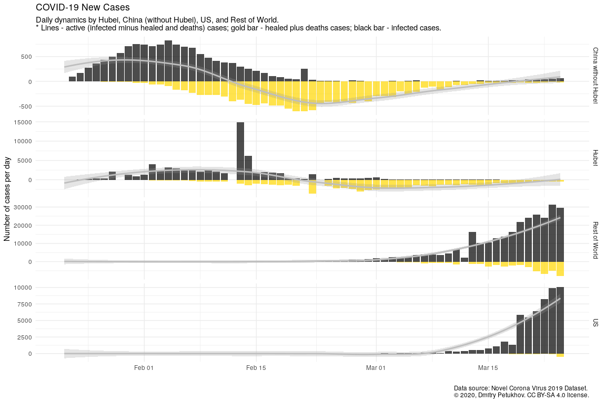
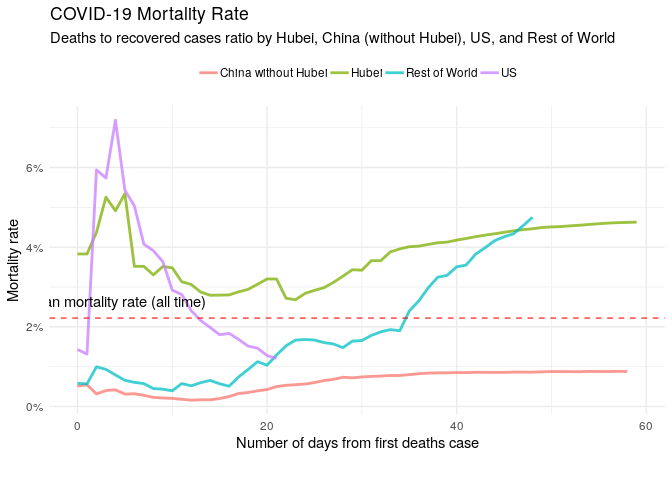
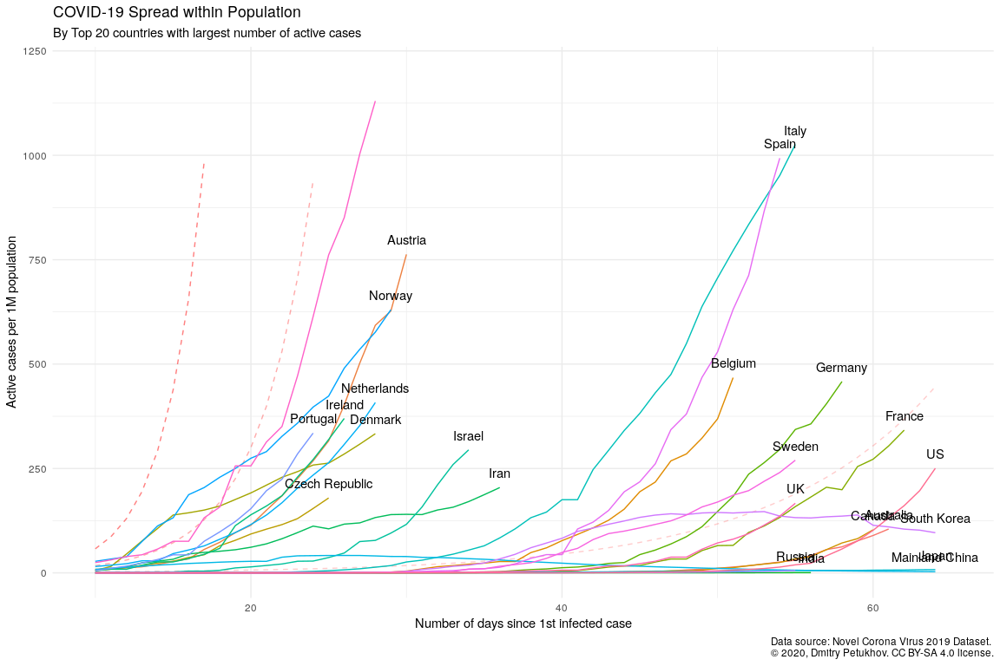
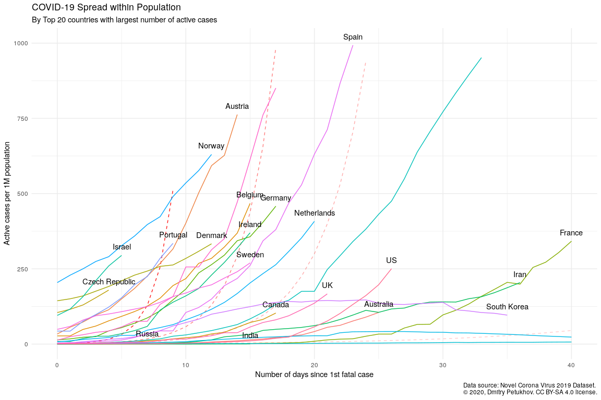

COVID-19 Analytics
================
27 March, 2020

## Load dataset

Get list of files in datasets
    container:

    ## [1] "COVID19_line_list_data.csv"         "COVID19_open_line_list.csv"        
    ## [3] "covid_19_data.csv"                  "time_series_covid_19_confirmed.csv"
    ## [5] "time_series_covid_19_deaths.csv"    "time_series_covid_19_recovered.csv"

Load `covid_19_data.csv` dataset:

    ## # A tibble: 100 x 8
    ##      SNo ObservationDate Province.State       Country.Region Last.Update  Confirmed Deaths Recovered
    ##    <int> <chr>           <chr>                <chr>          <chr>            <dbl>  <dbl>     <dbl>
    ##  1  4845 03/11/2020      Maryland             US             2020-03-11T…         9      0         0
    ##  2  5584 03/14/2020      St Martin            France         2020-03-14T…         2      0         0
    ##  3  1099 02/09/2020      <NA>                 India          2020-02-03T…         3      0         0
    ##  4  3330 03/04/2020      <NA>                 Philippines    2020-02-12T…         3      1         1
    ##  5  3037 03/02/2020      Portland, OR         US             2020-03-02T…         2      0         0
    ##  6  2816 02/29/2020      Lackland, TX (From … US             2020-02-24T…         0      0         0
    ##  7  9008 03/26/2020      French Guiana        France         2020-03-26 …        28      0         6
    ##  8   453 01/31/2020      Shanxi               Mainland China 1/31/2020 2…        39      0         1
    ##  9  5493 03/14/2020      Tennessee            US             2020-03-14T…        32      0         0
    ## 10  8260 03/24/2020      <NA>                 Eswatini       2020-03-24 …         4      0         0
    ## # … with 90 more rows

Get dataset structure:

    ## 'data.frame':    9117 obs. of  8 variables:
    ##  $ SNo            : int  1 2 3 4 5 6 7 8 9 10 ...
    ##  $ ObservationDate: chr  "01/22/2020" "01/22/2020" "01/22/2020" "01/22/2020" ...
    ##  $ Province.State : chr  "Anhui" "Beijing" "Chongqing" "Fujian" ...
    ##  $ Country.Region : chr  "Mainland China" "Mainland China" "Mainland China" "Mainland China" ...
    ##  $ Last.Update    : chr  "1/22/2020 17:00" "1/22/2020 17:00" "1/22/2020 17:00" "1/22/2020 17:00" ...
    ##  $ Confirmed      : num  1 14 6 1 0 26 2 1 4 1 ...
    ##  $ Deaths         : num  0 0 0 0 0 0 0 0 0 0 ...
    ##  $ Recovered      : num  0 0 0 0 0 0 0 0 0 0 ...

## Preprocessing data

Set `area` column, processing `province_state` columns, and format dates
columns:

    ## # A tibble: 9,117 x 9
    ##      sno observation_date province_state country_region last_update         confirmed deaths
    ##    <int> <date>           <chr>          <chr>          <dttm>                  <dbl>  <dbl>
    ##  1     1 2020-01-22       Anhui          Mainland China 2020-01-22 17:00:00         1      0
    ##  2     2 2020-01-22       Beijing        Mainland China 2020-01-22 17:00:00        14      0
    ##  3     3 2020-01-22       Chongqing      Mainland China 2020-01-22 17:00:00         6      0
    ##  4     4 2020-01-22       Fujian         Mainland China 2020-01-22 17:00:00         1      0
    ##  5     5 2020-01-22       Gansu          Mainland China 2020-01-22 17:00:00         0      0
    ##  6     6 2020-01-22       Guangdong      Mainland China 2020-01-22 17:00:00        26      0
    ##  7     7 2020-01-22       Guangxi        Mainland China 2020-01-22 17:00:00         2      0
    ##  8     8 2020-01-22       Guizhou        Mainland China 2020-01-22 17:00:00         1      0
    ##  9     9 2020-01-22       Hainan         Mainland China 2020-01-22 17:00:00         4      0
    ## 10    10 2020-01-22       Hebei          Mainland China 2020-01-22 17:00:00         1      0
    ## # … with 9,107 more rows, and 2 more variables: recovered <dbl>, area <fct>

Get dataset structure after preprocessing:

    ## # A tibble: 9 x 20
    ##   type  variable missing complete n     min   max   empty n_unique median top_counts ordered mean 
    ##   <chr> <chr>    <chr>   <chr>    <chr> <chr> <chr> <chr> <chr>    <chr>  <chr>      <chr>   <chr>
    ## 1 char… country… 0       9117     9117  2     32    0     210      <NA>   <NA>       <NA>    <NA> 
    ## 2 char… provinc… 4091    5026     9117  2     43    0     288      <NA>   <NA>       <NA>    <NA> 
    ## 3 Date  observa… 0       9117     9117  2020… 2020… <NA>  65       2020-… <NA>       <NA>    <NA> 
    ## 4 fact… area     0       9117     9117  <NA>  <NA>  <NA>  4        <NA>   Res: 5248… FALSE   <NA> 
    ## 5 inte… sno      0       9117     9117  <NA>  <NA>  <NA>  <NA>     <NA>   <NA>       <NA>    4559 
    ## 6 nume… confirm… 0       9117     9117  <NA>  <NA>  <NA>  <NA>     <NA>   <NA>       <NA>    766.…
    ## 7 nume… deaths   0       9117     9117  <NA>  <NA>  <NA>  <NA>     <NA>   <NA>       <NA>    " 28…
    ## 8 nume… recover… 0       9117     9117  <NA>  <NA>  <NA>  <NA>     <NA>   <NA>       <NA>    255.…
    ## 9 POSI… last_up… 0       9117     9117  2020… 2020… <NA>  1808     2020-… <NA>       <NA>    <NA> 
    ## # … with 7 more variables: sd <chr>, p0 <chr>, p25 <chr>, p50 <chr>, p75 <chr>, p100 <chr>,
    ## #   hist <chr>

## COVID-19 spread

Get virus spread statistics grouped by `area`:

### Prepare data

Calculate total infected, recovered, and fatal cases:

    ## # A tibble: 260 x 6
    ## # Groups:   area [4]
    ##    area                observation_date confirmed_total deaths_total recovered_total active_total
    ##    <fct>               <date>                     <dbl>        <dbl>           <dbl>        <dbl>
    ##  1 China without Hubei 2020-03-26                 13497          118           12860          519
    ##  2 Hubei               2020-03-26                 67801         3169           61201         3431
    ##  3 Rest of World       2020-03-26                364457        19474           47408       297575
    ##  4 US                  2020-03-26                 83836         1209             681        81946
    ##  5 China without Hubei 2020-03-25                 13420          118           12850          452
    ##  6 Hubei               2020-03-25                 67801         3163           60811         3827
    ##  7 Rest of World       2020-03-25                320595        16958           39748       263889
    ##  8 US                  2020-03-25                 65778          942             361        64475
    ##  9 China without Hubei 2020-03-24                 13379          117           12845          417
    ## 10 Hubei               2020-03-24                 67801         3160           60324         4317
    ## # … with 250 more rows

### Visualize

<!-- -->

## Dynamics of Infection

Get daily dynamics of new infected and recovered cases.

### Prepare data

    ## # A tibble: 65 x 4
    ##    area  observation_date retired_per_day infected_per_day
    ##    <fct> <date>                     <dbl>            <dbl>
    ##  1 Hubei 2020-03-26                   396                0
    ##  2 Hubei 2020-03-25                   490                0
    ##  3 Hubei 2020-03-24                   449                1
    ##  4 Hubei 2020-03-23                   458                0
    ##  5 Hubei 2020-03-22                   492                0
    ##  6 Hubei 2020-03-21                   570                0
    ##  7 Hubei 2020-03-20                   703                0
    ##  8 Hubei 2020-03-19                   763                0
    ##  9 Hubei 2020-03-18                   935                1
    ## 10 Hubei 2020-03-17                   873                1
    ## # … with 55 more rows

### Visualize

<!-- -->

## Mortality rate

### Prepare data

    ## # A tibble: 21 x 7
    ##    area  observation_date reference_date recovered_total deaths_total confirmed_death…
    ##    <fct> <date>           <date>                   <dbl>        <dbl>            <dbl>
    ##  1 US    2020-03-26       2020-03-06                 681         1209           0.0144
    ##  2 US    2020-03-25       2020-03-06                 361          942           0.0143
    ##  3 US    2020-03-24       2020-03-06                 348          706           0.0131
    ##  4 US    2020-03-23       2020-03-06                   0          552           0.0126
    ##  5 US    2020-03-22       2020-03-06                   0          427           0.0127
    ##  6 US    2020-03-21       2020-03-06                 171          307           0.0120
    ##  7 US    2020-03-20       2020-03-06                 147          244           0.0128
    ##  8 US    2020-03-19       2020-03-06                 108          200           0.0146
    ##  9 US    2020-03-18       2020-03-06                 106          118           0.0152
    ## 10 US    2020-03-17       2020-03-06                  17          108           0.0168
    ## # … with 11 more rows, and 1 more variable: recovered_deaths_rate <dbl>

### Visualize

<!-- -->

<!-- -->

<!-- -->

## World population

### Load world population

Get datasets
    list:

    ## [1] "metadata_country.csv"   "metadata_indicator.csv" "population_clean.csv"  
    ## [4] "population_raw.csv"

Load world population dataset:

    ## 'data.frame':    264 obs. of  61 variables:
    ##  $ Country.Name: chr  "Aruba" "Afghanistan" "Angola" "Albania" ...
    ##  $ Country.Code: chr  "ABW" "AFG" "AGO" "ALB" ...
    ##  $ X1960       : num  54211 8996973 5454933 1608800 13411 ...
    ##  $ X1961       : num  55438 9169410 5531472 1659800 14375 ...
    ##  $ X1962       : num  56225 9351441 5608539 1711319 15370 ...
    ##  $ X1963       : num  56695 9543205 5679458 1762621 16412 ...
    ##  $ X1964       : num  57032 9744781 5735044 1814135 17469 ...
    ##  $ X1965       : num  57360 9956320 5770570 1864791 18549 ...
    ##  $ X1966       : num  57715 10174836 5781214 1914573 19647 ...
    ##  $ X1967       : num  58055 10399926 5774243 1965598 20758 ...
    ##  $ X1968       : num  58386 10637063 5771652 2022272 21890 ...
    ##  $ X1969       : num  58726 10893776 5803254 2081695 23058 ...
    ##  $ X1970       : num  59063 11173642 5890365 2135479 24276 ...
    ##  $ X1971       : num  59440 11475445 6040777 2187853 25559 ...
    ##  $ X1972       : num  59840 11791215 6248552 2243126 26892 ...
    ##  $ X1973       : num  60243 12108963 6496962 2296752 28232 ...
    ##  $ X1974       : num  60528 12412950 6761380 2350124 29520 ...
    ##  $ X1975       : num  60657 12689160 7024000 2404831 30705 ...
    ##  $ X1976       : num  60586 12943093 7279509 2458526 31777 ...
    ##  $ X1977       : num  60366 13171306 7533735 2513546 32771 ...
    ##  $ X1978       : num  60103 13341198 7790707 2566266 33737 ...
    ##  $ X1979       : num  59980 13411056 8058067 2617832 34818 ...
    ##  $ X1980       : num  60096 13356511 8341289 2671997 36067 ...
    ##  $ X1981       : num  60567 13171673 8640446 2726056 37500 ...
    ##  $ X1982       : num  61345 12882528 8952950 2784278 39114 ...
    ##  $ X1983       : num  62201 12537730 9278096 2843960 40867 ...
    ##  $ X1984       : num  62836 12204292 9614754 2904429 42706 ...
    ##  $ X1985       : num  63026 11938208 9961997 2964762 44600 ...
    ##  $ X1986       : num  62644 11736179 10320111 3022635 46517 ...
    ##  $ X1987       : num  61833 11604534 10689250 3083605 48455 ...
    ##  $ X1988       : num  61079 11618005 11068050 3142336 50434 ...
    ##  $ X1989       : num  61032 11868877 11454777 3227943 52448 ...
    ##  $ X1990       : num  62149 12412308 11848386 3286542 54509 ...
    ##  $ X1991       : num  64622 13299017 12248901 3266790 56671 ...
    ##  $ X1992       : num  68235 14485546 12657366 3247039 58888 ...
    ##  $ X1993       : num  72504 15816603 13075049 3227287 60971 ...
    ##  $ X1994       : num  76700 17075727 13503747 3207536 62677 ...
    ##  $ X1995       : num  80324 18110657 13945206 3187784 63850 ...
    ##  $ X1996       : num  83200 18853437 14400719 3168033 64360 ...
    ##  $ X1997       : num  85451 19357126 14871570 3148281 64327 ...
    ##  $ X1998       : num  87277 19737765 15359601 3128530 64142 ...
    ##  $ X1999       : num  89005 20170844 15866869 3108778 64370 ...
    ##  $ X2000       : num  90853 20779953 16395473 3089027 65390 ...
    ##  $ X2001       : num  92898 21606988 16945753 3060173 67341 ...
    ##  $ X2002       : num  94992 22600770 17519417 3051010 70049 ...
    ##  $ X2003       : num  97017 23680871 18121479 3039616 73182 ...
    ##  $ X2004       : num  98737 24726684 18758145 3026939 76244 ...
    ##  $ X2005       : num  100031 25654277 19433602 3011487 78867 ...
    ##  $ X2006       : num  100834 26433049 20149901 2992547 80993 ...
    ##  $ X2007       : num  101222 27100536 20905363 2970017 82684 ...
    ##  $ X2008       : num  101358 27722276 21695634 2947314 83862 ...
    ##  $ X2009       : num  101455 28394813 22514281 2927519 84463 ...
    ##  $ X2010       : num  101669 29185507 23356246 2913021 84449 ...
    ##  $ X2011       : num  102046 30117413 24220661 2905195 83747 ...
    ##  $ X2012       : num  102560 31161376 25107931 2900401 82427 ...
    ##  $ X2013       : num  103159 32269589 26015780 2895092 80774 ...
    ##  $ X2014       : num  103774 33370794 26941779 2889104 79213 ...
    ##  $ X2015       : num  104341 34413603 27884381 2880703 78011 ...
    ##  $ X2016       : num  104872 35383128 28842484 2876101 77297 ...
    ##  $ X2017       : num  105366 36296400 29816748 2873457 77001 ...
    ##  $ X2018       : num  105845 37172386 30809762 2866376 77006 ...

Select relevant columns:

    ## # A tibble: 264 x 2
    ##    country                      n
    ##    <chr>                    <dbl>
    ##  1 Aruba                   105845
    ##  2 Afghanistan           37172386
    ##  3 Angola                30809762
    ##  4 Albania                2866376
    ##  5 Andorra                  77006
    ##  6 Arab World           419790588
    ##  7 United Arab Emirates   9630959
    ##  8 Argentina             44494502
    ##  9 Armenia                2951776
    ## 10 American Samoa           55465
    ## # … with 254 more rows

### Preprocessing

Get not matched countries:

    ## # A tibble: 13 x 2
    ##    country_region         n
    ##    <chr>              <dbl>
    ##  1 Mainland China   3769052
    ##  2 US                373452
    ##  3 Iran              335415
    ##  4 South Korea       209178
    ##  5 UK                 65955
    ##  6 Others             26228
    ##  7 Hong Kong           6509
    ##  8 Russia              4267
    ##  9 Egypt               4069
    ## 10 Taiwan              3069
    ## 11 Slovakia            1866
    ## 12 Diamond Princess    1424
    ## 13 Brunei              1071

Correct top of unmached countries:

Test updated matching:

    ## # A tibble: 5 x 2
    ##   country_region       n
    ##   <chr>            <dbl>
    ## 1 Others           26228
    ## 2 Taiwan            3069
    ## 3 Slovakia          1866
    ## 4 Diamond Princess  1424
    ## 5 Brunei            1071

Much better :)

## Enrich COVID dataset with world population

### Infected, recovered, fatal, and active cases

Calculate number of infected, recovered, fatal, and active cases grouped
by country:

View stats for Russia:

    ## # A tibble: 56 x 10
    ##    country_region observation_date confirmed_total recovered_total deaths_total active_total
    ##    <chr>          <date>                     <dbl>           <dbl>        <dbl>        <dbl>
    ##  1 Russia         2020-03-26                   840              38            3          799
    ##  2 Russia         2020-03-25                   658              29            3          626
    ##  3 Russia         2020-03-24                   495              22            1          472
    ##  4 Russia         2020-03-23                   438              17            1          420
    ##  5 Russia         2020-03-22                   367              16            1          350
    ##  6 Russia         2020-03-21                   306              12            1          293
    ##  7 Russia         2020-03-20                   253               9            1          243
    ##  8 Russia         2020-03-19                   199               9            1          189
    ##  9 Russia         2020-03-18                   147               8            0          139
    ## 10 Russia         2020-03-17                   114               8            0          106
    ## # … with 46 more rows, and 4 more variables: first_confirmed_date <date>,
    ## #   n_days_since_1st_confirmed <dbl>, first_deaths_case_date <date>, n_days_since_1st_deaths <dbl>

View stats for US:

    ## # A tibble: 65 x 10
    ##    country_region observation_date confirmed_total recovered_total deaths_total active_total
    ##    <chr>          <date>                     <dbl>           <dbl>        <dbl>        <dbl>
    ##  1 US             2020-03-26                 83836             681         1209        81946
    ##  2 US             2020-03-25                 65778             361          942        64475
    ##  3 US             2020-03-24                 53740             348          706        52686
    ##  4 US             2020-03-23                 43667               0          552        43115
    ##  5 US             2020-03-22                 33746               0          427        33319
    ##  6 US             2020-03-21                 25493             171          307        25015
    ##  7 US             2020-03-20                 19101             147          244        18710
    ##  8 US             2020-03-19                 13680             108          200        13372
    ##  9 US             2020-03-18                  7786             106          118         7562
    ## 10 US             2020-03-17                  6421              17          108         6296
    ## # … with 55 more rows, and 4 more variables: first_confirmed_date <date>,
    ## #   n_days_since_1st_confirmed <dbl>, first_deaths_case_date <date>, n_days_since_1st_deaths <dbl>

### Enrich COVID-19 dataset with world population

    ## # A tibble: 56 x 5
    ##    country_region n_days_since_1st_confirmed population_n confirmed_total confirmed_total_per_1M
    ##    <chr>                               <dbl>        <dbl>           <dbl>                  <dbl>
    ##  1 Russia                                 55    144478050             840                  5.81 
    ##  2 Russia                                 54    144478050             658                  4.55 
    ##  3 Russia                                 53    144478050             495                  3.43 
    ##  4 Russia                                 52    144478050             438                  3.03 
    ##  5 Russia                                 51    144478050             367                  2.54 
    ##  6 Russia                                 50    144478050             306                  2.12 
    ##  7 Russia                                 49    144478050             253                  1.75 
    ##  8 Russia                                 48    144478050             199                  1.38 
    ##  9 Russia                                 47    144478050             147                  1.02 
    ## 10 Russia                                 46    144478050             114                  0.789
    ## # … with 46 more rows

### TOPs

Calculate countries stats whose populations were most affected by the
virus:

#### Top countries by infected cases

    ## # A tibble: 33 x 5
    ##    country_region population_n confirmed_total confirmed_total_per_1M n_days_since_1st_confirmed
    ##    <chr>                 <dbl>           <dbl>                  <dbl>                      <dbl>
    ##  1 Switzerland         8516543           11811                  1387.                         30
    ##  2 Italy              60431283           80589                  1334.                         55
    ##  3 Spain              46723749           57786                  1237.                         54
    ##  4 Austria             8847037            6909                   781.                         30
    ##  5 Norway              5314336            3369                   634.                         29
    ##  6 Belgium            11422068            6235                   546.                         51
    ##  7 Germany            82927922           43938                   530.                         58
    ##  8 France             66987244           29551                   441.                         62
    ##  9 Netherlands        17231017            7468                   433.                         28
    ## 10 Ireland             4853506            1819                   375.                         26
    ## # … with 23 more rows

#### Top countries by active cases

    ## # A tibble: 33 x 5
    ##    country_region population_n active_total active_total_per_1M n_days_since_1st_confirmed
    ##    <chr>                 <dbl>        <dbl>               <dbl>                      <dbl>
    ##  1 Switzerland         8516543        11489               1349.                         30
    ##  2 Italy              60431283        62013               1026.                         55
    ##  3 Spain              46723749        46406                993.                         54
    ##  4 Austria             8847037         6748                763.                         30
    ##  5 Norway              5314336         3349                630.                         29
    ##  6 Belgium            11422068         5340                468.                         51
    ##  7 Germany            82927922        37998                458.                         58
    ##  8 Netherlands        17231017         7027                408.                         28
    ##  9 Ireland             4853506         1795                370.                         26
    ## 10 France             66987244        22898                342.                         62
    ## # … with 23 more rows

#### Top countries by fatal cases

    ## # A tibble: 33 x 5
    ##    country_region population_n deaths_total deaths_total_per_1M n_days_since_1st_confirmed
    ##    <chr>                 <dbl>        <dbl>               <dbl>                      <dbl>
    ##  1 Italy              60431283         8215              136.                           55
    ##  2 Spain              46723749         4365               93.4                          54
    ##  3 Iran               81800269         2234               27.3                          36
    ##  4 France             66987244         1698               25.3                          62
    ##  5 Netherlands        17231017          435               25.2                          28
    ##  6 Switzerland         8516543          191               22.4                          30
    ##  7 Belgium            11422068          220               19.3                          51
    ##  8 UK                 66488991          580                8.72                         55
    ##  9 Sweden             10183175           77                7.56                         55
    ## 10 Denmark             5797446           41                7.07                         28
    ## # … with 23 more rows

### Select countries to monitoring

Get top
    20:

    ## Selecting by active_total_per_1M

    ##  [1] "Australia"      "Austria"        "Belgium"        "Canada"         "Czech Republic"
    ##  [6] "Denmark"        "France"         "Germany"        "India"          "Iran"          
    ## [11] "Ireland"        "Israel"         "Italy"          "Japan"          "Mainland China"
    ## [16] "Netherlands"    "Norway"         "Portugal"       "Russia"         "South Korea"   
    ## [21] "Spain"          "Sweden"         "Switzerland"    "UK"             "US"

#### Active cases per 1M population x \# of days since 1st infected case

<!-- -->

#### Active cases per 1M population x \# of days since 1st fatal case

<!-- -->
