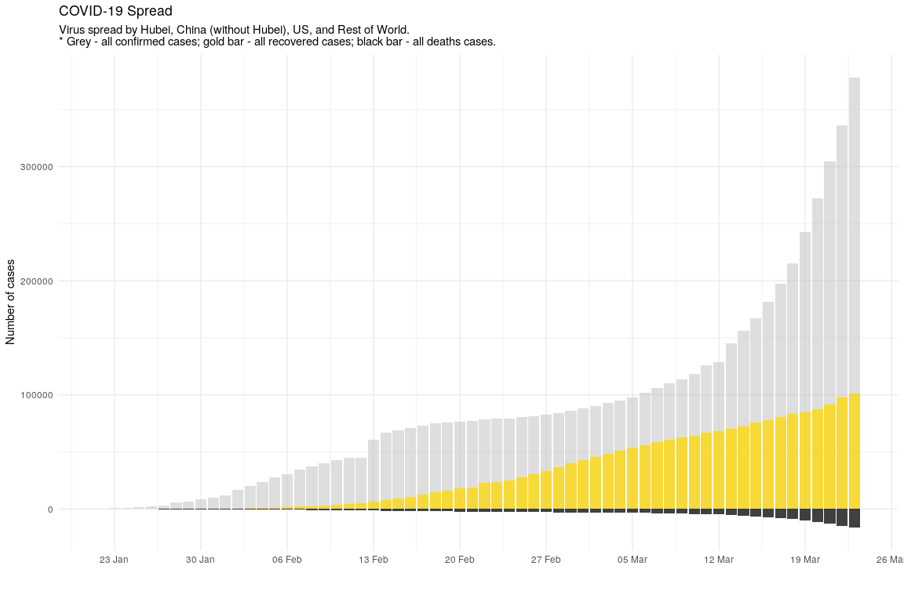
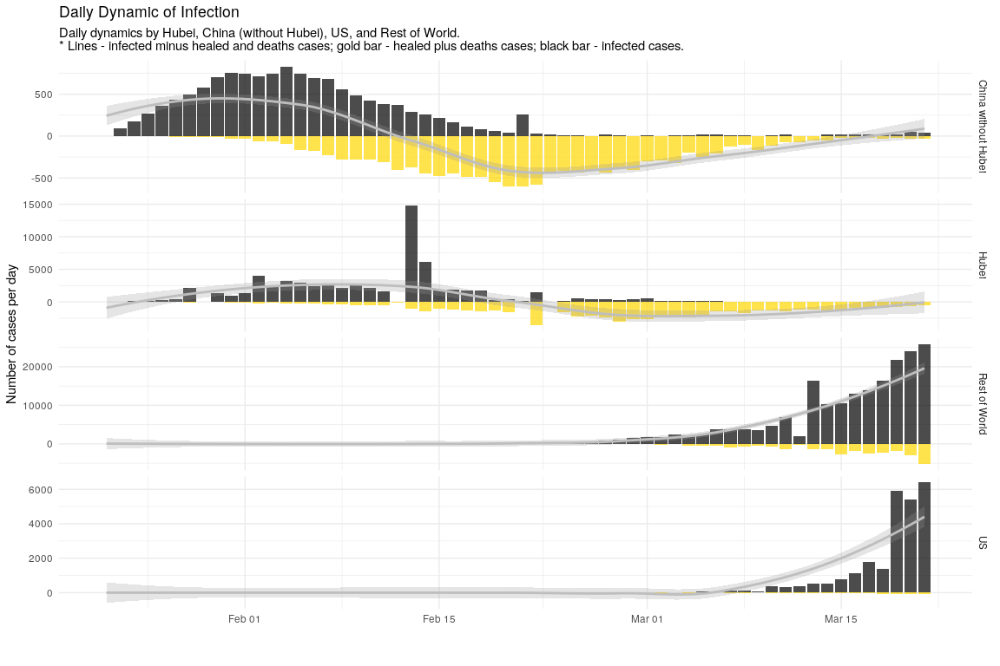
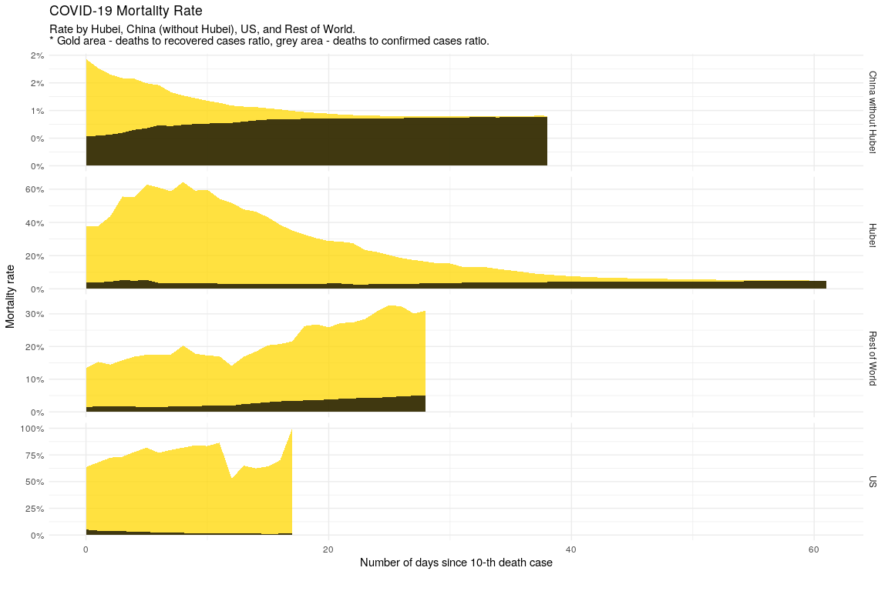
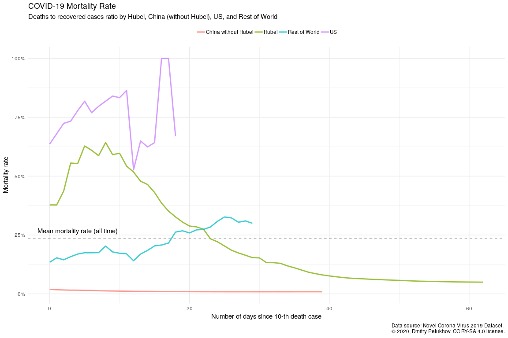

COVID-19 Analytics
================
22 March, 2020

## Load dataset

Get datasets list:

``` r
input_data_container <- "../input/novel-corona-virus-2019-dataset.zip"

print(
  as.character(unzip(input_data_container, list = T)$Name)
)
```

    ## [1] "COVID19_line_list_data.csv"         "COVID19_open_line_list.csv"        
    ## [3] "covid_19_data.csv"                  "time_series_covid_19_confirmed.csv"
    ## [5] "time_series_covid_19_deaths.csv"    "time_series_covid_19_recovered.csv"

Load COVID-19 data:

``` r
covid_data <- read.csv(unz(input_data_container, "covid_19_data.csv"), 
                       na.strings = c("NA", "None", ""),
                       header = T, sep = ",")
```

Data structure:

``` r
str(covid_data)
```

    ## 'data.frame':    7617 obs. of  8 variables:
    ##  $ SNo            : int  1 2 3 4 5 6 7 8 9 10 ...
    ##  $ ObservationDate: chr  "01/22/2020" "01/22/2020" "01/22/2020" "01/22/2020" ...
    ##  $ Province.State : chr  "Anhui" "Beijing" "Chongqing" "Fujian" ...
    ##  $ Country.Region : chr  "Mainland China" "Mainland China" "Mainland China" "Mainland China" ...
    ##  $ Last.Update    : chr  "1/22/2020 17:00" "1/22/2020 17:00" "1/22/2020 17:00" "1/22/2020 17:00" ...
    ##  $ Confirmed      : num  1 14 6 1 0 26 2 1 4 1 ...
    ##  $ Deaths         : num  0 0 0 0 0 0 0 0 0 0 ...
    ##  $ Recovered      : num  0 0 0 0 0 0 0 0 0 0 ...

View data:

``` r
covid_data %>% sample_n(100) %>% as_tibble
```

    ## # A tibble: 100 x 8
    ##      SNo ObservationDate Province.State Country.Region Last.Update        Confirmed Deaths Recovered
    ##    <int> <chr>           <chr>          <chr>          <chr>                  <dbl>  <dbl>     <dbl>
    ##  1  5563 03/14/2020      <NA>           Turkey         2020-03-13T23:33:…         5      0         0
    ##  2  6782 03/19/2020      <NA>           Bahrain        2020-03-19T18:13:…       278      1       100
    ##  3   493 01/31/2020      <NA>           Sweden         1/31/2020 23:59            1      0         0
    ##  4  2131 02/23/2020      Yunnan         Mainland China 2020-02-23T05:33:…       174      2       115
    ##  5  2558 02/27/2020      <NA>           Algeria        2020-02-25T23:43:…         1      0         0
    ##  6  4694 03/10/2020      <NA>           Mongolia       2020-03-10T06:13:…         1      0         0
    ##  7  5785 03/15/2020      <NA>           Maldives       2020-03-15T18:20:…        13      0         0
    ##  8  1332 02/12/2020      <NA>           Nepal          2020-02-12T14:43:…         1      0         1
    ##  9  5812 03/15/2020      <NA>           Turkey         2020-03-15T18:20:…         6      0         0
    ## 10   388 01/30/2020      Guangxi        Mainland China 1/30/20 16:00             78      0         2
    ## # … with 90 more rows

## Preprocessing data

``` r
# repair names
names(covid_data) <- names(covid_data) %>% str_replace_all(fixed("."), "_") %>% str_to_lower

covid_data %<>% 
  rename(observation_date = observationdate) %>% 
  mutate(
    ## location processing
    province_state = str_trim(province_state),
    area = as.factor(
      case_when(
        province_state == "Hubei" ~ "Hubei",
        country_region == "US" ~ "US",
        str_detect(country_region, "China") ~ "China without Hubei",
        TRUE ~ "Rest of World")),
    
    ## dates processing
    observation_date = mdy(observation_date),
    last_update = parse_date_time(str_replace_all(last_update, "T", " "), 
                                  orders = c("%Y-%m-%d %H:%M:%S", "m/d/y %H:%M"))
  )
  

covid_data %>% as_tibble
```

    ## # A tibble: 7,617 x 9
    ##      sno observation_date province_state country_region last_update         confirmed deaths
    ##    <int> <date>           <chr>          <chr>          <dttm>                  <dbl>  <dbl>
    ##  1     1 2020-01-22       Anhui          Mainland China 2020-01-22 17:00:00         1      0
    ##  2     2 2020-01-22       Beijing        Mainland China 2020-01-22 17:00:00        14      0
    ##  3     3 2020-01-22       Chongqing      Mainland China 2020-01-22 17:00:00         6      0
    ##  4     4 2020-01-22       Fujian         Mainland China 2020-01-22 17:00:00         1      0
    ##  5     5 2020-01-22       Gansu          Mainland China 2020-01-22 17:00:00         0      0
    ##  6     6 2020-01-22       Guangdong      Mainland China 2020-01-22 17:00:00        26      0
    ##  7     7 2020-01-22       Guangxi        Mainland China 2020-01-22 17:00:00         2      0
    ##  8     8 2020-01-22       Guizhou        Mainland China 2020-01-22 17:00:00         1      0
    ##  9     9 2020-01-22       Hainan         Mainland China 2020-01-22 17:00:00         4      0
    ## 10    10 2020-01-22       Hebei          Mainland China 2020-01-22 17:00:00         1      0
    ## # … with 7,607 more rows, and 2 more variables: recovered <dbl>, area <fct>

Get data structure after preprocessing:

``` r
covid_data %>% skim_to_wide
```

    ## # A tibble: 9 x 20
    ##   type  variable missing complete n     min   max   empty n_unique median top_counts ordered mean 
    ##   <chr> <chr>    <chr>   <chr>    <chr> <chr> <chr> <chr> <chr>    <chr>  <chr>      <chr>   <chr>
    ## 1 char… country… 0       7617     7617  2     32    0     195      <NA>   <NA>       <NA>    <NA> 
    ## 2 char… provinc… 3262    4355     7617  2     43    0     280      <NA>   <NA>       <NA>    <NA> 
    ## 3 Date  observa… 0       7617     7617  2020… 2020… <NA>  60       2020-… <NA>       <NA>    <NA> 
    ## 4 fact… area     0       7617     7617  <NA>  <NA>  <NA>  4        <NA>   Res: 4199… FALSE   <NA> 
    ## 5 inte… sno      0       7617     7617  <NA>  <NA>  <NA>  <NA>     <NA>   <NA>       <NA>    3809 
    ## 6 nume… confirm… 0       7617     7617  <NA>  <NA>  <NA>  <NA>     <NA>   <NA>       <NA>    638.…
    ## 7 nume… deaths   0       7617     7617  <NA>  <NA>  <NA>  <NA>     <NA>   <NA>       <NA>    " 22…
    ## 8 nume… recover… 0       7617     7617  <NA>  <NA>  <NA>  <NA>     <NA>   <NA>       <NA>    234.…
    ## 9 POSI… last_up… 0       7617     7617  2020… 2020… <NA>  1803     2020-… <NA>       <NA>    <NA> 
    ## # … with 7 more variables: sd <chr>, p0 <chr>, p25 <chr>, p50 <chr>, p75 <chr>, p100 <chr>,
    ## #   hist <chr>

## COVID-19 spread

Get virus spread statistics grouped by `area`:

### Prepare data

Calculate total confirmed, deaths, and recovered cases:

``` r
spread_df <- covid_data %>% 
  group_by(
    area, observation_date
  ) %>% 
  summarise(
    confirmed_total = sum(confirmed),
    deaths_total = sum(deaths),
    recovered_total = sum(recovered)
  )

spread_df %>% arrange(desc(observation_date))
```

    ## # A tibble: 240 x 5
    ## # Groups:   area [4]
    ##    area                observation_date confirmed_total deaths_total recovered_total
    ##    <fct>               <date>                     <dbl>        <dbl>           <dbl>
    ##  1 China without Hubei 2020-03-21                 13214          116           12803
    ##  2 Hubei               2020-03-21                 67800         3139           58946
    ##  3 Rest of World       2020-03-21                198021         9411           19756
    ##  4 US                  2020-03-21                 25493          307             171
    ##  5 China without Hubei 2020-03-20                 13177          116           12776
    ##  6 Hubei               2020-03-20                 67800         3133           58382
    ##  7 Rest of World       2020-03-20                172089         7806           16098
    ##  8 US                  2020-03-20                 19101          244             147
    ##  9 China without Hubei 2020-03-19                 13131          115           12748
    ## 10 Hubei               2020-03-19                 67800         3130           57682
    ## # … with 230 more rows

### Visualize

``` r
ggplot(spread_df, aes(observation_date)) +
  
  geom_col(aes(y = recovered_total), alpha = .6, fill = "gold") +
  geom_col(aes(y = -deaths_total), alpha = .6, fill = "black") +
  geom_line(aes(y = confirmed_total, color = area), size = .75) +

  scale_x_date(date_labels = "%d %b", date_breaks = "7 days") +
  scale_color_discrete(name = "Infected cases") +
  
  #scale_y_continuous(trans = "log2") +
  
  labs(x = "", y = "Number of cases", 
       title = "COVID-19 Spread", 
       subtitle = "Virus spread by Hubei, China (without Hubei), US, and Rest of World. \n* Lines - confirmed cases in area; gold bar - all recovered cases; black bar - all deaths cases.", 
       caption = caption) +
  
  theme_minimal() +
  theme(legend.position = "top")
```

<!-- -->

## Dynamics of Infection

Get daily dynamics of the number of infected and recovered cases.

### Prepare data

``` r
covid_daily <- spread_df %>% 
  mutate_at(
    vars(ends_with("_total")),
    list("per_day" = ~ (. - lag(.)))
  ) %>% 
  ungroup() %>% 
  transmute(
    area, observation_date,
    retired_per_day = recovered_total_per_day + deaths_total_per_day,
    infected_per_day = confirmed_total_per_day
  ) %>% 
  mutate_at(
    vars(ends_with("_per_day")), 
    list(~ replace_na(., 0))
  )
  
covid_daily %>% 
  filter(area == "Hubei") %>% 
  arrange(desc(observation_date))
```

    ## # A tibble: 60 x 4
    ##    area  observation_date retired_per_day infected_per_day
    ##    <fct> <date>                     <dbl>            <dbl>
    ##  1 Hubei 2020-03-21                   570                0
    ##  2 Hubei 2020-03-20                   703                0
    ##  3 Hubei 2020-03-19                   763                0
    ##  4 Hubei 2020-03-18                   935                1
    ##  5 Hubei 2020-03-17                   873                1
    ##  6 Hubei 2020-03-16                   868                4
    ##  7 Hubei 2020-03-15                  1338                4
    ##  8 Hubei 2020-03-14                  1420                4
    ##  9 Hubei 2020-03-13                  1241                5
    ## 10 Hubei 2020-03-12                  1194                8
    ## # … with 50 more rows

### Visualize

``` r
ggplot(covid_daily, aes(x = observation_date)) +
  geom_col(aes(y = -retired_per_day), fill = "gold", alpha = .7) +
  geom_col(aes(y = infected_per_day), fill = "black", alpha = .7) +
  geom_smooth(aes(y = infected_per_day - retired_per_day), method = "loess", color = "grey", alpha = .25) +
  
  facet_grid(area ~ ., scale = "free") +
  
  labs(title = "Daily Dynamic of Infection", 
       subtitle = "Daily dynamics by Hubei, China (without Hubei), US, and Rest of World. \n* Lines - infected minus healed and deaths cases; gold bar - healed plus deaths cases; black bar - infected cases.", 
       x = "", y = "Number of cases per day",
       caption = caption) +
  
  theme_minimal()
```

<!-- -->

## Mortality rate

### Prepare data

``` r
mortality_df <- covid_data %>% 
  group_by(area, observation_date) %>% 
  summarise(
    confirmed_total = sum(confirmed),
    deaths_total = sum(deaths),
    recovered_total = sum(recovered)
  ) %>% 
  ungroup() %>% 
  inner_join(
    covid_data %>% 
      filter(deaths > 0) %>% 
      group_by(area) %>% 
      summarise(first_observation_date = min(observation_date)),
    by = "area"
  ) %>% 
  mutate(
    confirmed_deaths_rate = deaths_total/confirmed_total,
    recovered_deaths_total = deaths_total/recovered_total,
    n_days = observation_date %>% difftime(first_observation_date, units = "days") %>% as.numeric
  ) %>% 
  filter(n_days >= 0)


mortality_df %>% 
  filter(area == "US") %>% 
  arrange(desc(observation_date))
```

    ## # A tibble: 22 x 9
    ##    area  observation_date confirmed_total deaths_total recovered_total first_observati…
    ##    <fct> <date>                     <dbl>        <dbl>           <dbl> <date>          
    ##  1 US    2020-03-21                 25493          307             171 2020-02-29      
    ##  2 US    2020-03-20                 19101          244             147 2020-02-29      
    ##  3 US    2020-03-19                 13680          200             108 2020-02-29      
    ##  4 US    2020-03-18                  7786          118             106 2020-02-29      
    ##  5 US    2020-03-17                  6421          108              17 2020-02-29      
    ##  6 US    2020-03-16                  4632           85              17 2020-02-29      
    ##  7 US    2020-03-15                  3499           63              12 2020-02-29      
    ##  8 US    2020-03-14                  2726           54              12 2020-02-29      
    ##  9 US    2020-03-13                  2179           47              12 2020-02-29      
    ## 10 US    2020-03-12                  1663           40              12 2020-02-29      
    ## # … with 12 more rows, and 3 more variables: confirmed_deaths_rate <dbl>,
    ## #   recovered_deaths_total <dbl>, n_days <dbl>

### Visualize

``` r
ggplot(mortality_df, aes(x = n_days)) +
  geom_area(aes(y = recovered_deaths_total), alpha = .5, fill = "grey") +
  geom_area(aes(y = confirmed_deaths_rate), alpha = .75, fill = "black") +
  
  scale_y_continuous(labels = scales::percent_format(accuracy = 1)) +
  
  facet_wrap(area ~ ., scales = "free") +
  
  labs(x = "Number of days from 1-st deaths case", y = "Mortality rate", 
       title = "COVID-19 Mortality Rate", 
       subtitle = "Rate by Hubei, China (without Hubei), US, and Rest of World. \n* Grey area - deaths to recovered cases ratio, black area - deaths to confirmed cases ratio.", 
       caption = caption) +
  
  theme_minimal()
```

<!-- -->

``` r
ggplot(mortality_df, aes(x = n_days)) +
  geom_line(aes(y = confirmed_deaths_rate, color = area), size = 1, alpha = .75) +
  
  geom_hline(aes(yintercept = mean(mortality_df$confirmed_deaths_rate)), linetype = "dashed", color = "red", alpha = .75) +
  annotate(geom = "text", label = "Mean mortality rate (all time)", x = 4, y = mean(mortality_df$confirmed_deaths_rate), vjust = -1) +

  scale_y_continuous(labels = scales::percent_format(accuracy = 1)) +
  
  labs(x = "Number of days from first deaths case", y = "Mortality rate", 
       title = "COVID-19 Mortality Rate", 
       subtitle = "Deaths to recovered cases ratio by Hubei, China (without Hubei), US, and Rest of World", 
       caption = "") +
  
  theme_minimal() +
  theme(legend.position = "top", 
        legend.title = element_blank())
```

<!-- -->
