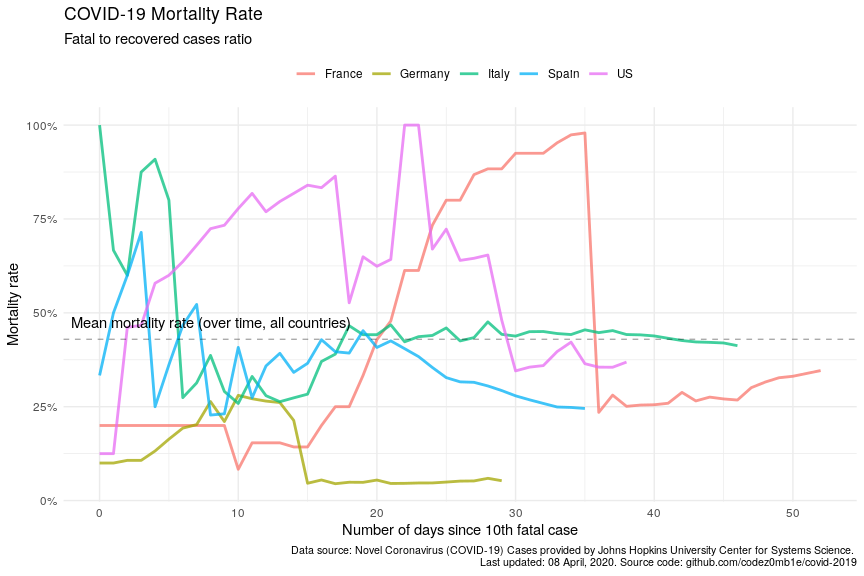
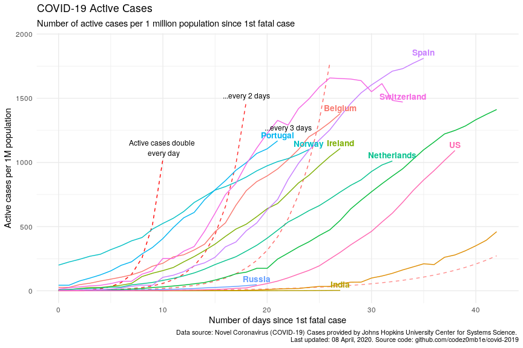

COVID-19 Analytics
================
08 April, 2020

## Table of contents

  - [Table of contents](#toc)
  - [Load datasets](#load-datasets)
      - [Load COVID-19 spread data](#load-covid-19-spread-data)
      - [Load world population data](#load-world-population-data)
  - [Preprocessing datasets](#preprocessing-datasets)
      - [Preprocessing COVID-19 spread
        data](#preprocessing-covid-19-spread-data)
      - [Preprocessing world population
        data](#preprocessing-world-population-data)
  - [COVID-19 worldwide spread](#covid-19-worldwide-spread)
      - [Total infected, recovered, and fatal
        cases](#total-infected,-recovered,-and-fatal-cases)
      - [Dynamics of spread](#dynamics-of-spread)
      - [Disease cases structure](#disease-cases-structure)
      - [Dynamics of daily cases](#dynamics-of-daily-cases)
  - [COVID-19 spread by countries](#covid-19-spread-by-countries)
      - [Infected, recovered, fatal, and active
        cases](#infected,-recovered,-fatal,-and-active-cases)
      - [Dynamics of spread](#dynamics-of-spread)
      - [Dynamics of daily cases](#dynamics-of-daily-cases)
      - [Mortality rate](#mortality-rate)
  - [COVID-19 spread by countries
    population](#covid-19-spread-by-countries-population)
      - [TOPs countries by infected, active, and fatal
        cases](#tops-countries-by-infected,-active,-and-fatal-cases)
          - [by infected cases](#by-infected-cases)
          - [by active cases](#by-active-cases)
          - [by fatal cases](#by-fatal-cases)
      - [Active cases per 1 million population vs number of days since
        1st infected
        case](#active-cases-per-1-million-population-vs-number-of-days-since-1st-infected-case)
      - [Active cases per 1 million population vs number of days since
        1st fatal
        case](#active-cases-per-1-million-population-vs-number-of-days-since-1st-fatal-case)

## Load datasets

### Load COVID-19 spread data

Get list of files in datasets
    container:

    ## [1] "COVID19_line_list_data.csv"            "COVID19_open_line_list.csv"           
    ## [3] "covid_19_data.csv"                     "time_series_covid_19_confirmed.csv"   
    ## [5] "time_series_covid_19_confirmed_US.csv" "time_series_covid_19_deaths.csv"      
    ## [7] "time_series_covid_19_deaths_US.csv"    "time_series_covid_19_recovered.csv"

Load `covid_19_data.csv` dataset:

    ## # A tibble: 100 x 8
    ##      SNo ObservationDate Province.State Country.Region Last.Update        Confirmed Deaths Recovered
    ##    <int> <chr>           <chr>          <chr>          <chr>                  <dbl>  <dbl>     <dbl>
    ##  1  2870 03/01/2020      <NA>           Vietnam        2020-02-25T08:53:…        16      0        16
    ##  2  9101 03/26/2020      Texas          US             2020-03-26 23:53:…      1563     21         0
    ##  3 12569 04/06/2020      Zhejiang       Mainland China 4/6/20 9:37             1264      1      1230
    ##  4  6415 03/17/2020      <NA>           Gabon          2020-03-14T13:33:…         1      0         0
    ##  5 12865 04/07/2020      Sint Maarten   Netherlands    2020-04-07 23:11:…        40      6         1
    ##  6 11558 04/03/2020      New Mexico     US             2020-04-03 22:52:…       534     10         0
    ##  7 11053 04/02/2020      <NA>           Guyana         2020-04-02 23:32:…        19      4         0
    ##  8  5304 03/13/2020      <NA>           Spain          2020-03-11T20:00:…      5232    133       193
    ##  9   290 01/28/2020      Tianjin        Mainland China 1/28/20 23:00             24      0         0
    ## 10   697 02/04/2020      Zhejiang       Mainland China 2020-02-04T13:03:…       829      0        62
    ## # … with 90 more rows

### Load world population data

Get datasets
    list:

    ## [1] "countries.csv"            "__MACOSX/"                "__MACOSX/._countries.csv"

Load `countries.csv` dataset:

    ## # A tibble: 169 x 14
    ##    iso_alpha2 iso_alpha3 iso_numeric name  official_name ccse_name density fertility_rate land_area
    ##    <chr>      <chr>            <int> <chr> <chr>         <chr>       <int>          <dbl>     <int>
    ##  1 AF         AFG                  4 Afgh… Islamic Repu… Afghanis…      60            4.6    652860
    ##  2 AL         ALB                  8 Alba… Republic of … Albania       105            1.6     27400
    ##  3 DZ         DZA                 12 Alge… People's Dem… Algeria        18            3.1   2381740
    ##  4 AD         AND                 20 Ando… Principality… Andorra       164           NA         470
    ##  5 AO         AGO                 24 Ango… Republic of … Angola         26            5.6   1246700
    ##  6 AG         ATG                 28 Anti… Antigua and … Antigua …     223            2         440
    ##  7 AR         ARG                 32 Arge… Argentine Re… Argentina      17            2.3   2736690
    ##  8 AM         ARM                 51 Arme… Republic of … Armenia       104            1.8     28470
    ##  9 AU         AUS                 36 Aust… Australia     Australia       3            1.8   7682300
    ## 10 AT         AUT                 40 Aust… Republic of … Austria       109            1.5     82409
    ## # … with 159 more rows, and 5 more variables: median_age <dbl>, migrants <dbl>, population <int>,
    ## #   urban_pop_rate <dbl>, world_share <dbl>

## Preprocessing datasets

### Preprocessing COVID-19 spread data

Set `area` column, processing `province_state` columns, and format dates
columns:

    ## # A tibble: 12,889 x 5
    ##    area          country        province_state observation_date confirmed
    ##    <fct>         <chr>          <chr>          <date>               <dbl>
    ##  1 Rest of World Spain          <NA>           2020-04-07          141942
    ##  2 US            US             New York       2020-04-07          139875
    ##  3 Rest of World Italy          <NA>           2020-04-07          135586
    ##  4 Rest of World France         <NA>           2020-04-07          109069
    ##  5 Rest of World Germany        <NA>           2020-04-07          107663
    ##  6 Hubei         Mainland China Hubei          2020-04-07           67803
    ##  7 Rest of World Iran           <NA>           2020-04-07           62589
    ##  8 Rest of World UK             <NA>           2020-04-07           55242
    ##  9 US            US             New Jersey     2020-04-07           44416
    ## 10 Rest of World Turkey         <NA>           2020-04-07           34109
    ## # … with 12,879 more rows

Get dataset structure after preprocessing:

|                                                  |            |
| :----------------------------------------------- | :--------- |
| Name                                             | Piped data |
| Number of rows                                   | 12889      |
| Number of columns                                | 9          |
| \_\_\_\_\_\_\_\_\_\_\_\_\_\_\_\_\_\_\_\_\_\_\_   |            |
| Column type frequency:                           |            |
| character                                        | 2          |
| Date                                             | 1          |
| factor                                           | 1          |
| numeric                                          | 4          |
| POSIXct                                          | 1          |
| \_\_\_\_\_\_\_\_\_\_\_\_\_\_\_\_\_\_\_\_\_\_\_\_ |            |
| Group variables                                  | None       |

Data summary

**Variable type:
character**

| skim\_variable  | n\_missing | complete\_rate | min | max | empty | n\_unique | whitespace |
| :-------------- | ---------: | -------------: | --: | --: | ----: | --------: | ---------: |
| province\_state |       6205 |           0.52 |   2 |  43 |     0 |       295 |          0 |
| country         |          0 |           1.00 |   2 |  32 |     0 |       219 |          1 |

**Variable type:
Date**

| skim\_variable    | n\_missing | complete\_rate | min        | max        | median     | n\_unique |
| :---------------- | ---------: | -------------: | :--------- | :--------- | :--------- | --------: |
| observation\_date |          0 |              1 | 2020-01-22 | 2020-04-07 | 2020-03-18 |        77 |

**Variable type:
factor**

| skim\_variable | n\_missing | complete\_rate | ordered | n\_unique | top\_counts                             |
| :------------- | ---------: | -------------: | :------ | --------: | :-------------------------------------- |
| area           |          0 |              1 | FALSE   |         4 | Res: 7948, US: 2556, Chi: 2308, Hub: 77 |

**Variable type:
numeric**

| skim\_variable | n\_missing | complete\_rate |    mean |      sd | p0 |  p25 |  p50 |  p75 |   p100 | hist  |
| :------------- | ---------: | -------------: | ------: | ------: | -: | ---: | ---: | ---: | -----: | :---- |
| sno            |          0 |              1 | 6445.00 | 3720.88 |  1 | 3223 | 6445 | 9667 |  12889 | ▇▇▇▇▇ |
| confirmed      |          0 |              1 | 1465.41 | 8477.77 |  0 |    5 |   49 |  331 | 141942 | ▇▁▁▁▁ |
| deaths         |          0 |              1 |   68.50 |  632.03 |  0 |    0 |    0 |    3 |  17127 | ▇▁▁▁▁ |
| recovered      |          0 |              1 |  372.51 | 3385.95 |  0 |    0 |    1 |   22 |  64073 | ▇▁▁▁▁ |

**Variable type:
POSIXct**

| skim\_variable | n\_missing | complete\_rate | min                 | max                 | median              | n\_unique |
| :------------- | ---------: | -------------: | :------------------ | :------------------ | :------------------ | --------: |
| last\_update   |          0 |              1 | 2020-01-22 17:00:00 | 2020-04-07 23:11:31 | 2020-03-13 22:22:02 |      1818 |

### Preprocessing world population data

Get unmatched countries:

    ## # A tibble: 56 x 2
    ##    country                  n
    ##    <chr>                <dbl>
    ##  1 Mainland China     4747763
    ##  2 UK                  467594
    ##  3 South Korea         327951
    ##  4 Czech Republic       56339
    ##  5 Others               26228
    ##  6 Hong Kong            15639
    ##  7 Diamond Princess      9968
    ##  8 Taiwan                7028
    ##  9 Ivory Coast           2832
    ## 10 West Bank and Gaza    2075
    ## # … with 46 more rows

Correct top of unmached countries.

And updated matching:

    ## # A tibble: 51 x 2
    ##    country                n
    ##    <chr>              <dbl>
    ##  1 Others             26228
    ##  2 Hong Kong          15639
    ##  3 Diamond Princess    9968
    ##  4 Ivory Coast         2832
    ##  5 West Bank and Gaza  2075
    ##  6 Kosovo              1533
    ##  7 Macau               1185
    ##  8 Mali                 401
    ##  9 Burma                196
    ## 10 Guadeloupe           187
    ## # … with 41 more rows

Much better :)

## COVID-19 worldwide spread

***Analyze COVID-19 worldwide spread.***

### Total infected, recovered, and fatal cases

View spread statistics:

    ## # A tibble: 77 x 9
    ##    observation_date active_total active_total_de… confirmed_total confirmed_total… recovered_total
    ##    <date>                  <dbl> <chr>                      <dbl> <chr>                      <dbl>
    ##  1 2020-04-07            1044177 5.05%                    1426096 6.02%                     300054
    ##  2 2020-04-06             994021 5.44%                    1345101 5.74%                     276515
    ##  3 2020-04-05             942729 6.33%                    1272115 6.24%                     260012
    ##  4 2020-04-04             886647 9.28%                    1197405 9.26%                     246152
    ##  5 2020-04-03             811334 8.19%                    1095917 8.17%                     225796
    ##  6 2020-04-02             749911 8.27%                    1013157 8.64%                     210263
    ##  7 2020-04-01             692619 8.67%                     932605 8.76%                     193177
    ##  8 2020-03-31             637346 9.84%                     857487 9.60%                     178034
    ##  9 2020-03-30             580247 8.03%                     782395 8.64%                     164566
    ## 10 2020-03-29             537133 9.48%                     720140 9.00%                     149082
    ## # … with 67 more rows, and 3 more variables: recovered_total_delta <chr>, deaths_total <dbl>,
    ## #   deaths_total_delta <chr>

### Dynamics of spread

    ## `geom_smooth()` using formula 'y ~ x'

<!-- -->

    ## `geom_smooth()` using formula 'y ~ x'

<!-- -->

### Disease cases structure

<!-- -->

<!-- -->

### Dynamics of daily cases

Get daily dynamics of new infected and recovered cases.

World daily spread:

    ## Selecting by active_total_per_day

    ## # A tibble: 7 x 5
    ##   observation_date confirmed_total_per_… deaths_total_per_d… recovered_total_per… active_total_per_…
    ##   <date>                           <dbl>               <dbl>                <dbl>              <dbl>
    ## 1 2020-04-05                       74710                4768                13860              56082
    ## 2 2020-04-04                      101488                5819                20356              75313
    ## 3 2020-04-03                       82760                5804                15533              61423
    ## 4 2020-04-02                       80552                6174                17086              57292
    ## 5 2020-04-01                       75118                4702                15143              55273
    ## 6 2020-03-31                       75092                4525                13468              57099
    ## 7 2020-03-28                       67415                3454                 8500              55461

    ## `geom_smooth()` using formula 'y ~ x'

<!-- -->

    ## `geom_smooth()` using formula 'y ~ x'

<!-- -->

## COVID-19 spread by countries

***Analyze COVID-19 spread y countries.***

### Infected, recovered, fatal, and active cases

Calculate number of infected, recovered, fatal, and active (infected
cases minus recovered and fatal) cases grouped by country:

Get countries ordered by total active cases:

    ## # A tibble: 6,794 x 10
    ##    country observation_date active_total active_total_de… confirmed_total confirmed_total…
    ##    <chr>   <date>                  <dbl> <chr>                      <dbl> <chr>           
    ##  1 US      2020-04-07             361738 7.56%                     396223 8.06%           
    ##  2 Italy   2020-04-07              94067 0.94%                     135586 2.29%           
    ##  3 Spain   2020-04-07              84689 2.16%                     141942 3.85%           
    ##  4 France  2020-04-07              80199 10.45%                    110065 11.22%          
    ##  5 Germany 2020-04-07              69566 -4.53%                    107663 4.15%           
    ##  6 United… 2020-04-07              49453 6.11%                      55949 7.02%           
    ##  7 Turkey  2020-04-07              31802 12.61%                     34109 12.88%          
    ##  8 Iran    2020-04-07              31678 -2.60%                     62589 3.45%           
    ##  9 Nether… 2020-04-07              17329 3.19%                      19709 4.14%           
    ## 10 Belgium 2020-04-07              16002 5.30%                      22194 6.63%           
    ## # … with 6,784 more rows, and 4 more variables: recovered_total <dbl>, recovered_total_delta <chr>,
    ## #   deaths_total <dbl>, deaths_total_delta <chr>

<!-- -->

### Dynamics of spread

    ## `geom_smooth()` using formula 'y ~ x'

<!-- -->

    ## `geom_smooth()` using formula 'y ~ x'

<!-- -->

### Dynamics of daily cases

Get daily dynamics of new infected and recovered cases by countries.

World daily spread:

    ## # A tibble: 6,794 x 6
    ## # Groups:   country [219]
    ##    country   observation_date confirmed_total_p… recovered_total_… deaths_total_pe… active_total_pe…
    ##    <chr>     <date>                        <dbl>             <dbl>            <dbl>            <dbl>
    ##  1 Afghanis… 2020-04-07                       56                 0                3               53
    ##  2 Albania   2020-04-07                        6                15                1              -10
    ##  3 Algeria   2020-04-07                       45                23               20                2
    ##  4 Andorra   2020-04-07                       20                 8                1               11
    ##  5 Angola    2020-04-07                        1                 0                0                1
    ##  6 Antigua … 2020-04-07                        4                 0                1                3
    ##  7 Argentina 2020-04-07                       74                13                8               53
    ##  8 Armenia   2020-04-07                       20                25                0               -5
    ##  9 Australia 2020-04-07                       98                 0                5               93
    ## 10 Austria   2020-04-07                      342               583               23             -264
    ## # … with 6,784 more rows

    ## `geom_smooth()` using formula 'y ~ x'

<!-- -->

    ## `geom_smooth()` using formula 'y ~ x'

<!-- -->

### Mortality rate

    ## # A tibble: 39 x 8
    ##    country observation_date first_confirmed… first_deaths_ca… recovered_total deaths_total
    ##    <chr>   <date>           <date>           <date>                     <dbl>        <dbl>
    ##  1 US      2020-04-07       2020-01-22       2020-02-29                 21763        12722
    ##  2 US      2020-04-06       2020-01-22       2020-02-29                 19581        10783
    ##  3 US      2020-04-05       2020-01-22       2020-02-29                 17448         9619
    ##  4 US      2020-04-04       2020-01-22       2020-02-29                 14652         8407
    ##  5 US      2020-04-03       2020-01-22       2020-02-29                  9707         7087
    ##  6 US      2020-04-02       2020-01-22       2020-02-29                  9001         5926
    ##  7 US      2020-04-01       2020-01-22       2020-02-29                  8474         4757
    ##  8 US      2020-03-31       2020-01-22       2020-02-29                  7024         3873
    ##  9 US      2020-03-30       2020-01-22       2020-02-29                  5644         2978
    ## 10 US      2020-03-29       2020-01-22       2020-02-29                  2665         2467
    ## # … with 29 more rows, and 2 more variables: confirmed_deaths_rate <dbl>,
    ## #   recovered_deaths_rate <dbl>

<!-- -->

<!-- -->

<!-- -->

## COVID-19 spread by countries population

    ## # A tibble: 68 x 5
    ##    country n_days_since_1st_confirmed population confirmed_total confirmed_total_per_1M
    ##    <chr>                        <dbl>      <int>           <dbl>                  <dbl>
    ##  1 Russia                          67  145934462            7497                   51.4
    ##  2 Russia                          66  145934462            6343                   43.5
    ##  3 Russia                          65  145934462            5389                   36.9
    ##  4 Russia                          64  145934462            4731                   32.4
    ##  5 Russia                          63  145934462            4149                   28.4
    ##  6 Russia                          62  145934462            3548                   24.3
    ##  7 Russia                          61  145934462            2777                   19.0
    ##  8 Russia                          60  145934462            2337                   16.0
    ##  9 Russia                          59  145934462            1836                   12.6
    ## 10 Russia                          58  145934462            1534                   10.5
    ## # … with 58 more rows

### TOPs countries by infected, active, and fatal cases

Calculate countries stats whose populations were most affected by the
virus:

#### …by infected cases

    ## # A tibble: 60 x 6
    ##    country   population confirmed_total confirmed_total_pe… n_days_since_1st_co… n_days_since_1st_d…
    ##    <chr>          <int>           <dbl>               <dbl>                <dbl>               <dbl>
    ##  1 Spain       46754778          141942               3036.                   66                  35
    ##  2 Switzerl…    8654622           22253               2571.                   42                  33
    ##  3 Italy       60461826          135586               2243.                   67                  46
    ##  4 Belgium     11589623           22194               1915.                   63                  27
    ##  5 France      65273511          110065               1686.                   74                  52
    ##  6 Austria      9006398           12639               1403.                   42                  26
    ##  7 Germany     83783942          107663               1285.                   70                  29
    ##  8 Portugal    10196709           12442               1220.                   36                  21
    ##  9 US         331002651          396223               1197.                   76                  38
    ## 10 Ireland      4937786            5709               1156.                   38                  27
    ## # … with 50 more rows

#### …by active cases

    ## # A tibble: 60 x 6
    ##    country    population active_total active_total_per_… n_days_since_1st_conf… n_days_since_1st_de…
    ##    <chr>           <int>        <dbl>              <dbl>                  <dbl>                <dbl>
    ##  1 Spain        46754778        84689              1811.                     66                   35
    ##  2 Italy        60461826        94067              1556.                     67                   46
    ##  3 Switzerla…    8654622        12728              1471.                     42                   33
    ##  4 Belgium      11589623        16002              1381.                     63                   27
    ##  5 France       65273511        80199              1229.                     74                   52
    ##  6 Portugal     10196709        11913              1168.                     36                   21
    ##  7 Ireland       4937786         5474              1109.                     38                   27
    ##  8 Norway        5421241         5965              1100.                     41                   24
    ##  9 US          331002651       361738              1093.                     76                   38
    ## 10 Netherlan…   17134872        17329              1011.                     40                   32
    ## # … with 50 more rows

#### …by fatal cases

    ## # A tibble: 60 x 6
    ##    country     population deaths_total deaths_total_per_… n_days_since_1st_conf… n_days_since_1st_d…
    ##    <chr>            <int>        <dbl>              <dbl>                  <dbl>               <dbl>
    ##  1 Spain         46754778        14045              300.                      66                  35
    ##  2 Italy         60461826        17127              283.                      67                  46
    ##  3 Belgium       11589623         2035              176.                      63                  27
    ##  4 France        65273511        10343              158.                      74                  52
    ##  5 Netherlands   17134872         2108              123.                      40                  32
    ##  6 Switzerland    8654622          821               94.9                     42                  33
    ##  7 United Kin…   67886011         6171               90.9                     67                  33
    ##  8 Sweden        10099265          591               58.5                     67                  27
    ##  9 Iran          83992949         3872               46.1                     48                  48
    ## 10 Ireland        4937786          210               42.5                     38                  27
    ## # … with 50 more rows

### Active cases per 1 million population vs number of days since 1st infected case

Select countries to
    monitoring:

    ##  [1] "Belgium"        "France"         "Ireland"        "Italy"          "Netherlands"   
    ##  [6] "Norway"         "Portugal"       "Spain"          "Switzerland"    "US"            
    ## [11] "Russia"         "India"          "Mainland China" "South Korea"

<!-- -->

### Active cases per 1 million population vs number of days since 1st fatal case

<!-- -->
