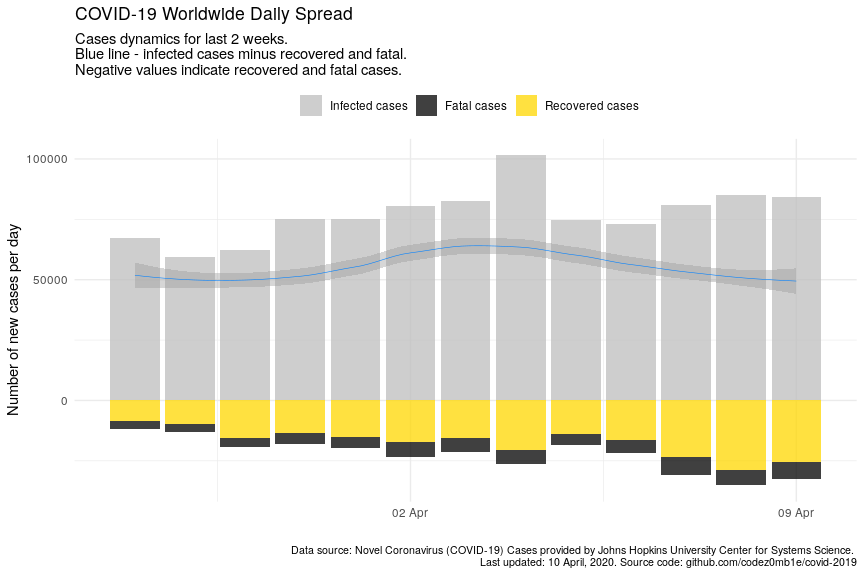
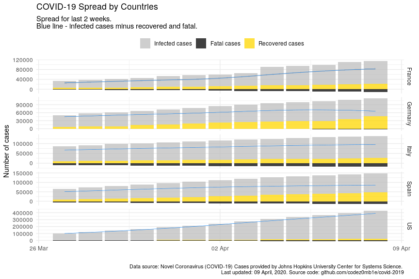
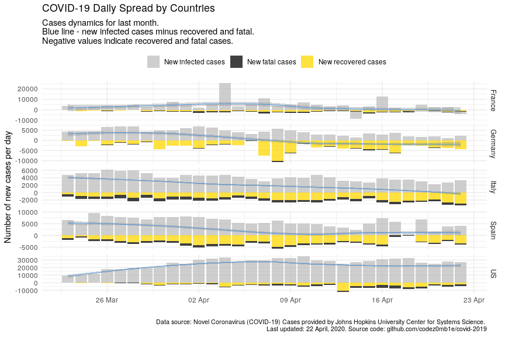
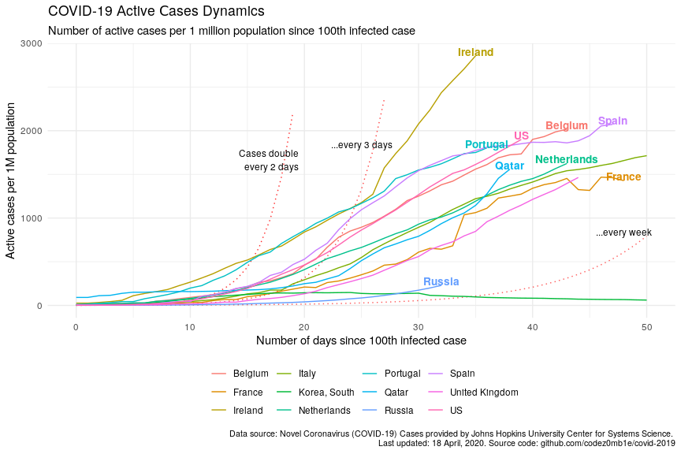
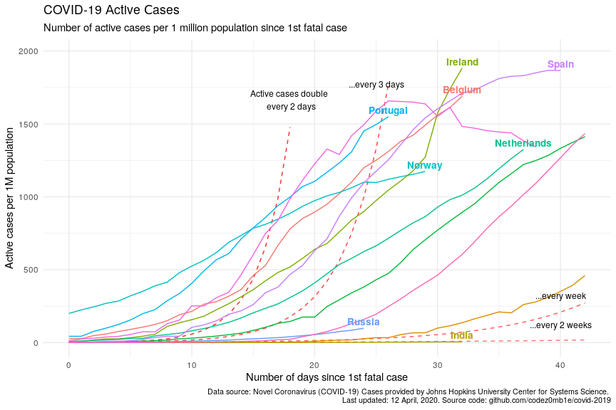

COVID-19 Analytics
================
13 April, 2020

#### Table of contents

  - [Load datasets](#load-datasets)
      - [Load COVID-19 spread data](#load-covid-19-spread-data)
      - [Load world population data](#load-world-population-data)
  - [Preprocessing datasets](#preprocessing-datasets)
      - [Preprocessing COVID-19 spread
        data](#preprocessing-covid-19-spread-data)
      - [Preprocessing world population
        data](#preprocessing-world-population-data)
  - [COVID-19 worldwide spread](#covid-19-worldwide-spread)
      - [Total infected, recovered, and fatal
        cases](#total-infected,-recovered,-and-fatal-cases)
      - [Dynamics of spread](#dynamics-of-spread)
      - [Disease cases structure](#disease-cases-structure)
      - [Dynamics of daily cases](#dynamics-of-daily-cases)
  - [COVID-19 spread by countries](#covid-19-spread-by-countries)
      - [Infected, recovered, fatal, and active
        cases](#infected,-recovered,-fatal,-and-active-cases)
      - [Dynamics of spread](#dynamics-of-spread)
      - [Dynamics of daily cases](#dynamics-of-daily-cases)
      - [Mortality rate](#mortality-rate)
  - [COVID-19 spread by countries
    population](#covid-19-spread-by-countries-population)
      - [TOPs countries by infected, active, and fatal
        cases](#tops-countries-by-infected,-active,-and-fatal-cases)
          - [by infected cases](#by-infected-cases)
          - [by active cases](#by-active-cases)
          - [by fatal cases](#by-fatal-cases)
      - [Active cases per 1 million population vs number of days since
        1st infected
        case](#active-cases-per-1-million-population-vs-number-of-days-since-1st-infected-case)
      - [Active cases per 1 million population vs number of days since
        1st fatal
        case](#active-cases-per-1-million-population-vs-number-of-days-since-1st-fatal-case)

## Load datasets

### Load COVID-19 spread data

Get list of files in datasets
    container:

    ## [1] "COVID19_line_list_data.csv"            "COVID19_open_line_list.csv"           
    ## [3] "covid_19_data.csv"                     "time_series_covid_19_confirmed.csv"   
    ## [5] "time_series_covid_19_confirmed_US.csv" "time_series_covid_19_deaths.csv"      
    ## [7] "time_series_covid_19_deaths_US.csv"    "time_series_covid_19_recovered.csv"

Load `covid_19_data.csv` dataset:

    ## # A tibble: 100 x 8
    ##      SNo ObservationDate Province.State Country.Region    Last.Update     Confirmed Deaths Recovered
    ##    <int> <chr>           <chr>          <chr>             <chr>               <dbl>  <dbl>     <dbl>
    ##  1  7592 03/21/2020      <NA>           Fiji              2020-03-19T14:…         1      0         0
    ##  2  1407 02/13/2020      <NA>           Sri Lanka         2020-02-08T03:…         1      0         1
    ##  3  7918 03/23/2020      <NA>           Algeria           2020-03-23 23:…       230     17        65
    ##  4  7819 03/22/2020      Guangxi        Mainland China    3/8/20 5:31           254      2       250
    ##  5  9661 03/28/2020      Maine          US                3/8/20 5:31           211      1         0
    ##  6  2919 03/01/2020      <NA>           Estonia           2020-02-27T16:…         1      0         0
    ##  7  5457 03/14/2020      <NA>           United Arab Emir… 2020-03-13T22:…        85      0        17
    ##  8  5912 03/16/2020      Denmark        Denmark           2020-03-16T18:…       914      3         1
    ##  9  2708 02/29/2020      Jiangxi        Mainland China    2020-02-29T01:…       935      1       811
    ## 10  8614 03/25/2020      <NA>           Mongolia          2020-03-25 23:…        10      0         0
    ## # … with 90 more rows

### Load world population data

Get datasets
    list:

    ## [1] "countries.csv"            "__MACOSX/"                "__MACOSX/._countries.csv"

Load `countries.csv` dataset:

    ## # A tibble: 169 x 14
    ##    iso_alpha2 iso_alpha3 iso_numeric name  official_name ccse_name density fertility_rate land_area
    ##    <chr>      <chr>            <int> <chr> <chr>         <chr>       <int>          <dbl>     <int>
    ##  1 AF         AFG                  4 Afgh… Islamic Repu… Afghanis…      60            4.6    652860
    ##  2 AL         ALB                  8 Alba… Republic of … Albania       105            1.6     27400
    ##  3 DZ         DZA                 12 Alge… People's Dem… Algeria        18            3.1   2381740
    ##  4 AD         AND                 20 Ando… Principality… Andorra       164           NA         470
    ##  5 AO         AGO                 24 Ango… Republic of … Angola         26            5.6   1246700
    ##  6 AG         ATG                 28 Anti… Antigua and … Antigua …     223            2         440
    ##  7 AR         ARG                 32 Arge… Argentine Re… Argentina      17            2.3   2736690
    ##  8 AM         ARM                 51 Arme… Republic of … Armenia       104            1.8     28470
    ##  9 AU         AUS                 36 Aust… Australia     Australia       3            1.8   7682300
    ## 10 AT         AUT                 40 Aust… Republic of … Austria       109            1.5     82409
    ## # … with 159 more rows, and 5 more variables: median_age <dbl>, migrants <dbl>, population <int>,
    ## #   urban_pop_rate <dbl>, world_share <dbl>

## Preprocessing datasets

### Preprocessing COVID-19 spread data

Set `area` column, processing `province_state` columns, and format dates
columns:

    ## # A tibble: 14,491 x 5
    ##    area          country        province_state observation_date confirmed
    ##    <fct>         <chr>          <chr>          <date>               <dbl>
    ##  1 US            US             New York       2020-04-12          189033
    ##  2 Rest of World Spain          <NA>           2020-04-12          166831
    ##  3 Rest of World Italy          <NA>           2020-04-12          156363
    ##  4 Rest of World France         <NA>           2020-04-12          132591
    ##  5 Rest of World Germany        <NA>           2020-04-12          127854
    ##  6 Rest of World UK             <NA>           2020-04-12           84279
    ##  7 Rest of World Iran           <NA>           2020-04-12           71686
    ##  8 Hubei         Mainland China Hubei          2020-04-12           67803
    ##  9 US            US             New Jersey     2020-04-12           61850
    ## 10 Rest of World Turkey         <NA>           2020-04-12           56956
    ## # … with 14,481 more rows

Get dataset structure after preprocessing:

|                                                  |            |
| :----------------------------------------------- | :--------- |
| Name                                             | Piped data |
| Number of rows                                   | 14491      |
| Number of columns                                | 9          |
| \_\_\_\_\_\_\_\_\_\_\_\_\_\_\_\_\_\_\_\_\_\_\_   |            |
| Column type frequency:                           |            |
| character                                        | 2          |
| Date                                             | 1          |
| factor                                           | 1          |
| numeric                                          | 4          |
| POSIXct                                          | 1          |
| \_\_\_\_\_\_\_\_\_\_\_\_\_\_\_\_\_\_\_\_\_\_\_\_ |            |
| Group variables                                  | None       |

Data summary

**Variable type:
character**

| skim\_variable  | n\_missing | complete\_rate | min | max | empty | n\_unique | whitespace |
| :-------------- | ---------: | -------------: | --: | --: | ----: | --------: | ---------: |
| province\_state |       7108 |           0.51 |   2 |  43 |     0 |       295 |          0 |
| country         |          0 |           1.00 |   2 |  32 |     0 |       220 |          1 |

**Variable type:
Date**

| skim\_variable    | n\_missing | complete\_rate | min        | max        | median     | n\_unique |
| :---------------- | ---------: | -------------: | :--------- | :--------- | :--------- | --------: |
| observation\_date |          0 |              1 | 2020-01-22 | 2020-04-12 | 2020-03-20 |        82 |

**Variable type:
factor**

| skim\_variable | n\_missing | complete\_rate | ordered | n\_unique | top\_counts                             |
| :------------- | ---------: | -------------: | :------ | --------: | :-------------------------------------- |
| area           |          0 |              1 | FALSE   |         4 | Res: 9105, US: 2846, Chi: 2458, Hub: 82 |

**Variable type:
numeric**

| skim\_variable | n\_missing | complete\_rate |    mean |       sd | p0 |    p25 |  p50 |     p75 |   p100 | hist  |
| :------------- | ---------: | -------------: | ------: | -------: | -: | -----: | ---: | ------: | -----: | :---- |
| sno            |          0 |              1 | 7246.00 |  4183.34 |  1 | 3623.5 | 7246 | 10868.5 |  14491 | ▇▇▇▇▇ |
| confirmed      |          0 |              1 | 1884.21 | 10414.71 |  0 |    6.0 |   66 |   435.0 | 189033 | ▇▁▁▁▁ |
| deaths         |          0 |              1 |   96.05 |   831.55 |  0 |    0.0 |    0 |     5.0 |  19899 | ▇▁▁▁▁ |
| recovered      |          0 |              1 |  461.24 |  3875.41 |  0 |    0.0 |    1 |    32.0 |  64281 | ▇▁▁▁▁ |

**Variable type:
POSIXct**

| skim\_variable | n\_missing | complete\_rate | min                 | max                 | median              | n\_unique |
| :------------- | ---------: | -------------: | :------------------ | :------------------ | :------------------ | --------: |
| last\_update   |          0 |              1 | 2020-01-22 17:00:00 | 2020-04-12 23:25:00 | 2020-03-15 18:20:18 |      1822 |

### Preprocessing world population data

Get unmatched countries:

    ## # A tibble: 57 x 2
    ##    country                  n
    ##    <chr>                <dbl>
    ##  1 Mainland China     5157393
    ##  2 UK                  834625
    ##  3 South Korea         380200
    ##  4 Czech Republic       84774
    ##  5 Others               26228
    ##  6 Hong Kong            20565
    ##  7 Diamond Princess     13528
    ##  8 Taiwan                8942
    ##  9 Ivory Coast           5211
    ## 10 West Bank and Gaza    3426
    ## # … with 47 more rows

Correct top of unmached countries.

And updated matching:

    ## # A tibble: 52 x 2
    ##    country                n
    ##    <chr>              <dbl>
    ##  1 Others             26228
    ##  2 Hong Kong          20565
    ##  3 Diamond Princess   13528
    ##  4 Ivory Coast         5211
    ##  5 West Bank and Gaza  3426
    ##  6 Kosovo              2717
    ##  7 Macau               1410
    ##  8 Mali                 813
    ##  9 Burma                347
    ## 10 Guinea-Bissau        327
    ## # … with 42 more rows

Much better :)

## COVID-19 worldwide spread

***Analyze COVID-19 worldwide spread.***

### Total infected, recovered, and fatal cases

View spread statistics:

    ## # A tibble: 82 x 9
    ##    observation_date active_total active_total_de… confirmed_total confirmed_total… recovered_total
    ##    <date>                  <dbl> <chr>                      <dbl> <chr>                      <dbl>
    ##  1 2020-04-12            1310868 3.96%                    1846680 4.24%                     421722
    ##  2 2020-04-11            1260901 3.94%                    1771514 4.72%                     402110
    ##  3 2020-04-10            1213098 5.86%                    1691719 6.04%                     376096
    ##  4 2020-04-09            1145920 4.74%                    1595350 5.58%                     353975
    ##  5 2020-04-08            1094105 4.78%                    1511104 5.96%                     328661
    ##  6 2020-04-07            1044177 5.05%                    1426096 6.02%                     300054
    ##  7 2020-04-06             994021 5.44%                    1345101 5.74%                     276515
    ##  8 2020-04-05             942729 6.32%                    1272115 6.24%                     260012
    ##  9 2020-04-04             886650 9.28%                    1197408 9.26%                     246152
    ## 10 2020-04-03             811334 8.17%                    1095917 8.15%                     225796
    ## # … with 72 more rows, and 3 more variables: recovered_total_delta <chr>, deaths_total <dbl>,
    ## #   deaths_total_delta <chr>

### Dynamics of spread

    ## `geom_smooth()` using formula 'y ~ x'

<!-- -->

    ## `geom_smooth()` using formula 'y ~ x'

<!-- -->

### Disease cases structure

<!-- -->

<!-- -->

### Dynamics of daily cases

Get daily dynamics of new infected and recovered cases.

World daily spread:

    ## Selecting by active_total_per_day

    ## # A tibble: 7 x 5
    ##   observation_date confirmed_total_per_… deaths_total_per_d… recovered_total_per… active_total_per_…
    ##   <date>                           <dbl>               <dbl>                <dbl>              <dbl>
    ## 1 2020-04-10                       96369                7070                22121              67178
    ## 2 2020-04-05                       74707                4768                13860              56079
    ## 3 2020-04-04                      101491                5819                20356              75316
    ## 4 2020-04-03                       82614                5804                15533              61277
    ## 5 2020-04-02                       80698                6174                17092              57432
    ## 6 2020-03-31                       75098                4525                13468              57105
    ## 7 2020-03-28                       67402                3454                 8500              55448

    ## `geom_smooth()` using formula 'y ~ x'

<!-- -->

    ## `geom_smooth()` using formula 'y ~ x'

<!-- -->

## COVID-19 spread by countries

***Analyze COVID-19 spread y countries.***

### Infected, recovered, fatal, and active cases

Calculate number of infected, recovered, fatal, and active (infected
cases minus recovered and fatal) cases grouped by country:

Get countries ordered by total active cases:

    ## # A tibble: 7,727 x 10
    ##    country observation_date active_total active_total_de… confirmed_total confirmed_total…
    ##    <chr>   <date>                  <dbl> <chr>                      <dbl> <chr>           
    ##  1 US      2020-04-12             500305 5.40%                     555313 5.49%           
    ##  2 Italy   2020-04-12             102253 1.98%                     156363 2.69%           
    ##  3 France  2020-04-12              91789 1.75%                     133670 2.25%           
    ##  4 Spain   2020-04-12              87231 -0.09%                    166831 2.33%           
    ##  5 United… 2020-04-12              73951 6.62%                      85206 6.68%           
    ##  6 Germany 2020-04-12              64532 -0.37%                    127854 2.36%           
    ##  7 Turkey  2020-04-12              52312 8.75%                      56956 9.18%           
    ##  8 Iran    2020-04-12              23318 -1.72%                     71686 2.37%           
    ##  9 Nether… 2020-04-12              22704 4.98%                      25746 4.78%           
    ## 10 Brazil  2020-04-12              20796 7.03%                      22192 7.07%           
    ## # … with 7,717 more rows, and 4 more variables: recovered_total <dbl>, recovered_total_delta <chr>,
    ## #   deaths_total <dbl>, deaths_total_delta <chr>

<!-- -->

### Dynamics of spread

    ## `geom_smooth()` using formula 'y ~ x'

<!-- -->

    ## `geom_smooth()` using formula 'y ~ x'

<!-- -->

### Dynamics of daily cases

Get daily dynamics of new infected and recovered cases by countries.

World daily spread:

    ## # A tibble: 7,727 x 6
    ## # Groups:   country [220]
    ##    country   observation_date confirmed_total_p… recovered_total_… deaths_total_pe… active_total_pe…
    ##    <chr>     <date>                        <dbl>             <dbl>            <dbl>            <dbl>
    ##  1 Afghanis… 2020-04-12                       52                 0                0               52
    ##  2 Albania   2020-04-12                       13                20                0               -7
    ##  3 Algeria   2020-04-12                       89               131               18              -60
    ##  4 Andorra   2020-04-12                       37                57                3              -23
    ##  5 Angola    2020-04-12                        0                 0                0                0
    ##  6 Antigua … 2020-04-12                        0                 0                0                0
    ##  7 Argentina 2020-04-12                      167                28                7              132
    ##  8 Armenia   2020-04-12                       46                24                0               22
    ##  9 Australia 2020-04-12                       12                 0                3                9
    ## 10 Austria   2020-04-12                      139               383               13             -257
    ## # … with 7,717 more rows

    ## `geom_smooth()` using formula 'y ~ x'

<!-- -->

    ## `geom_smooth()` using formula 'y ~ x'

<!-- -->

### Mortality rate

    ## # A tibble: 44 x 8
    ##    country observation_date first_confirmed… first_deaths_ca… recovered_total deaths_total
    ##    <chr>   <date>           <date>           <date>                     <dbl>        <dbl>
    ##  1 US      2020-04-12       2020-01-22       2020-02-29                 32988        22020
    ##  2 US      2020-04-11       2020-01-22       2020-02-29                 31270        20463
    ##  3 US      2020-04-10       2020-01-22       2020-02-29                 28790        18586
    ##  4 US      2020-04-09       2020-01-22       2020-02-29                 25410        16478
    ##  5 US      2020-04-08       2020-01-22       2020-02-29                 23559        14695
    ##  6 US      2020-04-07       2020-01-22       2020-02-29                 21763        12722
    ##  7 US      2020-04-06       2020-01-22       2020-02-29                 19581        10783
    ##  8 US      2020-04-05       2020-01-22       2020-02-29                 17448         9619
    ##  9 US      2020-04-04       2020-01-22       2020-02-29                 14652         8407
    ## 10 US      2020-04-03       2020-01-22       2020-02-29                  9707         7087
    ## # … with 34 more rows, and 2 more variables: confirmed_deaths_rate <dbl>,
    ## #   recovered_deaths_rate <dbl>

<!-- -->

<!-- -->

<!-- -->

## COVID-19 spread by countries population

    ## # A tibble: 73 x 5
    ##    country n_days_since_1st_confirmed population confirmed_total confirmed_total_per_1M
    ##    <chr>                        <dbl>      <int>           <dbl>                  <dbl>
    ##  1 Russia                          72  145934462           15770                  108. 
    ##  2 Russia                          71  145934462           13584                   93.1
    ##  3 Russia                          70  145934462           11917                   81.7
    ##  4 Russia                          69  145934462           10131                   69.4
    ##  5 Russia                          68  145934462            8672                   59.4
    ##  6 Russia                          67  145934462            7497                   51.4
    ##  7 Russia                          66  145934462            6343                   43.5
    ##  8 Russia                          65  145934462            5389                   36.9
    ##  9 Russia                          64  145934462            4731                   32.4
    ## 10 Russia                          63  145934462            4149                   28.4
    ## # … with 63 more rows

### TOPs countries by infected, active, and fatal cases

Calculate countries stats whose populations were most affected by the
virus:

#### …by infected cases

    ## # A tibble: 68 x 6
    ##    country   population confirmed_total confirmed_total_pe… n_days_since_1st_co… n_days_since_1st_d…
    ##    <chr>          <int>           <dbl>               <dbl>                <dbl>               <dbl>
    ##  1 Spain       46754778          166831               3568.                   71                  40
    ##  2 Switzerl…    8654622           25415               2937.                   47                  38
    ##  3 Italy       60461826          156363               2586.                   72                  51
    ##  4 Belgium     11589623           29647               2558.                   68                  32
    ##  5 France      65273511          133670               2048.                   79                  57
    ##  6 Ireland      4937786            9655               1955.                   43                  32
    ##  7 US         331002651          555313               1678.                   81                  43
    ##  8 Portugal    10196709           16585               1627.                   41                  26
    ##  9 Austria      9006398           13945               1548.                   47                  31
    ## 10 Germany     83783942          127854               1526.                   75                  34
    ## # … with 58 more rows

#### …by active cases

    ## # A tibble: 68 x 6
    ##    country    population active_total active_total_per_… n_days_since_1st_conf… n_days_since_1st_de…
    ##    <chr>           <int>        <dbl>              <dbl>                  <dbl>                <dbl>
    ##  1 Ireland       4937786         9296              1883.                     43                   32
    ##  2 Spain        46754778        87231              1866.                     71                   40
    ##  3 Italy        60461826       102253              1691.                     72                   51
    ##  4 Belgium      11589623        19584              1690.                     68                   32
    ##  5 Portugal     10196709        15804              1550.                     41                   26
    ##  6 US          331002651       500305              1511.                     81                   43
    ##  7 France       65273511        91789              1406.                     79                   57
    ##  8 Switzerla…    8654622        11609              1341.                     47                   38
    ##  9 Netherlan…   17134872        22704              1325.                     45                   37
    ## 10 Norway        5421241         6365              1174.                     46                   29
    ## # … with 58 more rows

#### …by fatal cases

    ## # A tibble: 68 x 6
    ##    country     population deaths_total deaths_total_per_… n_days_since_1st_conf… n_days_since_1st_d…
    ##    <chr>            <int>        <dbl>              <dbl>                  <dbl>               <dbl>
    ##  1 Spain         46754778        17209              368.                      71                  40
    ##  2 Italy         60461826        19899              329.                      72                  51
    ##  3 Belgium       11589623         3600              311.                      68                  32
    ##  4 France        65273511        14412              221.                      79                  57
    ##  5 Netherlands   17134872         2747              160.                      45                  37
    ##  6 United Kin…   67886011        10629              157.                      72                  38
    ##  7 Switzerland    8654622         1106              128.                      47                  38
    ##  8 Sweden        10099265          899               89.0                     72                  32
    ##  9 Ireland        4937786          334               67.6                     43                  32
    ## 10 US           331002651        22020               66.5                     81                  43
    ## # … with 58 more rows

### Active cases per 1 million population vs number of days since 1st infected case

Select countries to
    monitoring:

    ##  [1] "Belgium"        "France"         "Ireland"        "Italy"          "Netherlands"   
    ##  [6] "Norway"         "Portugal"       "Spain"          "Switzerland"    "US"            
    ## [11] "Russia"         "India"          "Mainland China" "South Korea"

<!-- -->

### Active cases per 1 million population vs number of days since 1st fatal case

<!-- -->
