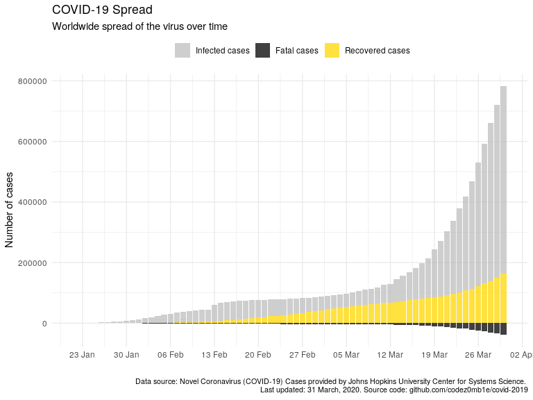
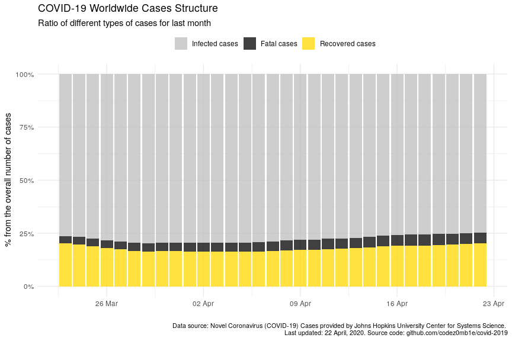
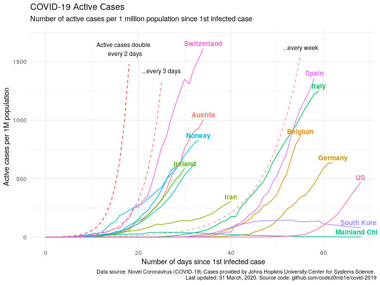
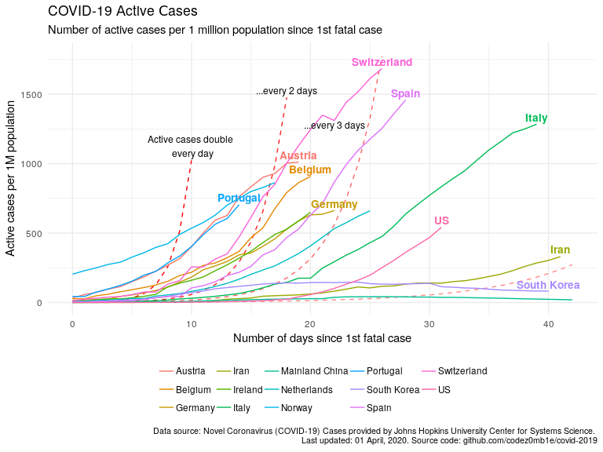

COVID-19 Analytics
================
01 April, 2020

## Load dataset

Get list of files in datasets
    container:

    ## [1] "COVID19_line_list_data.csv"            "COVID19_open_line_list.csv"           
    ## [3] "covid_19_data.csv"                     "time_series_covid_19_confirmed.csv"   
    ## [5] "time_series_covid_19_confirmed_US.csv" "time_series_covid_19_deaths.csv"      
    ## [7] "time_series_covid_19_deaths_US.csv"    "time_series_covid_19_recovered.csv"

Load `covid_19_data.csv` dataset:

    ## # A tibble: 100 x 8
    ##      SNo ObservationDate Province.State  Country.Region  Last.Update      Confirmed Deaths Recovered
    ##    <int> <chr>           <chr>           <chr>           <chr>                <dbl>  <dbl>     <dbl>
    ##  1   202 01/26/2020      Qinghai         Mainland China  1/26/20 16:00            1      0         0
    ##  2  8197 03/23/2020      Utah            US              2020-03-23 23:2…       257      1         0
    ##  3  4566 03/10/2020      Inner Mongolia  Mainland China  2020-03-08T05:1…        75      1        70
    ##  4  4395 03/09/2020      Cobb County, GA US              2020-03-09T03:5…         3      0         0
    ##  5  2617 02/28/2020      <NA>            Singapore       2020-02-26T19:3…        93      0        62
    ##  6  6915 03/19/2020      <NA>            Congo (Kinshas… 2020-03-19T10:5…        14      0         0
    ##  7  9955 03/29/2020      Hong Kong       Hong Kong       2020-03-29 23:1…       641      4       112
    ##  8  8341 03/24/2020      <NA>            Saudi Arabia    2020-03-24 23:4…       767      1        28
    ##  9  1976 02/21/2020      Hong Kong       Hong Kong       2020-02-21T03:4…        68      2         5
    ## 10  5514 03/14/2020      Rhode Island    US              2020-03-14T18:5…        20      0         0
    ## # … with 90 more rows

Get dataset structure:

    ## Skim summary statistics
    ##  n obs: 10671 
    ##  n variables: 8 
    ## 
    ## ── Variable type:character ──────────────────────────────────────────────────────────────────────────────────────────────────────────────────────────────────────────────────────
    ##         variable missing complete     n min max empty n_unique
    ##   Country.Region       0    10671 10671   2  32     0      215
    ##      Last.Update       0    10671 10671  11  19     0     1814
    ##  ObservationDate       0    10671 10671  10  10     0       70
    ##   Province.State    4959     5712 10671   2  43     0      292
    ## 
    ## ── Variable type:integer ────────────────────────────────────────────────────────────────────────────────────────────────────────────────────────────────────────────────────────
    ##  variable missing complete     n mean     sd p0    p25  p50    p75  p100     hist
    ##       SNo       0    10671 10671 5336 3080.6  1 2668.5 5336 8003.5 10671 ▇▇▇▇▇▇▇▇
    ## 
    ## ── Variable type:numeric ────────────────────────────────────────────────────────────────────────────────────────────────────────────────────────────────────────────────────────
    ##   variable missing complete     n   mean      sd p0 p25 p50 p75   p100     hist
    ##  Confirmed       0    10671 10671 993.82 6268.84  0   3  31 229 105792 ▇▁▁▁▁▁▁▁
    ##     Deaths       0    10671 10671  40.67  398.62  0   0   0   2  12428 ▇▁▁▁▁▁▁▁
    ##  Recovered       0    10671 10671 289.51 3010.81  0   0   0  14  63153 ▇▁▁▁▁▁▁▁

## Preprocessing data

Set `area` column, processing `province_state` columns, and format dates
columns:

    ## # A tibble: 10,671 x 4
    ##    area          country_region      province_state observation_date
    ##    <fct>         <chr>               <chr>          <date>          
    ##  1 Rest of World Afghanistan         <NA>           2020-03-31      
    ##  2 Rest of World Albania             <NA>           2020-03-31      
    ##  3 Rest of World Algeria             <NA>           2020-03-31      
    ##  4 Rest of World Andorra             <NA>           2020-03-31      
    ##  5 Rest of World Angola              <NA>           2020-03-31      
    ##  6 Rest of World Antigua and Barbuda <NA>           2020-03-31      
    ##  7 Rest of World Argentina           <NA>           2020-03-31      
    ##  8 Rest of World Armenia             <NA>           2020-03-31      
    ##  9 Rest of World Austria             <NA>           2020-03-31      
    ## 10 Rest of World Azerbaijan          <NA>           2020-03-31      
    ## # … with 10,661 more rows

Get dataset structure after preprocessing:

    ## Skim summary statistics
    ##  n obs: 10671 
    ##  n variables: 9 
    ## 
    ## ── Variable type:character ──────────────────────────────────────────────────────────────────────────────────────────────────────────────────────────────────────────────────────
    ##        variable missing complete     n min max empty n_unique
    ##  country_region       0    10671 10671   2  32     0      215
    ##  province_state    4959     5712 10671   2  43     0      291
    ## 
    ## ── Variable type:Date ───────────────────────────────────────────────────────────────────────────────────────────────────────────────────────────────────────────────────────────
    ##          variable missing complete     n        min        max     median n_unique
    ##  observation_date       0    10671 10671 2020-01-22 2020-03-31 2020-03-13       70
    ## 
    ## ── Variable type:factor ─────────────────────────────────────────────────────────────────────────────────────────────────────────────────────────────────────────────────────────
    ##  variable missing complete     n n_unique                              top_counts ordered
    ##      area       0    10671 10671        4 Res: 6353, US: 2150, Chi: 2098, Hub: 70   FALSE
    ## 
    ## ── Variable type:integer ────────────────────────────────────────────────────────────────────────────────────────────────────────────────────────────────────────────────────────
    ##  variable missing complete     n mean     sd p0    p25  p50    p75  p100     hist
    ##       sno       0    10671 10671 5336 3080.6  1 2668.5 5336 8003.5 10671 ▇▇▇▇▇▇▇▇
    ## 
    ## ── Variable type:numeric ────────────────────────────────────────────────────────────────────────────────────────────────────────────────────────────────────────────────────────
    ##   variable missing complete     n   mean      sd p0 p25 p50 p75   p100     hist
    ##  confirmed       0    10671 10671 993.82 6268.84  0   3  31 229 105792 ▇▁▁▁▁▁▁▁
    ##     deaths       0    10671 10671  40.67  398.62  0   0   0   2  12428 ▇▁▁▁▁▁▁▁
    ##  recovered       0    10671 10671 289.51 3010.81  0   0   0  14  63153 ▇▁▁▁▁▁▁▁
    ## 
    ## ── Variable type:POSIXct ────────────────────────────────────────────────────────────────────────────────────────────────────────────────────────────────────────────────────────
    ##     variable missing complete     n        min        max     median n_unique
    ##  last_update       0    10671 10671 2020-01-22 2020-03-31 2020-03-11     1813

## COVID-19 spread

Get virus spread statistics grouped by `area`:

### Prepare data

Calculate total infected, recovered, and fatal cases:

    ## # A tibble: 280 x 5
    ## # Groups:   area [4]
    ##    area                  observation_date confirmed_total deaths_total recovered_total
    ##    <fct>                 <date>                     <dbl>        <dbl>           <dbl>
    ##  1 China (exclude Hubei) 2020-03-31                 13723          118           12915
    ##  2 Hubei                 2020-03-31                 67801         3187           63153
    ##  3 Rest of World         2020-03-31                587791        34929           94942
    ##  4 US                    2020-03-31                188172         3873            7024
    ##  5 China (exclude Hubei) 2020-03-30                 13677          118           12901
    ##  6 Hubei                 2020-03-30                 67801         3186           62889
    ##  7 Rest of World         2020-03-30                539080        31300           83132
    ##  8 US                    2020-03-30                161807         2978            5644
    ##  9 China (exclude Hubei) 2020-03-29                 13643          118           12890
    ## 10 Hubei                 2020-03-29                 67801         3182           62570
    ## # … with 270 more rows

### Visualize

Wordwide virus spread statistics:

    ## # A tibble: 70 x 4
    ##    observation_date confirmed_total deaths_total recovered_total
    ##    <date>                     <dbl>        <dbl>           <dbl>
    ##  1 2020-03-31                857487        42107          178034
    ##  2 2020-03-30                782365        37582          164566
    ##  3 2020-03-29                720117        33925          149082
    ##  4 2020-03-28                660706        30652          139415
    ##  5 2020-03-27                593291        27198          130915
    ##  6 2020-03-26                529591        23970          122150
    ##  7 2020-03-25                467594        21181          113770
    ##  8 2020-03-24                417966        18615          107705
    ##  9 2020-03-23                378287        16497          100958
    ## 10 2020-03-22                337020        14623           97243
    ## # … with 60 more rows

<!-- -->

<!-- -->

## COVID-19 daily spread

Get daily dynamics of new infected and recovered cases.

### Prepare data

    ## # A tibble: 70 x 8
    ##    area  observation_date confirmed_total deaths_total recovered_total confirmed_total…
    ##    <fct> <date>                     <dbl>        <dbl>           <dbl>            <dbl>
    ##  1 Hubei 2020-03-31                 67801         3187           63153                0
    ##  2 Hubei 2020-03-30                 67801         3186           62889                0
    ##  3 Hubei 2020-03-29                 67801         3182           62570                0
    ##  4 Hubei 2020-03-28                 67801         3177           62098                0
    ##  5 Hubei 2020-03-27                 67801         3174           61732                0
    ##  6 Hubei 2020-03-26                 67801         3169           61201                0
    ##  7 Hubei 2020-03-25                 67801         3163           60811                0
    ##  8 Hubei 2020-03-24                 67801         3160           60324                1
    ##  9 Hubei 2020-03-23                 67800         3153           59882                0
    ## 10 Hubei 2020-03-22                 67800         3144           59433                0
    ## # … with 60 more rows, and 2 more variables: deaths_total_per_day <dbl>,
    ## #   recovered_total_per_day <dbl>

### Visualize

<!-- -->

## COVID-19 mortality rate

### Prepare data

    ## # A tibble: 26 x 7
    ##    area  observation_date reference_date recovered_total deaths_total confirmed_death…
    ##    <fct> <date>           <date>                   <dbl>        <dbl>            <dbl>
    ##  1 US    2020-03-31       2020-03-06                7024         3873           0.0206
    ##  2 US    2020-03-30       2020-03-06                5644         2978           0.0184
    ##  3 US    2020-03-29       2020-03-06                2665         2467           0.0175
    ##  4 US    2020-03-28       2020-03-06                1072         2026           0.0167
    ##  5 US    2020-03-27       2020-03-06                 869         1581           0.0156
    ##  6 US    2020-03-26       2020-03-06                 681         1209           0.0144
    ##  7 US    2020-03-25       2020-03-06                 361          942           0.0143
    ##  8 US    2020-03-24       2020-03-06                 348          706           0.0131
    ##  9 US    2020-03-23       2020-03-06                   0          552           0.0126
    ## 10 US    2020-03-22       2020-03-06                   0          427           0.0127
    ## # … with 16 more rows, and 1 more variable: recovered_deaths_rate <dbl>

### Visualize

<!-- -->

<!-- -->

<!-- -->

## Enrich COVID dataset with world population

### Load world population

Get datasets
    list:

    ## [1] "metadata_country.csv"   "metadata_indicator.csv" "population_clean.csv"  
    ## [4] "population_raw.csv"

Load world population dataset:

    ## # A tibble: 61 x 17
    ##    type  variable missing complete n     min   max   empty n_unique mean  sd    p0    p25   p50  
    ##    <chr> <chr>    <chr>   <chr>    <chr> <chr> <chr> <chr> <chr>    <chr> <chr> <chr> <chr> <chr>
    ##  1 char… Country… 0       264      264   3     3     0     264      <NA>  <NA>  <NA>  <NA>  <NA> 
    ##  2 char… Country… 0       264      264   4     52    0     264      <NA>  <NA>  <NA>  <NA>  <NA> 
    ##  3 nume… X1960    4       260      264   <NA>  <NA>  <NA>  <NA>     "118… 3730… 3893  " 50… " 36…
    ##  4 nume… X1961    4       260      264   <NA>  <NA>  <NA>  <NA>     1196… 3775… 3989  " 51… " 37…
    ##  5 nume… X1962    4       260      264   <NA>  <NA>  <NA>  <NA>     1217… 3841… 4076  " 52… " 38…
    ##  6 nume… X1963    4       260      264   <NA>  <NA>  <NA>  <NA>     "124… 3926… 4183  " 53… " 39…
    ##  7 nume… X1964    4       260      264   <NA>  <NA>  <NA>  <NA>     "127… 4012… 4308  " 54… " 40…
    ##  8 nume… X1965    4       260      264   <NA>  <NA>  <NA>  <NA>     1297… "410… 4468  " 55… " 41…
    ##  9 nume… X1966    4       260      264   <NA>  <NA>  <NA>  <NA>     1326… 4195… 4685  " 56… " 42…
    ## 10 nume… X1967    4       260      264   <NA>  <NA>  <NA>  <NA>     1354… 4288… 4920  " 58… " 43…
    ## # … with 51 more rows, and 3 more variables: p75 <chr>, p100 <chr>, hist <chr>

Select relevant columns:

    ## # A tibble: 264 x 2
    ##    country                             n
    ##    <chr>                           <dbl>
    ##  1 World                      7594270356
    ##  2 IDA & IBRD total           6412522234
    ##  3 Low & middle income        6383958209
    ##  4 Middle income              5678540888
    ##  5 IBRD only                  4772284113
    ##  6 Early-demographic dividend 3249140605
    ##  7 Lower middle income        3022905169
    ##  8 Upper middle income        2655635719
    ##  9 East Asia & Pacific        2328220870
    ## 10 Late-demographic dividend  2288665963
    ## # … with 254 more rows

### Preprocessing

Get unmatched countries:

    ## # A tibble: 15 x 2
    ##    country_region         n
    ##    <chr>              <dbl>
    ##  1 Mainland China   4176244
    ##  2 US               1087452
    ##  3 Iran              527564
    ##  4 South Korea       257018
    ##  5 UK                165726
    ##  6 Others             26228
    ##  7 Russia             12274
    ##  8 Hong Kong           9626
    ##  9 Egypt               7156
    ## 10 Diamond Princess    4984
    ## 11 Taiwan              4545
    ## 12 Slovakia            3440
    ## 13 Brunei              1688
    ## 14 Venezuela           1296
    ## 15 Ivory Coast         1052

Correct top of unmached countries.

And updated matching:

    ## # A tibble: 7 x 2
    ##   country_region       n
    ##   <chr>            <dbl>
    ## 1 Others           26228
    ## 2 Diamond Princess  4984
    ## 3 Taiwan            4545
    ## 4 Slovakia          3440
    ## 5 Brunei            1688
    ## 6 Venezuela         1296
    ## 7 Ivory Coast       1052

Much better :)

### Infected, recovered, fatal, and active cases

Calculate number of infected, recovered, fatal, and active cases grouped
by country:

View statistics in US:

    ## # A tibble: 70 x 10
    ##    country_region observation_date confirmed_total recovered_total deaths_total active_total
    ##    <chr>          <date>                     <dbl>           <dbl>        <dbl>        <dbl>
    ##  1 US             2020-03-31                188172            7024         3873       177275
    ##  2 US             2020-03-30                161807            5644         2978       153185
    ##  3 US             2020-03-29                140886            2665         2467       135754
    ##  4 US             2020-03-28                121478            1072         2026       118380
    ##  5 US             2020-03-27                101657             869         1581        99207
    ##  6 US             2020-03-26                 83836             681         1209        81946
    ##  7 US             2020-03-25                 65778             361          942        64475
    ##  8 US             2020-03-24                 53740             348          706        52686
    ##  9 US             2020-03-23                 43667               0          552        43115
    ## 10 US             2020-03-22                 33746               0          427        33319
    ## # … with 60 more rows, and 4 more variables: first_confirmed_date <date>,
    ## #   n_days_since_1st_confirmed <dbl>, first_deaths_case_date <date>, n_days_since_1st_deaths <dbl>

View statistics in Russia:

    ## # A tibble: 61 x 10
    ##    country_region observation_date confirmed_total recovered_total deaths_total active_total
    ##    <chr>          <date>                     <dbl>           <dbl>        <dbl>        <dbl>
    ##  1 Russia         2020-03-31                  2337             121           17         2199
    ##  2 Russia         2020-03-30                  1836              66            9         1761
    ##  3 Russia         2020-03-29                  1534              64            8         1462
    ##  4 Russia         2020-03-28                  1264              49            4         1211
    ##  5 Russia         2020-03-27                  1036              45            4          987
    ##  6 Russia         2020-03-26                   840              38            3          799
    ##  7 Russia         2020-03-25                   658              29            3          626
    ##  8 Russia         2020-03-24                   495              22            1          472
    ##  9 Russia         2020-03-23                   438              17            1          420
    ## 10 Russia         2020-03-22                   367              16            1          350
    ## # … with 51 more rows, and 4 more variables: first_confirmed_date <date>,
    ## #   n_days_since_1st_confirmed <dbl>, first_deaths_case_date <date>, n_days_since_1st_deaths <dbl>

### Join COVID-19 dataset with world population

    ## # A tibble: 61 x 5
    ##    country_region n_days_since_1st_confirmed population_n confirmed_total confirmed_total_per_1M
    ##    <chr>                               <dbl>        <dbl>           <dbl>                  <dbl>
    ##  1 Russia                                 60    144478050            2337                  16.2 
    ##  2 Russia                                 59    144478050            1836                  12.7 
    ##  3 Russia                                 58    144478050            1534                  10.6 
    ##  4 Russia                                 57    144478050            1264                   8.75
    ##  5 Russia                                 56    144478050            1036                   7.17
    ##  6 Russia                                 55    144478050             840                   5.81
    ##  7 Russia                                 54    144478050             658                   4.55
    ##  8 Russia                                 53    144478050             495                   3.43
    ##  9 Russia                                 52    144478050             438                   3.03
    ## 10 Russia                                 51    144478050             367                   2.54
    ## # … with 51 more rows

### TOPs countries by infected, active, and fatal cases

Calculate countries stats whose populations were most affected by the
virus:

#### Top countries by infected cases

    ## # A tibble: 45 x 5
    ##    country_region population_n confirmed_total confirmed_total_per_1M n_days_since_1st_confirmed
    ##    <chr>                 <dbl>           <dbl>                  <dbl>                      <dbl>
    ##  1 Spain              46723749           95923                  2053.                         59
    ##  2 Switzerland         8516543           16605                  1950.                         35
    ##  3 Italy              60431283          105792                  1751.                         60
    ##  4 Austria             8847037           10180                  1151.                         35
    ##  5 Belgium            11422068           12775                  1118.                         56
    ##  6 Norway              5314336            4641                   873.                         34
    ##  7 Germany            82927922           71808                   866.                         63
    ##  8 France             66987244           52827                   789.                         67
    ##  9 Netherlands        17231017           12667                   735.                         33
    ## 10 Portugal           10281762            7443                   724.                         29
    ## # … with 35 more rows

#### Top countries by active cases

    ## # A tibble: 45 x 5
    ##    country_region population_n active_total active_total_per_1M n_days_since_1st_confirmed
    ##    <chr>                 <dbl>        <dbl>               <dbl>                      <dbl>
    ##  1 Switzerland         8516543        14349               1685.                         35
    ##  2 Spain              46723749        68200               1460.                         59
    ##  3 Italy              60431283        77635               1285.                         60
    ##  4 Austria             8847037         8957               1012.                         35
    ##  5 Belgium            11422068        10374                908.                         56
    ##  6 Norway              5314336         4589                864.                         34
    ##  7 Portugal           10281762         7240                704.                         29
    ##  8 Germany            82927922        54933                662.                         63
    ##  9 Netherlands        17231017        11374                660.                         33
    ## 10 Ireland             4853506         3159                651.                         31
    ## # … with 35 more rows

#### Top countries by fatal cases

    ## # A tibble: 45 x 5
    ##    country_region population_n deaths_total deaths_total_per_1M n_days_since_1st_confirmed
    ##    <chr>                 <dbl>        <dbl>               <dbl>                      <dbl>
    ##  1 Italy              60431283        12428               206.                          60
    ##  2 Spain              46723749         8464               181.                          59
    ##  3 Belgium            11422068          705                61.7                         56
    ##  4 Netherlands        17231017         1040                60.4                         33
    ##  5 France             66987244         3532                52.7                         67
    ##  6 Switzerland         8516543          433                50.8                         35
    ##  7 Iran               81800269         2898                35.4                         41
    ##  8 UK                 66488991         1793                27.0                         60
    ##  9 Sweden             10183175          180                17.7                         60
    ## 10 Portugal           10281762          160                15.6                         29
    ## # … with 35 more rows

#### Select countries to monitoring

Get top N
    countries:

    ##  [1] "Austria"        "Belgium"        "Germany"        "Ireland"        "Italy"         
    ##  [6] "Netherlands"    "Norway"         "Portugal"       "Spain"          "Switzerland"   
    ## [11] "US"             "Mainland China" "South Korea"    "Iran"

### Active cases per 1M population vs number of days since 1st infected case

<!-- -->

### Active cases per 1 million population vs number of days since 1st fatal case

<!-- -->
