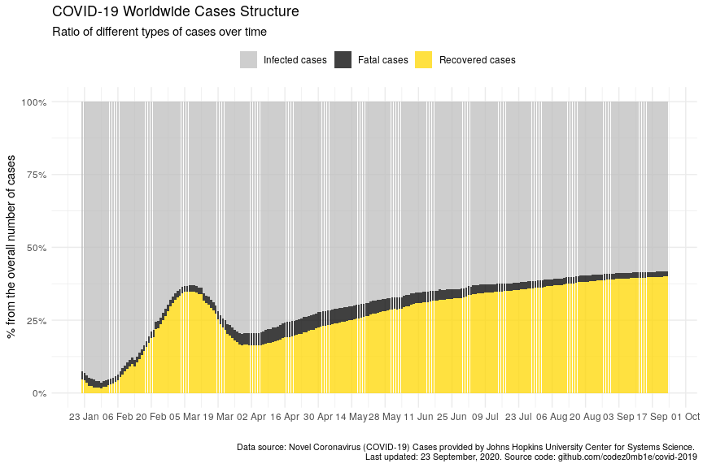
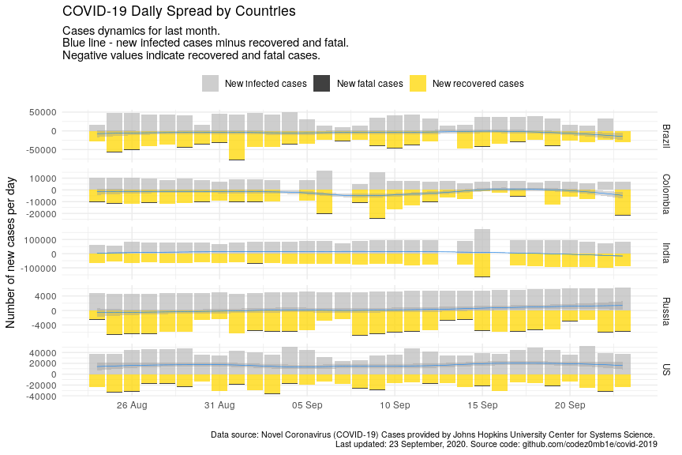

COVID-19 Analytics
================
14 April, 2020

#### Table of contents

  - [Load datasets](#load-datasets)
      - [Load COVID-19 spread data](#load-covid-19-spread-data)
      - [Load world population data](#load-world-population-data)
  - [Preprocessing datasets](#preprocessing-datasets)
      - [Preprocessing COVID-19 spread
        data](#preprocessing-covid-19-spread-data)
      - [Preprocessing world population
        data](#preprocessing-world-population-data)
  - [COVID-19 worldwide spread](#covid-19-worldwide-spread)
      - [Total infected, recovered, and fatal
        cases](#total-infected,-recovered,-and-fatal-cases)
      - [Dynamics of spread](#dynamics-of-spread)
      - [Disease cases structure](#disease-cases-structure)
      - [Dynamics of daily cases](#dynamics-of-daily-cases)
  - [COVID-19 spread by countries](#covid-19-spread-by-countries)
      - [Infected, recovered, fatal, and active
        cases](#infected,-recovered,-fatal,-and-active-cases)
      - [Dynamics of spread](#dynamics-of-spread)
      - [Dynamics of daily cases](#dynamics-of-daily-cases)
      - [Mortality rate](#mortality-rate)
  - [COVID-19 spread by countries
    population](#covid-19-spread-by-countries-population)
      - [TOPs countries by infected, active, and fatal
        cases](#tops-countries-by-infected,-active,-and-fatal-cases)
          - [by infected cases](#by-infected-cases)
          - [by active cases](#by-active-cases)
          - [by fatal cases](#by-fatal-cases)
      - [Active cases per 1 million population vs number of days since
        100th infected
        case](#active-cases-per-1-million-population-vs-number-of-days-since-100th-infected-case)
      - [Active cases per 1 million population vs number of days since
        10th fatal
        case](#active-cases-per-1-million-population-vs-number-of-days-since-10th-fatal-case)

## Load datasets

### Load COVID-19 spread data

Get list of files in datasets
    container:

    ## [1] "COVID19_line_list_data.csv"            "COVID19_open_line_list.csv"           
    ## [3] "covid_19_data.csv"                     "time_series_covid_19_confirmed.csv"   
    ## [5] "time_series_covid_19_confirmed_US.csv" "time_series_covid_19_deaths.csv"      
    ## [7] "time_series_covid_19_deaths_US.csv"    "time_series_covid_19_recovered.csv"

Load `covid_19_data.csv` dataset:

    ## # A tibble: 100 x 8
    ##      SNo ObservationDate Province.State Country.Region Last.Update        Confirmed Deaths Recovered
    ##    <int> <chr>           <chr>          <chr>          <chr>                  <dbl>  <dbl>     <dbl>
    ##  1  6476 03/18/2020      <NA>           Greece         2020-03-18T16:59:…       418      5         8
    ##  2  1469 02/14/2020      <NA>           Russia         2020-02-12T14:43:…         2      0         2
    ##  3  8592 03/25/2020      <NA>           Kazakhstan     2020-03-25 23:37:…        81      0         0
    ##  4  9860 03/29/2020      <NA>           Paraguay       3/8/20 5:31               59      3         1
    ##  5  2575 02/27/2020      Boston, MA     US             2020-02-01T19:43:…         1      0         0
    ##  6  4767 03/11/2020      Hong Kong      Hong Kong      2020-03-11T18:52:…       126      3        65
    ##  7   442 01/31/2020      Jiangsu        Mainland China 1/31/2020 23:59          168      0         5
    ##  8  8234 03/24/2020      <NA>           Bulgaria       2020-03-24 23:41:…       218      3         3
    ##  9  9537 03/28/2020      <NA>           Nepal          3/8/20 5:31                5      0         1
    ## 10  4695 03/10/2020      <NA>           Nepal          2020-03-10T08:33:…         1      0         1
    ## # … with 90 more rows

### Load world population data

Get datasets
    list:

    ## [1] "countries.csv"            "__MACOSX/"                "__MACOSX/._countries.csv"

Load `countries.csv` dataset:

    ## # A tibble: 169 x 14
    ##    iso_alpha2 iso_alpha3 iso_numeric name  official_name ccse_name density fertility_rate land_area
    ##    <chr>      <chr>            <int> <chr> <chr>         <chr>       <int>          <dbl>     <int>
    ##  1 AF         AFG                  4 Afgh… Islamic Repu… Afghanis…      60            4.6    652860
    ##  2 AL         ALB                  8 Alba… Republic of … Albania       105            1.6     27400
    ##  3 DZ         DZA                 12 Alge… People's Dem… Algeria        18            3.1   2381740
    ##  4 AD         AND                 20 Ando… Principality… Andorra       164           NA         470
    ##  5 AO         AGO                 24 Ango… Republic of … Angola         26            5.6   1246700
    ##  6 AG         ATG                 28 Anti… Antigua and … Antigua …     223            2         440
    ##  7 AR         ARG                 32 Arge… Argentine Re… Argentina      17            2.3   2736690
    ##  8 AM         ARM                 51 Arme… Republic of … Armenia       104            1.8     28470
    ##  9 AU         AUS                 36 Aust… Australia     Australia       3            1.8   7682300
    ## 10 AT         AUT                 40 Aust… Republic of … Austria       109            1.5     82409
    ## # … with 159 more rows, and 5 more variables: median_age <dbl>, migrants <dbl>, population <int>,
    ## #   urban_pop_rate <dbl>, world_share <dbl>

## Preprocessing datasets

### Preprocessing COVID-19 spread data

Set `area` column, processing `province_state` columns, and format dates
columns:

    ## # A tibble: 14,811 x 5
    ##    area          country        province_state observation_date confirmed
    ##    <fct>         <chr>          <chr>          <date>               <dbl>
    ##  1 US            US             New York       2020-04-13          195749
    ##  2 Rest of World Spain          <NA>           2020-04-13          170099
    ##  3 Rest of World Italy          <NA>           2020-04-13          159516
    ##  4 Rest of World France         <NA>           2020-04-13          136779
    ##  5 Rest of World Germany        <NA>           2020-04-13          130072
    ##  6 Rest of World UK             <NA>           2020-04-13           88621
    ##  7 Rest of World Iran           <NA>           2020-04-13           73303
    ##  8 Hubei         Mainland China Hubei          2020-04-13           67803
    ##  9 US            US             New Jersey     2020-04-13           64584
    ## 10 Rest of World Turkey         <NA>           2020-04-13           61049
    ## # … with 14,801 more rows

Get dataset structure after preprocessing:

|                                                  |            |
| :----------------------------------------------- | :--------- |
| Name                                             | Piped data |
| Number of rows                                   | 14811      |
| Number of columns                                | 9          |
| \_\_\_\_\_\_\_\_\_\_\_\_\_\_\_\_\_\_\_\_\_\_\_   |            |
| Column type frequency:                           |            |
| character                                        | 2          |
| Date                                             | 1          |
| factor                                           | 1          |
| numeric                                          | 4          |
| POSIXct                                          | 1          |
| \_\_\_\_\_\_\_\_\_\_\_\_\_\_\_\_\_\_\_\_\_\_\_\_ |            |
| Group variables                                  | None       |

Data summary

**Variable type:
character**

| skim\_variable  | n\_missing | complete\_rate | min | max | empty | n\_unique | whitespace |
| :-------------- | ---------: | -------------: | --: | --: | ----: | --------: | ---------: |
| province\_state |       7289 |           0.51 |   2 |  43 |     0 |       295 |          0 |
| country         |          0 |           1.00 |   2 |  32 |     0 |       220 |          1 |

**Variable type:
Date**

| skim\_variable    | n\_missing | complete\_rate | min        | max        | median     | n\_unique |
| :---------------- | ---------: | -------------: | :--------- | :--------- | :--------- | --------: |
| observation\_date |          0 |              1 | 2020-01-22 | 2020-04-13 | 2020-03-21 |        83 |

**Variable type:
factor**

| skim\_variable | n\_missing | complete\_rate | ordered | n\_unique | top\_counts                             |
| :------------- | ---------: | -------------: | :------ | --------: | :-------------------------------------- |
| area           |          0 |              1 | FALSE   |         4 | Res: 9336, US: 2904, Chi: 2488, Hub: 83 |

**Variable type:
numeric**

| skim\_variable | n\_missing | complete\_rate |    mean |       sd | p0 |    p25 |  p50 |     p75 |   p100 | hist  |
| :------------- | ---------: | -------------: | ------: | -------: | -: | -----: | ---: | ------: | -----: | :---- |
| sno            |          0 |              1 | 7406.00 |  4275.71 |  1 | 3703.5 | 7406 | 11108.5 |  14811 | ▇▇▇▇▇ |
| confirmed      |          0 |              1 | 1972.96 | 10807.78 |  0 |    6.0 |   69 |   458.0 | 195749 | ▇▁▁▁▁ |
| deaths         |          0 |              1 |  102.04 |   872.42 |  0 |    0.0 |    0 |     5.0 |  20465 | ▇▁▁▁▁ |
| recovered      |          0 |              1 |  481.57 |  3993.91 |  0 |    0.0 |    1 |    34.0 |  64727 | ▇▁▁▁▁ |

**Variable type:
POSIXct**

| skim\_variable | n\_missing | complete\_rate | min                 | max                 | median              | n\_unique |
| :------------- | ---------: | -------------: | :------------------ | :------------------ | :------------------ | --------: |
| last\_update   |          0 |              1 | 2020-01-22 17:00:00 | 2020-04-13 23:15:42 | 2020-03-16 14:38:45 |      1823 |

### Preprocessing world population data

Get unmatched countries:

    ## # A tibble: 57 x 2
    ##    country                  n
    ##    <chr>                <dbl>
    ##  1 Mainland China     5239552
    ##  2 UK                  924195
    ##  3 South Korea         390737
    ##  4 Czech Republic       90833
    ##  5 Others               26228
    ##  6 Hong Kong            21574
    ##  7 Diamond Princess     14240
    ##  8 Taiwan                9335
    ##  9 Ivory Coast           5837
    ## 10 West Bank and Gaza    3734
    ## # … with 47 more rows

Correct top of unmached countries.

And updated matching:

    ## # A tibble: 52 x 2
    ##    country                n
    ##    <chr>              <dbl>
    ##  1 Others             26228
    ##  2 Hong Kong          21574
    ##  3 Diamond Princess   14240
    ##  4 Ivory Coast         5837
    ##  5 West Bank and Gaza  3734
    ##  6 Kosovo              3000
    ##  7 Macau               1455
    ##  8 Mali                 936
    ##  9 Burma                409
    ## 10 Guinea-Bissau        365
    ## # … with 42 more rows

Much better :)

## COVID-19 worldwide spread

***Analyze COVID-19 worldwide spread.***

### Total infected, recovered, and fatal cases

View spread statistics:

    ## # A tibble: 83 x 9
    ##    observation_date active_total active_total_de… confirmed_total confirmed_total… recovered_total
    ##    <date>                  <dbl> <chr>                      <dbl> <chr>                      <dbl>
    ##  1 2020-04-13            1349182 2.92%                    1917320 3.83%                     448655
    ##  2 2020-04-12            1310868 3.96%                    1846680 4.24%                     421722
    ##  3 2020-04-11            1260901 3.94%                    1771514 4.72%                     402110
    ##  4 2020-04-10            1213098 5.86%                    1691719 6.04%                     376096
    ##  5 2020-04-09            1145920 4.74%                    1595350 5.58%                     353975
    ##  6 2020-04-08            1094105 4.78%                    1511104 5.96%                     328661
    ##  7 2020-04-07            1044177 5.05%                    1426096 6.02%                     300054
    ##  8 2020-04-06             994021 5.44%                    1345101 5.74%                     276515
    ##  9 2020-04-05             942729 6.32%                    1272115 6.24%                     260012
    ## 10 2020-04-04             886650 9.28%                    1197408 9.26%                     246152
    ## # … with 73 more rows, and 3 more variables: recovered_total_delta <chr>, deaths_total <dbl>,
    ## #   deaths_total_delta <chr>

### Dynamics of spread

    ## `geom_smooth()` using formula 'y ~ x'

<!-- -->

    ## `geom_smooth()` using formula 'y ~ x'

<!-- -->

### Disease cases structure

<!-- -->

<!-- -->

### Dynamics of daily cases

Get daily dynamics of new infected and recovered cases.

World daily spread:

    ## Selecting by active_total_per_day

    ## # A tibble: 7 x 5
    ##   observation_date confirmed_total_per_… deaths_total_per_d… recovered_total_per… active_total_per_…
    ##   <date>                           <dbl>               <dbl>                <dbl>              <dbl>
    ## 1 2020-04-10                       96369                7070                22121              67178
    ## 2 2020-04-05                       74707                4768                13860              56079
    ## 3 2020-04-04                      101491                5819                20356              75316
    ## 4 2020-04-03                       82614                5804                15533              61277
    ## 5 2020-04-02                       80698                6174                17092              57432
    ## 6 2020-03-31                       75098                4525                13468              57105
    ## 7 2020-03-28                       67402                3454                 8500              55448

    ## `geom_smooth()` using formula 'y ~ x'

<!-- -->

    ## `geom_smooth()` using formula 'y ~ x'

<!-- -->

## COVID-19 spread by countries

***Analyze COVID-19 spread y countries.***

### Infected, recovered, fatal, and active cases

Calculate number of infected, recovered, fatal, and active (infected
cases minus recovered and fatal) cases grouped by country:

Get countries ordered by total active cases:

    ## # A tibble: 3,267 x 10
    ##    country observation_date active_total active_total_de… confirmed_total confirmed_total…
    ##    <chr>   <date>                  <dbl> <chr>                      <dbl> <chr>           
    ##  1 US      2020-04-13             513608 2.66%                     580619 4.56%           
    ##  2 Italy   2020-04-13             103616 1.33%                     159516 2.02%           
    ##  3 France  2020-04-13              94888 3.38%                     137875 3.15%           
    ##  4 Spain   2020-04-13              87616 0.44%                     170099 1.96%           
    ##  5 United… 2020-04-13              77919 5.37%                      89570 5.12%           
    ##  6 Germany 2020-04-13              62578 -3.03%                    130072 1.73%           
    ##  7 Turkey  2020-04-13              55796 6.66%                      61049 7.19%           
    ##  8 Nether… 2020-04-13              23582 3.87%                      26710 3.74%           
    ##  9 Iran    2020-04-13              22735 -2.50%                     73303 2.26%           
    ## 10 Brazil  2020-04-13              21929 5.45%                      23430 5.58%           
    ## # … with 3,257 more rows, and 4 more variables: recovered_total <dbl>, recovered_total_delta <chr>,
    ## #   deaths_total <dbl>, deaths_total_delta <chr>

<!-- -->

### Dynamics of spread

    ## `geom_smooth()` using formula 'y ~ x'

<!-- -->

    ## `geom_smooth()` using formula 'y ~ x'

<!-- -->

### Dynamics of daily cases

Get daily dynamics of new infected and recovered cases by countries.

World daily spread:

    ## # A tibble: 3,267 x 6
    ## # Groups:   country [125]
    ##    country  observation_date confirmed_total_p… recovered_total_p… deaths_total_pe… active_total_pe…
    ##    <chr>    <date>                        <dbl>              <dbl>            <dbl>            <dbl>
    ##  1 Afghani… 2020-04-13                       58                  0                3               55
    ##  2 Albania  2020-04-13                       21                 15                0                6
    ##  3 Algeria  2020-04-13                       69                 10               20               39
    ##  4 Andorra  2020-04-13                        8                  0                0                8
    ##  5 Argenti… 2020-04-13                       66                 47                7               12
    ##  6 Armenia  2020-04-13                       26                 14                1               11
    ##  7 Austral… 2020-04-13                       36                  0                1               35
    ##  8 Austria  2020-04-13                       96                356               18             -278
    ##  9 Azerbai… 2020-04-13                       50                 39                1               10
    ## 10 Bahrain  2020-04-13                      225                 33                0              192
    ## # … with 3,257 more rows

    ## `geom_smooth()` using formula 'y ~ x'

<!-- -->

    ## `geom_smooth()` using formula 'y ~ x'

<!-- -->

### Mortality rate

    ## # A tibble: 35 x 8
    ##    country observation_date since_100_confi… since_10_deaths… recovered_total deaths_total
    ##    <chr>   <date>           <date>           <date>                     <dbl>        <dbl>
    ##  1 US      2020-04-13       2020-03-10       2020-03-04                 43482        23529
    ##  2 US      2020-04-12       2020-03-10       2020-03-04                 32988        22020
    ##  3 US      2020-04-11       2020-03-10       2020-03-04                 31270        20463
    ##  4 US      2020-04-10       2020-03-10       2020-03-04                 28790        18586
    ##  5 US      2020-04-09       2020-03-10       2020-03-04                 25410        16478
    ##  6 US      2020-04-08       2020-03-10       2020-03-04                 23559        14695
    ##  7 US      2020-04-07       2020-03-10       2020-03-04                 21763        12722
    ##  8 US      2020-04-06       2020-03-10       2020-03-04                 19581        10783
    ##  9 US      2020-04-05       2020-03-10       2020-03-04                 17448         9619
    ## 10 US      2020-04-04       2020-03-10       2020-03-04                 14652         8407
    ## # … with 25 more rows, and 2 more variables: confirmed_deaths_rate <dbl>,
    ## #   recovered_deaths_rate <dbl>

<!-- -->

<!-- -->

<!-- -->

## COVID-19 spread by countries population

    ## # A tibble: 28 x 5
    ##    country n_days_since_100_confirmed population confirmed_total confirmed_total_per_1M
    ##    <chr>                        <dbl>      <int>           <dbl>                  <dbl>
    ##  1 Russia                          27  145934462           18328                  126. 
    ##  2 Russia                          26  145934462           15770                  108. 
    ##  3 Russia                          25  145934462           13584                   93.1
    ##  4 Russia                          24  145934462           11917                   81.7
    ##  5 Russia                          23  145934462           10131                   69.4
    ##  6 Russia                          22  145934462            8672                   59.4
    ##  7 Russia                          21  145934462            7497                   51.4
    ##  8 Russia                          20  145934462            6343                   43.5
    ##  9 Russia                          19  145934462            5389                   36.9
    ## 10 Russia                          18  145934462            4731                   32.4
    ## # … with 18 more rows

### TOPs countries by infected, active, and fatal cases

Calculate countries stats whose populations were most affected by the
virus:

#### …by infected cases

    ## # A tibble: 69 x 6
    ##    country   population confirmed_total confirmed_total_pe… n_days_since_100_co… n_days_since_10th_…
    ##    <chr>          <int>           <dbl>               <dbl>                <dbl>               <dbl>
    ##  1 Spain       46754778          170099               3638.                   42                  36
    ##  2 Switzerl…    8654622           25688               2968.                   39                  31
    ##  3 Belgium     11589623           30589               2639.                   38                  26
    ##  4 Italy       60461826          159516               2638.                   50                  47
    ##  5 Ireland      4937786           10647               2156.                   30                  18
    ##  6 France      65273511          137875               2112.                   43                  37
    ##  7 US         331002651          580619               1754.                   34                  40
    ##  8 Portugal    10196709           16934               1661.                   31                  23
    ##  9 Austria      9006398           14041               1559.                   36                  22
    ## 10 Netherla…   17134872           26710               1559.                   38                  30
    ## # … with 59 more rows

#### …by active cases

    ## # A tibble: 69 x 6
    ##    country    population active_total active_total_per_… n_days_since_100_conf… n_days_since_10th_d…
    ##    <chr>           <int>        <dbl>              <dbl>                  <dbl>                <dbl>
    ##  1 Ireland       4937786        10257              2077.                     30                   18
    ##  2 Spain        46754778        87616              1874.                     42                   36
    ##  3 Belgium      11589623        19979              1724.                     38                   26
    ##  4 Italy        60461826       103616              1714.                     50                   47
    ##  5 Portugal     10196709        16122              1581.                     31                   23
    ##  6 US          331002651       513608              1552.                     34                   40
    ##  7 France       65273511        94888              1454.                     43                   37
    ##  8 Netherlan…   17134872        23582              1376.                     38                   30
    ##  9 Switzerla…    8654622        10850              1254.                     39                   31
    ## 10 Norway        5421241         6437              1187.                     38                   20
    ## # … with 59 more rows

#### …by fatal cases

    ## # A tibble: 69 x 6
    ##    country     population deaths_total deaths_total_per_… n_days_since_100_con… n_days_since_10th_d…
    ##    <chr>            <int>        <dbl>              <dbl>                 <dbl>                <dbl>
    ##  1 Spain         46754778        17756              380.                     42                   36
    ##  2 Italy         60461826        20465              338.                     50                   47
    ##  3 Belgium       11589623         3903              337.                     38                   26
    ##  4 France        65273511        14986              230.                     43                   37
    ##  5 United Kin…   67886011        11347              167.                     39                   30
    ##  6 Netherlands   17134872         2833              165.                     38                   30
    ##  7 Switzerland    8654622         1138              131.                     39                   31
    ##  8 Sweden        10099265          919               91.0                    38                   25
    ##  9 Ireland        4937786          365               73.9                    30                   18
    ## 10 US           331002651        23529               71.1                    34                   40
    ## # … with 59 more rows

### Active cases per 1 million population vs number of days since 100th infected case

Select countries to
    monitoring:

    ##  [1] "Belgium"        "France"         "Ireland"        "Italy"          "Netherlands"   
    ##  [6] "Norway"         "Portugal"       "Spain"          "Switzerland"    "US"            
    ## [11] "Russia"         "Mainland China" "Korea, South"

<!-- -->

### Active cases per 1 million population vs number of days since 10th fatal case

<!-- -->

***Stay healthy. Help the sick.***
