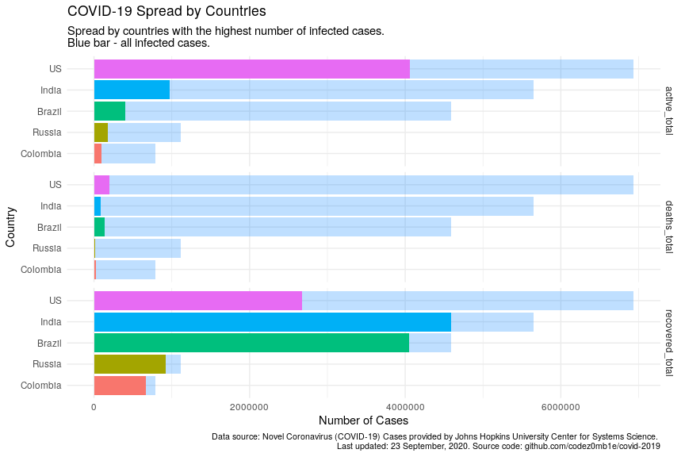

COVID-19 Analytics
================
06 April, 2020

## Load COVID-19 data

Get list of files in datasets
    container:

    ## [1] "COVID19_line_list_data.csv"            "COVID19_open_line_list.csv"           
    ## [3] "covid_19_data.csv"                     "time_series_covid_19_confirmed.csv"   
    ## [5] "time_series_covid_19_confirmed_US.csv" "time_series_covid_19_deaths.csv"      
    ## [7] "time_series_covid_19_deaths_US.csv"    "time_series_covid_19_recovered.csv"

Load `covid_19_data.csv` dataset:

    ## # A tibble: 100 x 8
    ##      SNo ObservationDate Province.State     Country.Region Last.Update    Confirmed Deaths Recovered
    ##    <int> <chr>           <chr>              <chr>          <chr>              <dbl>  <dbl>     <dbl>
    ##  1 10423 03/31/2020      <NA>               Grenada        2020-03-31 23…         9      0         0
    ##  2  4223 03/08/2020      Santa Rosa County… US             2020-03-08T15…         1      1         0
    ##  3  8133 03/23/2020      Jiangxi            Mainland China 2020-03-23 23…       936      1       934
    ##  4  8760 03/25/2020      New York           US             2020-03-25 23…     30841    285         0
    ##  5  9891 03/29/2020      <NA>               Tanzania       2020-03-29 23…        14      0         1
    ##  6   242 01/27/2020      Hong Kong          Hong Kong      1/27/20 23:59          8      0         0
    ##  7  4643 03/10/2020      Kentucky           US             2020-03-10T02…         6      0         0
    ##  8  1712 02/17/2020      Orange, CA         US             2020-02-01T19…         1      0         0
    ##  9   700 02/04/2020      Hunan              Mainland China 2020-02-04T14…       593      0        31
    ## 10 10863 04/01/2020      Channel Islands    UK             2020-04-01 22…       172      3         0
    ## # … with 90 more rows

## Preprocessing COVID-19 data

Set `area` column, processing `province_state` columns, and format dates
columns:

    ## # A tibble: 12,249 x 5
    ##    area          country_region province_state observation_date confirmed
    ##    <fct>         <chr>          <chr>          <date>               <dbl>
    ##  1 Rest of World Spain          <NA>           2020-04-05          131646
    ##  2 Rest of World Italy          <NA>           2020-04-05          128948
    ##  3 US            US             New York       2020-04-05          123160
    ##  4 Rest of World Germany        <NA>           2020-04-05          100123
    ##  5 Rest of World France         <NA>           2020-04-05           92839
    ##  6 Hubei         Mainland China Hubei          2020-04-05           67803
    ##  7 Rest of World Iran           <NA>           2020-04-05           58226
    ##  8 Rest of World UK             <NA>           2020-04-05           47806
    ##  9 US            US             New Jersey     2020-04-05           37505
    ## 10 Rest of World Turkey         <NA>           2020-04-05           27069
    ## # … with 12,239 more rows

Get dataset structure after preprocessing:

|                                                  |            |
| :----------------------------------------------- | :--------- |
| Name                                             | Piped data |
| Number of rows                                   | 12249      |
| Number of columns                                | 9          |
| \_\_\_\_\_\_\_\_\_\_\_\_\_\_\_\_\_\_\_\_\_\_\_   |            |
| Column type frequency:                           |            |
| character                                        | 2          |
| Date                                             | 1          |
| factor                                           | 1          |
| numeric                                          | 4          |
| POSIXct                                          | 1          |
| \_\_\_\_\_\_\_\_\_\_\_\_\_\_\_\_\_\_\_\_\_\_\_\_ |            |
| Group variables                                  | None       |

Data summary

**Variable type:
character**

| skim\_variable  | n\_missing | complete\_rate | min | max | empty | n\_unique | whitespace |
| :-------------- | ---------: | -------------: | --: | --: | ----: | --------: | ---------: |
| province\_state |       5845 |           0.52 |   2 |  43 |     0 |       294 |          0 |
| country\_region |          0 |           1.00 |   2 |  32 |     0 |       218 |          1 |

**Variable type:
Date**

| skim\_variable    | n\_missing | complete\_rate | min        | max        | median     | n\_unique |
| :---------------- | ---------: | -------------: | :--------- | :--------- | :--------- | --------: |
| observation\_date |          0 |              1 | 2020-01-22 | 2020-04-05 | 2020-03-16 |        75 |

**Variable type:
factor**

| skim\_variable | n\_missing | complete\_rate | ordered | n\_unique | top\_counts                             |
| :------------- | ---------: | -------------: | :------ | --------: | :-------------------------------------- |
| area           |          0 |              1 | FALSE   |         4 | Res: 7486, US: 2440, Chi: 2248, Hub: 75 |

**Variable type:
numeric**

| skim\_variable | n\_missing | complete\_rate |    mean |      sd | p0 |  p25 |  p50 |  p75 |   p100 | hist  |
| :------------- | ---------: | -------------: | ------: | ------: | -: | ---: | ---: | ---: | -----: | :---- |
| sno            |          0 |              1 | 6125.00 | 3536.13 |  1 | 3063 | 6125 | 9187 |  12249 | ▇▇▇▇▇ |
| confirmed      |          0 |              1 | 1315.72 | 7771.56 |  0 |    4 |   44 |  301 | 131646 | ▇▁▁▁▁ |
| deaths         |          0 |              1 |   59.31 |  559.66 |  0 |    0 |    0 |    3 |  15887 | ▇▁▁▁▁ |
| recovered      |          0 |              1 |  344.91 | 3257.03 |  0 |    0 |    1 |   18 |  63945 | ▇▁▁▁▁ |

**Variable type:
POSIXct**

| skim\_variable | n\_missing | complete\_rate | min                 | max                 | median              | n\_unique |
| :------------- | ---------: | -------------: | :------------------ | :------------------ | :------------------ | --------: |
| last\_update   |          0 |              1 | 2020-01-22 17:00:00 | 2020-04-05 23:13:44 | 2020-03-14 22:33:03 |      1818 |

## COVID-19 spread

Calculate total infected, recovered, and fatal cases:

### Wordwide spread

Last week statistics:

    ## # A tibble: 75 x 9
    ##    observation_date active_total active_total_de… confirmed_total confirmed_total… recovered_total
    ##    <date>                  <dbl> <chr>                      <dbl> <chr>                      <dbl>
    ##  1 2020-04-05             942729 6.33%                    1272115 6.24%                     260012
    ##  2 2020-04-04             886647 9.28%                    1197405 9.26%                     246152
    ##  3 2020-04-03             811334 8.19%                    1095917 8.17%                     225796
    ##  4 2020-04-02             749911 8.27%                    1013157 8.64%                     210263
    ##  5 2020-04-01             692619 8.67%                     932605 8.76%                     193177
    ##  6 2020-03-31             637346 9.85%                     857487 9.60%                     178034
    ##  7 2020-03-30             580217 8.03%                     782365 8.64%                     164566
    ##  8 2020-03-29             537110 9.47%                     720117 8.99%                     149082
    ##  9 2020-03-28             490639 12.74%                    660706 11.36%                    139415
    ## 10 2020-03-27             435178 13.48%                    593291 12.03%                    130915
    ## # … with 65 more rows, and 3 more variables: recovered_total_delta <chr>, deaths_total <dbl>,
    ## #   deaths_total_delta <chr>

    ## `geom_smooth()` using formula 'y ~ x'

<!-- -->

<!-- -->

### Spread by country

    ## # A tibble: 6,430 x 10
    ## # Groups:   country_region [218]
    ##    country_region observation_date active_total active_total_de… confirmed_total confirmed_total…
    ##    <chr>          <date>                  <dbl> <chr>                      <dbl> <chr>           
    ##  1 US             2020-04-05             310005 8.47%                     337072 9.14%           
    ##  2 Italy          2020-04-05              91246 3.37%                     128948 3.46%           
    ##  3 Spain          2020-04-05              80925 1.15%                     131646 4.34%           
    ##  4 Germany        2020-04-05              69839 2.33%                     100123 4.19%           
    ##  5 France         2020-04-05              69331 2.41%                      93773 3.22%           
    ##  6 UK             2020-04-05              43264 14.03%                     48436 14.03%          
    ##  7 Iran           2020-04-05              34887 7.16%                      58226 4.45%           
    ##  8 Turkey         2020-04-05              25453 12.39%                     27069 13.10%          
    ##  9 Netherlands    2020-04-05              15925 7.54%                      17953 7.33%           
    ## 10 Belgium        2020-04-05              14493 4.26%                      19691 6.84%           
    ## # … with 6,420 more rows, and 4 more variables: recovered_total <dbl>, recovered_total_delta <chr>,
    ## #   deaths_total <dbl>, deaths_total_delta <chr>

<!-- -->

## COVID-19 daily spread

Get daily dynamics of new infected and recovered cases.

### World daily spread

    ## Selecting by active_total_per_day

    ## # A tibble: 7 x 9
    ##   observation_date confirmed_total deaths_total recovered_total active_total confirmed_total…
    ##   <date>                     <dbl>        <dbl>           <dbl>        <dbl>            <dbl>
    ## 1 2020-04-05               1272115        69374          260012       942729            74710
    ## 2 2020-04-04               1197405        64606          246152       886647           101488
    ## 3 2020-04-03               1095917        58787          225796       811334            82760
    ## 4 2020-04-02               1013157        52983          210263       749911            80552
    ## 5 2020-04-01                932605        46809          193177       692619            75118
    ## 6 2020-03-31                857487        42107          178034       637346            75122
    ## 7 2020-03-28                660706        30652          139415       490639            67415
    ## # … with 3 more variables: deaths_total_per_day <dbl>, recovered_total_per_day <dbl>,
    ## #   active_total_per_day <dbl>

    ## `geom_smooth()` using formula 'y ~ x'

<!-- -->

### Countries daily spread

    ## # A tibble: 7 x 10
    ##   country_region observation_date confirmed_total deaths_total recovered_total active_total
    ##   <chr>          <date>                     <dbl>        <dbl>           <dbl>        <dbl>
    ## 1 India          2020-04-05                  3588           99             229         3260
    ## 2 India          2020-04-04                  3082           86             229         2767
    ## 3 India          2020-04-03                  2567           72             192         2303
    ## 4 India          2020-04-02                  2543           72             191         2280
    ## 5 India          2020-04-01                  1998           58             148         1792
    ## 6 India          2020-03-31                  1397           35             123         1239
    ## 7 India          2020-03-30                  1251           32             102         1117
    ## # … with 4 more variables: confirmed_total_per_day <dbl>, deaths_total_per_day <dbl>,
    ## #   recovered_total_per_day <dbl>, active_total_per_day <dbl>

Top 5 countries with the largest number of infected people:

    ## # A tibble: 5 x 1
    ##   value         
    ##   <chr>         
    ## 1 Germany       
    ## 2 Italy         
    ## 3 Mainland China
    ## 4 Spain         
    ## 5 US

    ## `geom_smooth()` using formula 'y ~ x'

<!-- -->

## COVID-19 mortality rate

### Prepare data

    ## # A tibble: 31 x 7
    ##    area  observation_date reference_date recovered_total deaths_total confirmed_death…
    ##    <fct> <date>           <date>                   <dbl>        <dbl>            <dbl>
    ##  1 US    2020-04-05       2020-03-06               17448         9619           0.0285
    ##  2 US    2020-04-04       2020-03-06               14652         8407           0.0272
    ##  3 US    2020-04-03       2020-03-06                9707         7087           0.0257
    ##  4 US    2020-04-02       2020-03-06                9001         5926           0.0243
    ##  5 US    2020-04-01       2020-03-06                8474         4757           0.0223
    ##  6 US    2020-03-31       2020-03-06                7024         3873           0.0206
    ##  7 US    2020-03-30       2020-03-06                5644         2978           0.0184
    ##  8 US    2020-03-29       2020-03-06                2665         2467           0.0175
    ##  9 US    2020-03-28       2020-03-06                1072         2026           0.0167
    ## 10 US    2020-03-27       2020-03-06                 869         1581           0.0156
    ## # … with 21 more rows, and 1 more variable: recovered_deaths_rate <dbl>

### Visualize

<!-- -->

    ## Warning: Use of `mortality_df$confirmed_deaths_rate` is discouraged. Use `confirmed_deaths_rate`
    ## instead.

<!-- -->

    ## Warning: Use of `mortality_df$recovered_deaths_rate` is discouraged. Use `recovered_deaths_rate`
    ## instead.

<!-- -->

## Enrich COVID dataset with world population

### Load world population

Get datasets
    list:

    ## [1] "metadata_country.csv"   "metadata_indicator.csv" "population_clean.csv"  
    ## [4] "population_raw.csv"

Load world population dataset:

    ## Warning: 'skim_to_wide' is deprecated.
    ## Use 'skim()' instead.
    ## See help("Deprecated")

|                                                  |       |
| :----------------------------------------------- | :---- |
| Name                                             | .data |
| Number of rows                                   | 264   |
| Number of columns                                | 61    |
| \_\_\_\_\_\_\_\_\_\_\_\_\_\_\_\_\_\_\_\_\_\_\_   |       |
| Column type frequency:                           |       |
| character                                        | 2     |
| numeric                                          | 59    |
| \_\_\_\_\_\_\_\_\_\_\_\_\_\_\_\_\_\_\_\_\_\_\_\_ |       |
| Group variables                                  | None  |

Data summary

**Variable type:
character**

| skim\_variable | n\_missing | complete\_rate | min | max | empty | n\_unique | whitespace |
| :------------- | ---------: | -------------: | --: | --: | ----: | --------: | ---------: |
| Country.Name   |          0 |              1 |   4 |  52 |     0 |       264 |          0 |
| Country.Code   |          0 |              1 |   3 |   3 |     0 |       264 |          0 |

**Variable type:
numeric**

| skim\_variable | n\_missing | complete\_rate |      mean |        sd |    p0 |       p25 |      p50 |      p75 |       p100 | hist  |
| :------------- | ---------: | -------------: | --------: | --------: | ----: | --------: | -------: | -------: | ---------: | :---- |
| X1960          |          4 |           0.98 | 118066400 | 373094241 |  3893 |  502290.8 |  3658470 | 25326714 | 3032019978 | ▇▁▁▁▁ |
| X1961          |          4 |           0.98 | 119648669 | 377562097 |  3989 |  510963.5 |  3738358 | 26114516 | 3073077563 | ▇▁▁▁▁ |
| X1962          |          4 |           0.98 | 121763970 | 384127817 |  4076 |  520655.2 |  3821016 | 26904107 | 3126066253 | ▇▁▁▁▁ |
| X1963          |          4 |           0.98 | 124396921 | 392684664 |  4183 |  531158.8 |  3926268 | 27664156 | 3191186048 | ▇▁▁▁▁ |
| X1964          |          4 |           0.98 | 127050218 | 401284372 |  4308 |  542128.5 |  4051891 | 28399335 | 3256700083 | ▇▁▁▁▁ |
| X1965          |          4 |           0.98 | 129768943 | 410119796 |  4468 |  553335.8 |  4180652 | 29136761 | 3323623700 | ▇▁▁▁▁ |
| X1966          |          4 |           0.98 | 132632086 | 419522073 |  4685 |  564751.0 |  4275565 | 29886078 | 3393699205 | ▇▁▁▁▁ |
| X1967          |          4 |           0.98 | 135485895 | 428862102 |  4920 |  582360.0 |  4344568 | 30595026 | 3463147267 | ▇▁▁▁▁ |
| X1968          |          4 |           0.98 | 138391981 | 438414589 |  5193 |  598108.0 |  4415026 | 31202390 | 3533536526 | ▇▁▁▁▁ |
| X1969          |          4 |           0.98 | 141441535 | 448454661 |  5459 |  610004.0 |  4455048 | 31795274 | 3608235815 | ▇▁▁▁▁ |
| X1970          |          4 |           0.98 | 144535096 | 458692922 |  5712 |  624190.8 |  4524434 | 32346695 | 3683676306 | ▇▁▁▁▁ |
| X1971          |          4 |           0.98 | 147708051 | 469188729 |  5766 |  639975.0 |  4619667 | 32808301 | 3761307048 | ▇▁▁▁▁ |
| X1972          |          4 |           0.98 | 150841883 | 479502906 |  5790 |  657318.5 |  4718924 | 33168089 | 3837726171 | ▇▁▁▁▁ |
| X1973          |          4 |           0.98 | 153954394 | 489733786 |  5822 |  676210.8 |  4835192 | 33543687 | 3913217944 | ▇▁▁▁▁ |
| X1974          |          4 |           0.98 | 157076407 | 499919618 |  5905 |  696617.0 |  4948002 | 33932241 | 3989385034 | ▇▁▁▁▁ |
| X1975          |          4 |           0.98 | 160138274 | 509827244 |  6060 |  718454.0 |  5030640 | 34331580 | 4063806523 | ▇▁▁▁▁ |
| X1976          |          4 |           0.98 | 163150740 | 519530382 |  6323 |  730926.2 |  5113140 | 34729356 | 4136393107 | ▇▁▁▁▁ |
| X1977          |          4 |           0.98 | 166151776 | 529128266 |  6650 |  755654.0 |  5257900 | 35205232 | 4208770941 | ▇▁▁▁▁ |
| X1978          |          4 |           0.98 | 169204175 | 538877317 |  7014 |  771637.8 |  5367789 | 36186828 | 4282341460 | ▇▁▁▁▁ |
| X1979          |          4 |           0.98 | 172329848 | 548859597 |  7358 |  775872.0 |  5491303 | 37202782 | 4357793599 | ▇▁▁▁▁ |
| X1980          |          4 |           0.98 | 175494963 | 558960222 |  7637 |  781296.0 |  5613169 | 37649318 | 4434021975 | ▇▁▁▁▁ |
| X1981          |          4 |           0.98 | 178744689 | 569360845 |  7827 |  790787.5 |  5756905 | 37999785 | 4512268962 | ▇▁▁▁▁ |
| X1982          |          4 |           0.98 | 182125271 | 580271932 |  7956 |  803115.2 |  5909983 | 38321097 | 4593454253 | ▇▁▁▁▁ |
| X1983          |          4 |           0.98 | 185545830 | 591323430 |  8041 |  818670.5 |  6070597 | 38606244 | 4675367633 | ▇▁▁▁▁ |
| X1984          |          4 |           0.98 | 188963318 | 602330556 |  8115 |  839735.8 |  6236056 | 39632250 | 4756998073 | ▇▁▁▁▁ |
| X1985          |          4 |           0.98 | 192448428 | 613555782 |  8219 |  860899.2 |  6400751 | 40690542 | 4840155168 | ▇▁▁▁▁ |
| X1986          |          4 |           0.98 | 196037511 | 625131293 |  8336 |  881903.5 |  6491332 | 41401679 | 4925801334 | ▇▁▁▁▁ |
| X1987          |          4 |           0.98 | 199720010 | 637032430 |  8485 |  903032.2 |  6674338 | 42048575 | 5013576387 | ▇▁▁▁▁ |
| X1988          |          4 |           0.98 | 203443561 | 649044400 |  8637 |  924401.0 |  6810832 | 42712736 | 5102293348 | ▇▁▁▁▁ |
| X1989          |          4 |           0.98 | 207161943 | 660976107 |  8779 |  946270.2 |  6947822 | 43404853 | 5190965222 | ▇▁▁▁▁ |
| X1990          |          2 |           0.99 | 209360607 | 670639333 |  8913 |  996139.5 |  7085706 | 42485762 | 5281340078 | ▇▁▁▁▁ |
| X1991          |          2 |           0.99 | 213004435 | 682229395 |  9026 | 1015708.0 |  7131271 | 42944327 | 5369210095 | ▇▁▁▁▁ |
| X1992          |          3 |           0.99 | 217370237 | 694660447 |  9112 | 1027475.0 |  7295384 | 43747962 | 5453393960 | ▇▁▁▁▁ |
| X1993          |          3 |           0.99 | 220928285 | 705834332 |  9194 | 1060862.0 |  7315865 | 44194628 | 5538448726 | ▇▁▁▁▁ |
| X1994          |          3 |           0.99 | 224452897 | 716914555 |  9252 | 1094212.0 |  7466793 | 44641540 | 5622575421 | ▇▁▁▁▁ |
| X1995          |          2 |           0.99 | 227114487 | 726714679 |  9298 | 1123986.5 |  7556988 | 44795143 | 5707533023 | ▇▁▁▁▁ |
| X1996          |          2 |           0.99 | 230577880 | 737636559 |  9323 | 1141519.8 |  7650240 | 45256562 | 5790454220 | ▇▁▁▁▁ |
| X1997          |          2 |           0.99 | 234033150 | 748536469 |  9323 | 1161344.5 |  7750162 | 45721993 | 5873071768 | ▇▁▁▁▁ |
| X1998          |          1 |           1.00 | 236551035 | 758004966 |  9332 | 1165241.0 |  7860781 | 45948862 | 5954810550 | ▇▁▁▁▁ |
| X1999          |          1 |           1.00 | 239912779 | 768560450 |  9346 | 1188091.5 |  7992324 | 46398877 | 6035284135 | ▇▁▁▁▁ |
| X2000          |          1 |           1.00 | 243248716 | 778969032 |  9394 | 1214830.5 |  8048600 | 47056968 | 6115108363 | ▇▁▁▁▁ |
| X2001          |          1 |           1.00 | 246567574 | 789254894 |  9484 | 1242554.5 |  8111200 | 47899354 | 6194460444 | ▇▁▁▁▁ |
| X2002          |          1 |           1.00 | 249881155 | 799451875 |  9596 | 1265833.0 |  8171950 | 47952336 | 6273526441 | ▇▁▁▁▁ |
| X2003          |          1 |           1.00 | 253210637 | 809639689 |  9726 | 1283432.0 |  8234100 | 48020616 | 6352677699 | ▇▁▁▁▁ |
| X2004          |          1 |           1.00 | 256560990 | 819842682 |  9869 | 1301807.5 |  8306500 | 48323502 | 6432374971 | ▇▁▁▁▁ |
| X2005          |          1 |           1.00 | 259934349 | 830088928 |  9849 | 1320716.0 |  8391850 | 48567242 | 6512602867 | ▇▁▁▁▁ |
| X2006          |          1 |           1.00 | 263331577 | 840360066 |  9828 | 1324685.5 |  8484550 | 48895254 | 6593623202 | ▇▁▁▁▁ |
| X2007          |          1 |           1.00 | 266746587 | 850633097 |  9842 | 1324565.5 |  8581300 | 49370617 | 6675130418 | ▇▁▁▁▁ |
| X2008          |          1 |           1.00 | 270208909 | 861015197 |  9891 | 1386877.5 |  8763400 | 49854556 | 6757887172 | ▇▁▁▁▁ |
| X2009          |          1 |           1.00 | 273694125 | 871479848 |  9939 | 1409218.0 |  9142259 | 50363689 | 6840591577 | ▇▁▁▁▁ |
| X2010          |          1 |           1.00 | 277186142 | 881966984 | 10005 | 1427037.0 |  9378126 | 50908891 | 6922947261 | ▇▁▁▁▁ |
| X2011          |          1 |           1.00 | 280664727 | 892488605 | 10057 | 1449583.5 |  9460830 | 51497394 | 7004011262 | ▇▁▁▁▁ |
| X2012          |          2 |           0.99 | 285287577 | 904711000 | 10279 | 1409857.5 |  9624311 | 52478928 | 7086993625 | ▇▁▁▁▁ |
| X2013          |          2 |           0.99 | 288902278 | 915519111 | 10821 | 1427339.2 |  9746730 | 53230040 | 7170961674 | ▇▁▁▁▁ |
| X2014          |          2 |           0.99 | 292550756 | 926402200 | 10972 | 1444866.2 |  9855382 | 53979695 | 7255653881 | ▇▁▁▁▁ |
| X2015          |          2 |           0.99 | 296214796 | 937310751 | 11099 | 1463188.8 | 10001529 | 54709957 | 7340548192 | ▇▁▁▁▁ |
| X2016          |          2 |           0.99 | 299911439 | 948301949 | 11225 | 1514952.5 | 10124268 | 55415438 | 7426103221 | ▇▁▁▁▁ |
| X2017          |          2 |           0.99 | 303599502 | 959282903 | 11370 | 1577592.0 | 10178999 | 56416315 | 7510990456 | ▇▁▁▁▁ |
| X2018          |          2 |           0.99 | 307230187 | 970013362 | 11508 | 1638404.2 | 10232468 | 57414304 | 7594270356 | ▇▁▁▁▁ |

Select relevant columns:

    ## # A tibble: 264 x 2
    ##    country                             n
    ##    <chr>                           <dbl>
    ##  1 World                      7594270356
    ##  2 IDA & IBRD total           6412522234
    ##  3 Low & middle income        6383958209
    ##  4 Middle income              5678540888
    ##  5 IBRD only                  4772284113
    ##  6 Early-demographic dividend 3249140605
    ##  7 Lower middle income        3022905169
    ##  8 Upper middle income        2655635719
    ##  9 East Asia & Pacific        2328220870
    ## 10 Late-demographic dividend  2288665963
    ## # … with 254 more rows

### Preprocessing

Get unmatched countries:

    ## # A tibble: 18 x 2
    ##    country_region         n
    ##    <chr>              <dbl>
    ##  1 Mainland China   4584317
    ##  2 US               2465785
    ##  3 Iran              792777
    ##  4 UK                359366
    ##  5 South Korea       307336
    ##  6 Russia             32868
    ##  7 Others             26228
    ##  8 Hong Kong          13790
    ##  9 Egypt              12028
    ## 10 Diamond Princess    8544
    ## 11 Taiwan              6279
    ## 12 Slovakia            5672
    ## 13 Brunei              2356
    ## 14 Ivory Coast         2160
    ## 15 Venezuela           2052
    ## 16 Congo (Kinshasa)    1327
    ## 17 Kyrgyzstan          1235
    ## 18 Macau               1097

Correct top of unmached countries.

And updated matching:

    ## # A tibble: 10 x 2
    ##    country_region       n
    ##    <chr>            <dbl>
    ##  1 Others           26228
    ##  2 Diamond Princess  8544
    ##  3 Taiwan            6279
    ##  4 Slovakia          5672
    ##  5 Brunei            2356
    ##  6 Ivory Coast       2160
    ##  7 Venezuela         2052
    ##  8 Congo (Kinshasa)  1327
    ##  9 Kyrgyzstan        1235
    ## 10 Macau             1097

Much better :)

### Infected, recovered, fatal, and active cases

Calculate number of infected, recovered, fatal, and active (infected
cases minus recovered and fatal) cases grouped by country:

View statistics in US:

    ## # A tibble: 75 x 10
    ##    country_region observation_date confirmed_total recovered_total deaths_total active_total
    ##    <chr>          <date>                     <dbl>           <dbl>        <dbl>        <dbl>
    ##  1 US             2020-04-05                337072           17448         9619       310005
    ##  2 US             2020-04-04                308850           14652         8407       285791
    ##  3 US             2020-04-03                275586            9707         7087       258792
    ##  4 US             2020-04-02                243453            9001         5926       228526
    ##  5 US             2020-04-01                213372            8474         4757       200141
    ##  6 US             2020-03-31                188172            7024         3873       177275
    ##  7 US             2020-03-30                161807            5644         2978       153185
    ##  8 US             2020-03-29                140886            2665         2467       135754
    ##  9 US             2020-03-28                121478            1072         2026       118380
    ## 10 US             2020-03-27                101657             869         1581        99207
    ## # … with 65 more rows, and 4 more variables: first_confirmed_date <date>,
    ## #   n_days_since_1st_confirmed <dbl>, first_deaths_case_date <date>, n_days_since_1st_deaths <dbl>

View statistics in Russia:

    ## # A tibble: 66 x 10
    ##    country_region observation_date confirmed_total recovered_total deaths_total active_total
    ##    <chr>          <date>                     <dbl>           <dbl>        <dbl>        <dbl>
    ##  1 Russia         2020-04-05                  5389             355           45         4989
    ##  2 Russia         2020-04-04                  4731             333           43         4355
    ##  3 Russia         2020-04-03                  4149             281           34         3834
    ##  4 Russia         2020-04-02                  3548             235           30         3283
    ##  5 Russia         2020-04-01                  2777             190           24         2563
    ##  6 Russia         2020-03-31                  2337             121           17         2199
    ##  7 Russia         2020-03-30                  1836              66            9         1761
    ##  8 Russia         2020-03-29                  1534              64            8         1462
    ##  9 Russia         2020-03-28                  1264              49            4         1211
    ## 10 Russia         2020-03-27                  1036              45            4          987
    ## # … with 56 more rows, and 4 more variables: first_confirmed_date <date>,
    ## #   n_days_since_1st_confirmed <dbl>, first_deaths_case_date <date>, n_days_since_1st_deaths <dbl>

### Join COVID-19 dataset with world population

    ## # A tibble: 66 x 5
    ##    country_region n_days_since_1st_confirmed population_n confirmed_total confirmed_total_per_1M
    ##    <chr>                               <dbl>        <dbl>           <dbl>                  <dbl>
    ##  1 Russia                                 65    144478050            5389                  37.3 
    ##  2 Russia                                 64    144478050            4731                  32.7 
    ##  3 Russia                                 63    144478050            4149                  28.7 
    ##  4 Russia                                 62    144478050            3548                  24.6 
    ##  5 Russia                                 61    144478050            2777                  19.2 
    ##  6 Russia                                 60    144478050            2337                  16.2 
    ##  7 Russia                                 59    144478050            1836                  12.7 
    ##  8 Russia                                 58    144478050            1534                  10.6 
    ##  9 Russia                                 57    144478050            1264                   8.75
    ## 10 Russia                                 56    144478050            1036                   7.17
    ## # … with 56 more rows

### TOPs countries by infected, active, and fatal cases

Calculate countries stats whose populations were most affected by the
virus:

#### Top countries by infected cases

    ## # A tibble: 57 x 5
    ##    country_region population_n confirmed_total confirmed_total_per_1M n_days_since_1st_confirmed
    ##    <chr>                 <dbl>           <dbl>                  <dbl>                      <dbl>
    ##  1 Spain              46723749          131646                  2818.                         64
    ##  2 Switzerland         8516543           21100                  2478.                         40
    ##  3 Italy              60431283          128948                  2134.                         65
    ##  4 Belgium            11422068           19691                  1724.                         61
    ##  5 France             66987244           93773                  1400.                         72
    ##  6 Austria             8847037           12051                  1362.                         40
    ##  7 Germany            82927922          100123                  1207.                         68
    ##  8 Portugal           10281762           11278                  1097.                         34
    ##  9 Norway              5314336            5687                  1070.                         39
    ## 10 Netherlands        17231017           17953                  1042.                         38
    ## # … with 47 more rows

#### Top countries by active cases

    ## # A tibble: 57 x 5
    ##    country_region population_n active_total active_total_per_1M n_days_since_1st_confirmed
    ##    <chr>                 <dbl>        <dbl>               <dbl>                      <dbl>
    ##  1 Spain              46723749        80925               1732.                         64
    ##  2 Switzerland         8516543        13970               1640.                         40
    ##  3 Italy              60431283        91246               1510.                         65
    ##  4 Belgium            11422068        14493               1269.                         61
    ##  5 Portugal           10281762        10908               1061.                         34
    ##  6 Norway              5314336         5584               1051.                         39
    ##  7 France             66987244        69331               1035.                         72
    ##  8 Austria             8847037         8849               1000.                         40
    ##  9 Ireland             4853506         4811                991.                         36
    ## 10 US                327167434       310005                948.                         74
    ## # … with 47 more rows

#### Top countries by fatal cases

    ## # A tibble: 57 x 5
    ##    country_region population_n deaths_total deaths_total_per_1M n_days_since_1st_confirmed
    ##    <chr>                 <dbl>        <dbl>               <dbl>                      <dbl>
    ##  1 Spain              46723749        12641               271.                          64
    ##  2 Italy              60431283        15887               263.                          65
    ##  3 Belgium            11422068         1447               127.                          61
    ##  4 France             66987244         8093               121.                          72
    ##  5 Netherlands        17231017         1771               103.                          38
    ##  6 Switzerland         8516543          715                84.0                         40
    ##  7 UK                 66488991         4943                74.3                         65
    ##  8 Iran               81800269         3603                44.0                         46
    ##  9 Sweden             10183175          401                39.4                         65
    ## 10 Ireland             4853506          158                32.6                         36
    ## # … with 47 more rows

#### Select countries to monitoring

Get top N
    countries:

    ##  [1] "Austria"        "Belgium"        "France"         "Ireland"        "Italy"         
    ##  [6] "Norway"         "Portugal"       "Spain"          "Switzerland"    "US"            
    ## [11] "Mainland China" "South Korea"    "Iran"

### Active cases per 1M population vs number of days since 1st infected case

<!-- -->

### Active cases per 1 million population vs number of days since 1st fatal case

<!-- -->
