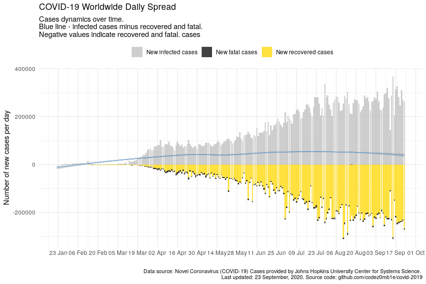

COVID-19 Analytics
================
29 April, 2020

#### Table of contents

  - [Load datasets](#load-datasets)
      - [Load COVID-19 spread data](#load-covid-19-spread-data)
      - [Load world population data](#load-world-population-data)
  - [Preprocessing datasets](#preprocessing-datasets)
      - [Preprocessing COVID-19 spread
        data](#preprocessing-covid-19-spread-data)
      - [Preprocessing world population
        data](#preprocessing-world-population-data)
  - [COVID-19 worldwide spread](#covid-19-worldwide-spread)
      - [Total infected, recovered, and fatal
        cases](#total-infected,-recovered,-and-fatal-cases)
      - [Dynamics of spread](#dynamics-of-spread)
      - [Disease cases structure](#disease-cases-structure)
      - [Dynamics of daily cases](#dynamics-of-daily-cases)
  - [COVID-19 spread by countries](#covid-19-spread-by-countries)
      - [Infected, recovered, fatal, and active
        cases](#infected,-recovered,-fatal,-and-active-cases)
      - [Dynamics of spread](#dynamics-of-spread)
      - [Dynamics of daily cases](#dynamics-of-daily-cases)
      - [Mortality rate](#mortality-rate)
  - [COVID-19 spread by countries
    population](#covid-19-spread-by-countries-population)
      - [TOPs countries by infected, active, and fatal
        cases](#tops-countries-by-infected,-active,-and-fatal-cases)
          - [by infected cases](#by-infected-cases)
          - [by active cases](#by-active-cases)
          - [by fatal cases](#by-fatal-cases)
      - [Active cases per 1 million population vs number of days since
        100th infected
        case](#active-cases-per-1-million-population-vs-number-of-days-since-100th-infected-case)
      - [Active cases per 1 million population vs number of days since
        10th fatal
        case](#active-cases-per-1-million-population-vs-number-of-days-since-10th-fatal-case)

## Load datasets

### Load COVID-19 spread data

Get list of files in datasets
    container:

    ## [1] "COVID19_line_list_data.csv"            "COVID19_open_line_list.csv"           
    ## [3] "covid_19_data.csv"                     "time_series_covid_19_confirmed.csv"   
    ## [5] "time_series_covid_19_confirmed_US.csv" "time_series_covid_19_deaths.csv"      
    ## [7] "time_series_covid_19_deaths_US.csv"    "time_series_covid_19_recovered.csv"

Load `covid_19_data.csv` dataset:

    ## # A tibble: 100 x 8
    ##      SNo ObservationDate Province.State   Country.Region  Last.Update     Confirmed Deaths Recovered
    ##    <int> <chr>           <chr>            <chr>           <chr>               <dbl>  <dbl>     <dbl>
    ##  1  7548 03/21/2020      <NA>             Equatorial Gui… 2020-03-19T20:…         6      0         0
    ##  2 19546 04/28/2020      New Brunswick    Canada          2020-04-29 02:…       118      0         0
    ##  3 11080 04/02/2020      <NA>             Luxembourg      4/2/20 8:53          2487     30        80
    ##  4  3221 03/03/2020      New York City, … US              2020-03-02T01:…         1      0         0
    ##  5  5473 03/14/2020      <NA>             Taiwan          2020-03-14T07:…        53      1        20
    ##  6  2734 02/29/2020      <NA>             Germany         2020-02-29T14:…        79      0        16
    ##  7  3428 03/05/2020      <NA>             Singapore       2020-03-05T13:…       117      0        78
    ##  8  6360 03/17/2020      Manitoba         Canada          2020-03-17T19:…         8      0         0
    ##  9  5760 03/15/2020      <NA>             Cyprus          2020-03-14T22:…        26      0         0
    ## 10 14062 04/11/2020      Georgia          US              2020-04-11 22:…     12159    429         0
    ## # … with 90 more rows

### Load world population data

Get datasets
    list:

    ## [1] "countries.csv"            "__MACOSX/"                "__MACOSX/._countries.csv"

Load `countries.csv` dataset:

    ## # A tibble: 169 x 14
    ##    iso_alpha2 iso_alpha3 iso_numeric name  official_name ccse_name density fertility_rate land_area
    ##    <chr>      <chr>            <int> <chr> <chr>         <chr>       <int>          <dbl>     <int>
    ##  1 AF         AFG                  4 Afgh… Islamic Repu… Afghanis…      60            4.6    652860
    ##  2 AL         ALB                  8 Alba… Republic of … Albania       105            1.6     27400
    ##  3 DZ         DZA                 12 Alge… People's Dem… Algeria        18            3.1   2381740
    ##  4 AD         AND                 20 Ando… Principality… Andorra       164           NA         470
    ##  5 AO         AGO                 24 Ango… Republic of … Angola         26            5.6   1246700
    ##  6 AG         ATG                 28 Anti… Antigua and … Antigua …     223            2         440
    ##  7 AR         ARG                 32 Arge… Argentine Re… Argentina      17            2.3   2736690
    ##  8 AM         ARM                 51 Arme… Republic of … Armenia       104            1.8     28470
    ##  9 AU         AUS                 36 Aust… Australia     Australia       3            1.8   7682300
    ## 10 AT         AUT                 40 Aust… Republic of … Austria       109            1.5     82409
    ## # … with 159 more rows, and 5 more variables: median_age <dbl>, migrants <dbl>, population <int>,
    ## #   urban_pop_rate <dbl>, world_share <dbl>

## Preprocessing datasets

### Preprocessing COVID-19 spread data

Set `area` column, processing `province_state` columns, and format dates
columns:

    ## # A tibble: 19,607 x 5
    ##    area          country province_state observation_date confirmed
    ##    <fct>         <chr>   <chr>          <date>               <dbl>
    ##  1 US            US      New York       2020-04-28          295106
    ##  2 Rest of World Spain   <NA>           2020-04-28          232128
    ##  3 Rest of World Italy   <NA>           2020-04-28          201505
    ##  4 Rest of World France  <NA>           2020-04-28          167605
    ##  5 Rest of World UK      <NA>           2020-04-28          161145
    ##  6 Rest of World Germany <NA>           2020-04-28          159912
    ##  7 Rest of World Turkey  <NA>           2020-04-28          114653
    ##  8 US            US      New Jersey     2020-04-28          113856
    ##  9 Rest of World Russia  <NA>           2020-04-28           93558
    ## 10 Rest of World Iran    <NA>           2020-04-28           92584
    ## # … with 19,597 more rows

### Preprocessing world population data

Get unmatched countries:

    ## # A tibble: 57 x 2
    ##    country                n
    ##    <chr>              <dbl>
    ##  1 Mainland China   6479873
    ##  2 UK               2867779
    ##  3 South Korea       550910
    ##  4 Czech Republic    194724
    ##  5 Hong Kong          36995
    ##  6 Others             26228
    ##  7 Diamond Princess   24920
    ##  8 Ivory Coast        19473
    ##  9 Taiwan             15575
    ## 10 Kosovo             10313
    ## # … with 47 more rows

Correct top of unmached countries.

And updated matching:

    ## # A tibble: 52 x 2
    ##    country                n
    ##    <chr>              <dbl>
    ##  1 Hong Kong          36995
    ##  2 Others             26228
    ##  3 Diamond Princess   24920
    ##  4 Ivory Coast        19473
    ##  5 Kosovo             10313
    ##  6 West Bank and Gaza  9769
    ##  7 Mali                5032
    ##  8 Burma               2162
    ##  9 Macau               2130
    ## 10 Guinea-Bissau       1131
    ## # … with 42 more rows

Much better :)

## COVID-19 worldwide spread

***Analyze COVID-19 worldwide spread.***

### Total infected, recovered, and fatal cases

View spread statistics:

    ## # A tibble: 98 x 9
    ##    observation_date active_total active_total_de… confirmed_total confirmed_total… recovered_total
    ##    <date>                  <dbl> <chr>                      <dbl> <chr>                      <dbl>
    ##  1 2020-04-28            1970587 1.75%                    3116398 2.45%                     928658
    ##  2 2020-04-27            1936630 1.97%                    3041764 2.37%                     893967
    ##  3 2020-04-26            1899198 1.17%                    2971475 2.58%                     865733
    ##  4 2020-04-25            1877215 3.14%                    2896746 3.06%                     816685
    ##  5 2020-04-24            1820144 2.28%                    2810715 3.76%                     793420
    ##  6 2020-04-23            1779541 2.79%                    2708885 3.24%                     738486
    ##  7 2020-04-22            1731200 2.27%                    2623960 2.94%                     709694
    ##  8 2020-04-21            1692721 2.18%                    2549123 3.11%                     679819
    ##  9 2020-04-20            1656535 2.74%                    2472259 2.95%                     645738
    ## 10 2020-04-19            1612432 2.97%                    2401379 3.61%                     623903
    ## # … with 88 more rows, and 3 more variables: recovered_total_delta <chr>, deaths_total <dbl>,
    ## #   deaths_total_delta <chr>

### Dynamics of spread

<!-- -->

<!-- -->

### Disease cases structure

<!-- -->

<!-- -->

### Dynamics of daily cases

Get daily dynamics of new infected and recovered cases.

World daily spread:

    ## # A tibble: 7 x 5
    ##   observation_date confirmed_total_per_… deaths_total_per_d… recovered_total_per… active_total_per_…
    ##   <date>                           <dbl>               <dbl>                <dbl>              <dbl>
    ## 1 2020-04-25                       86031                5695                23265              57071
    ## 2 2020-04-10                       96369                7070                22121              67178
    ## 3 2020-04-05                       74707                4768                13860              56079
    ## 4 2020-04-04                      101491                5819                20356              75316
    ## 5 2020-04-03                       82614                5804                15533              61277
    ## 6 2020-04-02                       80698                6174                17092              57432
    ## 7 2020-03-31                       75098                4525                13468              57105

<!-- -->

<!-- -->

## COVID-19 spread by countries

***Analyze COVID-19 spread y countries.***

### Infected, recovered, fatal, and active cases

Calculate number of infected, recovered, fatal, and active (infected
cases minus recovered and fatal) cases grouped by country:

Get countries ordered by total active cases:

    ## # A tibble: 5,244 x 10
    ##    country observation_date active_total active_total_de… confirmed_total confirmed_total…
    ##    <chr>   <date>                  <dbl> <chr>                      <dbl> <chr>           
    ##  1 US      2020-04-28             838291 2.17%                    1012582 2.47%           
    ##  2 United… 2020-04-28             139792 2.50%                     162350 2.53%           
    ##  3 Italy   2020-04-28             105205 -0.57%                    201505 1.05%           
    ##  4 France  2020-04-28              97584 1.29%                     169053 1.86%           
    ##  5 Spain   2020-04-28              84403 -0.78%                    232128 1.18%           
    ##  6 Russia  2020-04-28              84235 6.62%                      93558 7.36%           
    ##  7 Turkey  2020-04-28              72852 -3.60%                    114653 2.13%           
    ##  8 Germany 2020-04-28              36198 -5.07%                    159912 0.73%           
    ##  9 Brazil  2020-04-28              35608 12.32%                     73235 8.58%           
    ## 10 Nether… 2020-04-28              33913 0.37%                      38612 0.45%           
    ## # … with 5,234 more rows, and 4 more variables: recovered_total <dbl>, recovered_total_delta <chr>,
    ## #   deaths_total <dbl>, deaths_total_delta <chr>

<!-- -->

### Dynamics of spread

<!-- -->

<!-- -->

### Dynamics of daily cases

Get daily dynamics of new infected and recovered cases by countries.

World daily spread:

    ## # A tibble: 5,244 x 6
    ## # Groups:   country [138]
    ##    country  observation_date confirmed_total_p… recovered_total_p… deaths_total_pe… active_total_pe…
    ##    <chr>    <date>                        <dbl>              <dbl>            <dbl>            <dbl>
    ##  1 Afghani… 2020-04-28                      125                  8                1              116
    ##  2 Albania  2020-04-28                       14                  9                2                3
    ##  3 Algeria  2020-04-28                      132                 93                5               34
    ##  4 Andorra  2020-04-28                        0                 13                1              -14
    ##  5 Argenti… 2020-04-28                      124                 22               10               92
    ##  6 Armenia  2020-04-28                       59                 18                1               40
    ##  7 Austral… 2020-04-28                       23                 77                6              -60
    ##  8 Austria  2020-04-28                       83                218               20             -155
    ##  9 Azerbai… 2020-04-28                       39                 59                0              -20
    ## 10 Bahrain  2020-04-28                       88                 92                0               -4
    ## # … with 5,234 more rows

<!-- -->

<!-- -->

### Mortality rate

    ## # A tibble: 50 x 8
    ##    country observation_date since_100_confi… since_10_deaths… recovered_total deaths_total
    ##    <chr>   <date>           <date>           <date>                     <dbl>        <dbl>
    ##  1 US      2020-04-28       2020-03-10       2020-03-04                115936        58355
    ##  2 US      2020-04-27       2020-03-10       2020-03-04                111424        56259
    ##  3 US      2020-04-26       2020-03-10       2020-03-04                106988        54881
    ##  4 US      2020-04-25       2020-03-10       2020-03-04                100372        53755
    ##  5 US      2020-04-24       2020-03-10       2020-03-04                 99079        51949
    ##  6 US      2020-04-23       2020-03-10       2020-03-04                 80203        49954
    ##  7 US      2020-04-22       2020-03-10       2020-03-04                 77366        46622
    ##  8 US      2020-04-21       2020-03-10       2020-03-04                 75204        44444
    ##  9 US      2020-04-20       2020-03-10       2020-03-04                 72329        42094
    ## 10 US      2020-04-19       2020-03-10       2020-03-04                 70337        40661
    ## # … with 40 more rows, and 2 more variables: confirmed_deaths_rate <dbl>,
    ## #   recovered_deaths_rate <dbl>

<!-- -->

<!-- -->

<!-- -->

## COVID-19 spread by countries population

    ## # A tibble: 43 x 5
    ##    country n_days_since_100_confirmed population confirmed_total confirmed_total_per_1M
    ##    <chr>                        <dbl>      <int>           <dbl>                  <dbl>
    ##  1 Russia                          42  145934462           93558                   641.
    ##  2 Russia                          41  145934462           87147                   597.
    ##  3 Russia                          40  145934462           80949                   555.
    ##  4 Russia                          39  145934462           74588                   511.
    ##  5 Russia                          38  145934462           68622                   470.
    ##  6 Russia                          37  145934462           62773                   430.
    ##  7 Russia                          36  145934462           57999                   397.
    ##  8 Russia                          35  145934462           52763                   362.
    ##  9 Russia                          34  145934462           47121                   323.
    ## 10 Russia                          33  145934462           42853                   294.
    ## # … with 33 more rows

### TOPs countries by infected, active, and fatal cases

Calculate countries stats whose populations were most affected by the
virus:

#### …by infected cases

    ## # A tibble: 82 x 6
    ##    country    population confirmed_total confirmed_total_pe… n_days_since_100_c… n_days_since_10th_…
    ##    <chr>           <int>           <dbl>               <dbl>               <dbl>               <dbl>
    ##  1 Spain        46754778          232128               4965.                  57                  51
    ##  2 Qatar         2881053           11921               4138.                  48                  NA
    ##  3 Belgium      11589623           47334               4084.                  53                  41
    ##  4 Ireland       4937786           19877               4025.                  45                  33
    ##  5 Switzerla…    8654622           29264               3381.                  54                  46
    ##  6 Italy        60461826          201505               3333.                  65                  62
    ##  7 US          331002651         1012582               3059.                  49                  55
    ##  8 France       65273511          169053               2590.                  58                  52
    ##  9 Singapore     5850342           14951               2556.                  59                  11
    ## 10 United Ki…   67886011          162350               2392.                  54                  45
    ## # … with 72 more rows

#### …by active cases

    ## # A tibble: 82 x 6
    ##    country     population active_total active_total_per_… n_days_since_100_con… n_days_since_10th_d…
    ##    <chr>            <int>        <dbl>              <dbl>                 <dbl>                <dbl>
    ##  1 Qatar          2881053        10777              3741.                    48                   NA
    ##  2 US           331002651       838291              2533.                    49                   55
    ##  3 Belgium       11589623        29060              2507.                    53                   41
    ##  4 Singapore      5850342        13809              2360.                    59                   11
    ##  5 Portugal      10196709        21985              2156.                    46                   38
    ##  6 United Kin…   67886011       139792              2059.                    54                   45
    ##  7 Netherlands   17134872        33913              1979.                    53                   45
    ##  8 Ireland        4937786         9485              1921.                    45                   33
    ##  9 Spain         46754778        84403              1805.                    57                   51
    ## 10 Italy         60461826       105205              1740.                    65                   62
    ## # … with 72 more rows

#### …by fatal cases

    ## # A tibble: 82 x 6
    ##    country     population deaths_total deaths_total_per_… n_days_since_100_con… n_days_since_10th_d…
    ##    <chr>            <int>        <dbl>              <dbl>                 <dbl>                <dbl>
    ##  1 Belgium       11589623         7331               633.                    53                   41
    ##  2 Spain         46754778        23822               510.                    57                   51
    ##  3 Italy         60461826        27359               453.                    65                   62
    ##  4 France        65273511        23694               363.                    58                   52
    ##  5 United Kin…   67886011        21745               320.                    54                   45
    ##  6 Netherlands   17134872         4582               267.                    53                   45
    ##  7 Ireland        4937786         1159               235.                    45                   33
    ##  8 Sweden        10099265         2355               233.                    53                   40
    ##  9 Switzerland    8654622         1699               196.                    54                   46
    ## 10 US           331002651        58355               176.                    49                   55
    ## # … with 72 more rows

### Active cases per 1 million population vs number of days since 100th infected case

Select countries to
    monitoring:

    ##  [1] "Belgium"        "Ireland"        "Italy"          "Netherlands"    "Portugal"      
    ##  [6] "Qatar"          "Singapore"      "Spain"          "United Kingdom" "US"            
    ## [11] "Russia"         "Mainland China" "Korea, South"

<!-- -->

### Active cases per 1 million population vs number of days since 10th fatal case

<!-- -->

***Stay healthy. Help the sick.***
