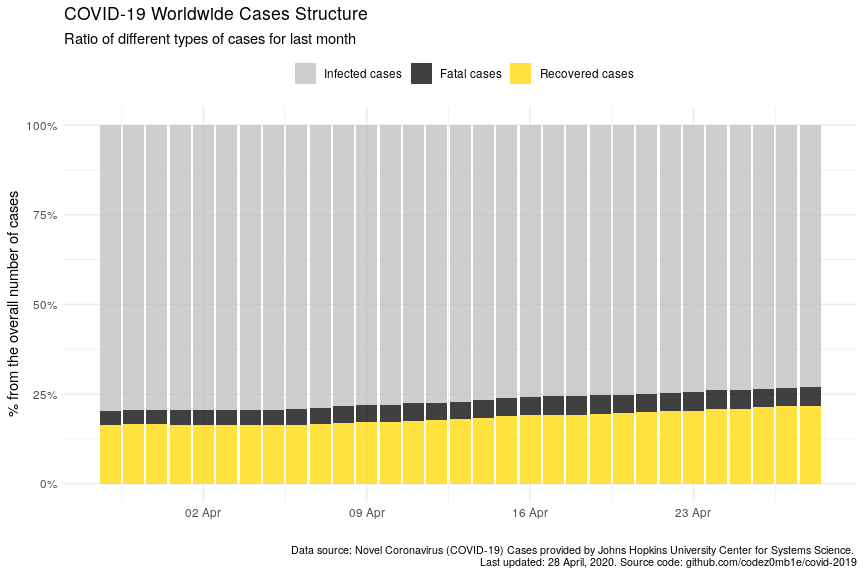
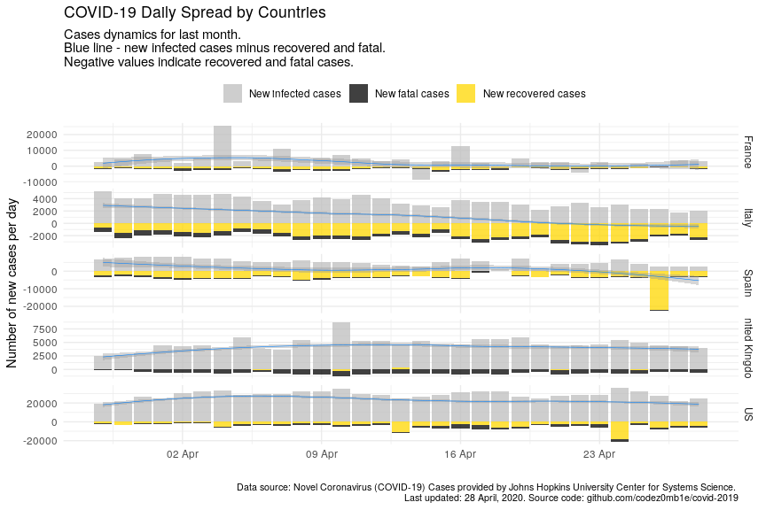

COVID-19 Analytics
================
19 April, 2020

#### Table of contents

  - [Load datasets](#load-datasets)
      - [Load COVID-19 spread data](#load-covid-19-spread-data)
      - [Load world population data](#load-world-population-data)
  - [Preprocessing datasets](#preprocessing-datasets)
      - [Preprocessing COVID-19 spread
        data](#preprocessing-covid-19-spread-data)
      - [Preprocessing world population
        data](#preprocessing-world-population-data)
  - [COVID-19 worldwide spread](#covid-19-worldwide-spread)
      - [Total infected, recovered, and fatal
        cases](#total-infected,-recovered,-and-fatal-cases)
      - [Dynamics of spread](#dynamics-of-spread)
      - [Disease cases structure](#disease-cases-structure)
      - [Dynamics of daily cases](#dynamics-of-daily-cases)
  - [COVID-19 spread by countries](#covid-19-spread-by-countries)
      - [Infected, recovered, fatal, and active
        cases](#infected,-recovered,-fatal,-and-active-cases)
      - [Dynamics of spread](#dynamics-of-spread)
      - [Dynamics of daily cases](#dynamics-of-daily-cases)
      - [Mortality rate](#mortality-rate)
  - [COVID-19 spread by countries
    population](#covid-19-spread-by-countries-population)
      - [TOPs countries by infected, active, and fatal
        cases](#tops-countries-by-infected,-active,-and-fatal-cases)
          - [by infected cases](#by-infected-cases)
          - [by active cases](#by-active-cases)
          - [by fatal cases](#by-fatal-cases)
      - [Active cases per 1 million population vs number of days since
        100th infected
        case](#active-cases-per-1-million-population-vs-number-of-days-since-100th-infected-case)
      - [Active cases per 1 million population vs number of days since
        10th fatal
        case](#active-cases-per-1-million-population-vs-number-of-days-since-10th-fatal-case)

## Load datasets

### Load COVID-19 spread data

Get list of files in datasets
    container:

    ## [1] "COVID19_line_list_data.csv"            "COVID19_open_line_list.csv"           
    ## [3] "covid_19_data.csv"                     "time_series_covid_19_confirmed.csv"   
    ## [5] "time_series_covid_19_confirmed_US.csv" "time_series_covid_19_deaths.csv"      
    ## [7] "time_series_covid_19_deaths_US.csv"    "time_series_covid_19_recovered.csv"

Load `covid_19_data.csv` dataset:

    ## # A tibble: 100 x 8
    ##      SNo ObservationDate Province.State Country.Region Last.Update        Confirmed Deaths Recovered
    ##    <int> <chr>           <chr>          <chr>          <chr>                  <dbl>  <dbl>     <dbl>
    ##  1  3119 03/03/2020      Jilin          Mainland China 2020-03-02T15:03:…        93      1        83
    ##  2  9840 03/29/2020      <NA>           Monaco         3/8/20 5:31               46      1         1
    ##  3   490 01/31/2020      <NA>           Finland        1/31/2020 23:59            1      0         0
    ##  4  7118 03/20/2020      <NA>           Serbia         2020-03-20T20:43:…       135      1         1
    ##  5 10963 04/01/2020      Tasmania       Australia      2020-04-01 22:04:…        69      2         5
    ##  6  3317 03/04/2020      <NA>           Finland        2020-03-01T23:23:…         6      0         1
    ##  7 11830 04/04/2020      Guangxi        Mainland China 4/4/20 9:38              254      2       252
    ##  8  9651 03/28/2020      Jiangsu        Mainland China 3/8/20 5:31              641      0       631
    ##  9  6756 03/19/2020      <NA>           Brazil         2020-03-19T20:43:…       621      6         2
    ## 10  4389 03/09/2020      <NA>           Luxembourg     2020-03-08T05:13:…         3      0         0
    ## # … with 90 more rows

### Load world population data

Get datasets
    list:

    ## [1] "countries.csv"            "__MACOSX/"                "__MACOSX/._countries.csv"

Load `countries.csv` dataset:

    ## # A tibble: 169 x 14
    ##    iso_alpha2 iso_alpha3 iso_numeric name  official_name ccse_name density fertility_rate land_area
    ##    <chr>      <chr>            <int> <chr> <chr>         <chr>       <int>          <dbl>     <int>
    ##  1 AF         AFG                  4 Afgh… Islamic Repu… Afghanis…      60            4.6    652860
    ##  2 AL         ALB                  8 Alba… Republic of … Albania       105            1.6     27400
    ##  3 DZ         DZA                 12 Alge… People's Dem… Algeria        18            3.1   2381740
    ##  4 AD         AND                 20 Ando… Principality… Andorra       164           NA         470
    ##  5 AO         AGO                 24 Ango… Republic of … Angola         26            5.6   1246700
    ##  6 AG         ATG                 28 Anti… Antigua and … Antigua …     223            2         440
    ##  7 AR         ARG                 32 Arge… Argentine Re… Argentina      17            2.3   2736690
    ##  8 AM         ARM                 51 Arme… Republic of … Armenia       104            1.8     28470
    ##  9 AU         AUS                 36 Aust… Australia     Australia       3            1.8   7682300
    ## 10 AT         AUT                 40 Aust… Republic of … Austria       109            1.5     82409
    ## # … with 159 more rows, and 5 more variables: median_age <dbl>, migrants <dbl>, population <int>,
    ## #   urban_pop_rate <dbl>, world_share <dbl>

## Preprocessing datasets

### Preprocessing COVID-19 spread data

Set `area` column, processing `province_state` columns, and format dates
columns:

    ## # A tibble: 16,409 x 5
    ##    area          country        province_state observation_date confirmed
    ##    <fct>         <chr>          <chr>          <date>               <dbl>
    ##  1 US            US             New York       2020-04-18          241712
    ##  2 Rest of World Spain          <NA>           2020-04-18          191726
    ##  3 Rest of World Italy          <NA>           2020-04-18          175925
    ##  4 Rest of World France         <NA>           2020-04-18          147969
    ##  5 Rest of World Germany        <NA>           2020-04-18          143342
    ##  6 Rest of World UK             <NA>           2020-04-18          114217
    ##  7 Rest of World Turkey         <NA>           2020-04-18           82329
    ##  8 US            US             New Jersey     2020-04-18           81420
    ##  9 Rest of World Iran           <NA>           2020-04-18           80868
    ## 10 Hubei         Mainland China Hubei          2020-04-18           68128
    ## # … with 16,399 more rows

Get dataset structure after preprocessing:

|                                                  |            |
| :----------------------------------------------- | :--------- |
| Name                                             | Piped data |
| Number of rows                                   | 16409      |
| Number of columns                                | 9          |
| \_\_\_\_\_\_\_\_\_\_\_\_\_\_\_\_\_\_\_\_\_\_\_   |            |
| Column type frequency:                           |            |
| character                                        | 2          |
| Date                                             | 1          |
| factor                                           | 1          |
| numeric                                          | 4          |
| POSIXct                                          | 1          |
| \_\_\_\_\_\_\_\_\_\_\_\_\_\_\_\_\_\_\_\_\_\_\_\_ |            |
| Group variables                                  | None       |

Data summary

**Variable type:
character**

| skim\_variable  | n\_missing | complete\_rate | min | max | empty | n\_unique | whitespace |
| :-------------- | ---------: | -------------: | --: | --: | ----: | --------: | ---------: |
| province\_state |       8194 |            0.5 |   2 |  43 |     0 |       295 |          0 |
| country         |          0 |            1.0 |   2 |  32 |     0 |       220 |          1 |

**Variable type:
Date**

| skim\_variable    | n\_missing | complete\_rate | min        | max        | median     | n\_unique |
| :---------------- | ---------: | -------------: | :--------- | :--------- | :--------- | --------: |
| observation\_date |          0 |              1 | 2020-01-22 | 2020-04-18 | 2020-03-23 |        88 |

**Variable type:
factor**

| skim\_variable | n\_missing | complete\_rate | ordered | n\_unique | top\_counts                              |
| :------------- | ---------: | -------------: | :------ | --------: | :--------------------------------------- |
| area           |          0 |              1 | FALSE   |         4 | Res: 10491, US: 3192, Chi: 2638, Hub: 88 |

**Variable type:
numeric**

| skim\_variable | n\_missing | complete\_rate |    mean |       sd | p0 |  p25 |  p50 |   p75 |   p100 | hist  |
| :------------- | ---------: | -------------: | ------: | -------: | -: | ---: | ---: | ----: | -----: | :---- |
| sno            |          0 |              1 | 8205.00 |  4737.01 |  1 | 4103 | 8205 | 12307 |  16409 | ▇▇▇▇▇ |
| confirmed      |          0 |              1 | 2435.51 | 12780.49 |  0 |    8 |   81 |   560 | 241712 | ▇▁▁▁▁ |
| deaths         |          0 |              1 |  135.82 |  1095.34 |  0 |    0 |    1 |     6 |  23227 | ▇▁▁▁▁ |
| recovered      |          0 |              1 |  598.48 |  4670.61 |  0 |    0 |    1 |    50 |  85400 | ▇▁▁▁▁ |

**Variable type:
POSIXct**

| skim\_variable | n\_missing | complete\_rate | min                 | max                 | median              | n\_unique |
| :------------- | ---------: | -------------: | :------------------ | :------------------ | :------------------ | --------: |
| last\_update   |          0 |              1 | 2020-01-22 17:00:00 | 2020-04-18 22:40:18 | 2020-03-19 10:53:03 |      1828 |

### Preprocessing world population data

Get unmatched countries:

    ## # A tibble: 57 x 2
    ##    country                  n
    ##    <chr>                <dbl>
    ##  1 Mainland China     5651848
    ##  2 UK                 1447751
    ##  3 South Korea         443793
    ##  4 Czech Republic      122748
    ##  5 Hong Kong            26665
    ##  6 Others               26228
    ##  7 Diamond Princess     17800
    ##  8 Taiwan               11311
    ##  9 Ivory Coast           9256
    ## 10 West Bank and Gaza    5610
    ## # … with 47 more rows

Correct top of unmached countries.

And updated matching:

    ## # A tibble: 52 x 2
    ##    country                n
    ##    <chr>              <dbl>
    ##  1 Hong Kong          26665
    ##  2 Others             26228
    ##  3 Diamond Princess   17800
    ##  4 Ivory Coast         9256
    ##  5 West Bank and Gaza  5610
    ##  6 Kosovo              5213
    ##  7 Mali                1786
    ##  8 Macau               1680
    ##  9 Burma                817
    ## 10 Guinea-Bissau        578
    ## # … with 42 more rows

Much better :)

## COVID-19 worldwide spread

***Analyze COVID-19 worldwide spread.***

### Total infected, recovered, and fatal cases

View spread statistics:

    ## # A tibble: 88 x 9
    ##    observation_date active_total active_total_de… confirmed_total confirmed_total… recovered_total
    ##    <date>                  <dbl> <chr>                      <dbl> <chr>                      <dbl>
    ##  1 2020-04-18            1565930 3.16%                    2317759 3.46%                     592319
    ##  2 2020-04-17            1518026 3.50%                    2240191 4.07%                     568343
    ##  3 2020-04-16            1466739 3.96%                    2152647 4.70%                     542107
    ##  4 2020-04-15            1410859 2.54%                    2056055 4.04%                     511019
    ##  5 2020-04-14            1375947 1.98%                    1976192 3.07%                     474261
    ##  6 2020-04-13            1349183 2.92%                    1917320 3.83%                     448655
    ##  7 2020-04-12            1310869 3.96%                    1846680 4.24%                     421722
    ##  8 2020-04-11            1260902 3.94%                    1771514 4.72%                     402110
    ##  9 2020-04-10            1213098 5.86%                    1691719 6.04%                     376096
    ## 10 2020-04-09            1145920 4.74%                    1595350 5.58%                     353975
    ## # … with 78 more rows, and 3 more variables: recovered_total_delta <chr>, deaths_total <dbl>,
    ## #   deaths_total_delta <chr>

### Dynamics of spread

    ## `geom_smooth()` using formula 'y ~ x'

<!-- -->

    ## `geom_smooth()` using formula 'y ~ x'

<!-- -->

### Disease cases structure

<!-- -->

<!-- -->

### Dynamics of daily cases

Get daily dynamics of new infected and recovered cases.

World daily spread:

    ## Selecting by active_total_per_day

    ## # A tibble: 7 x 5
    ##   observation_date confirmed_total_per_… deaths_total_per_d… recovered_total_per… active_total_per_…
    ##   <date>                           <dbl>               <dbl>                <dbl>              <dbl>
    ## 1 2020-04-16                       96592                9624                31088              55880
    ## 2 2020-04-10                       96369                7070                22121              67178
    ## 3 2020-04-05                       74707                4768                13860              56079
    ## 4 2020-04-04                      101491                5819                20356              75316
    ## 5 2020-04-03                       82614                5804                15533              61277
    ## 6 2020-04-02                       80698                6174                17092              57432
    ## 7 2020-03-31                       75098                4525                13468              57105

    ## `geom_smooth()` using formula 'y ~ x'

<!-- -->

    ## `geom_smooth()` using formula 'y ~ x'

<!-- -->

## COVID-19 spread by countries

***Analyze COVID-19 spread y countries.***

### Infected, recovered, fatal, and active cases

Calculate number of infected, recovered, fatal, and active (infected
cases minus recovered and fatal) cases grouped by country:

Get countries ordered by total active cases:

    ## # A tibble: 3,902 x 10
    ##    country observation_date active_total active_total_de… confirmed_total confirmed_total…
    ##    <chr>   <date>                  <dbl> <chr>                      <dbl> <chr>           
    ##  1 US      2020-04-18             628693 4.02%                     732197 4.64%           
    ##  2 Italy   2020-04-18             107771 0.76%                     175925 2.02%           
    ##  3 United… 2020-04-18              99402 4.89%                     115314 5.05%           
    ##  4 Spain   2020-04-18              96886 0.88%                     191726 0.46%           
    ##  5 France  2020-04-18              93217 -2.31%                    149149 0.01%           
    ##  6 Turkey  2020-04-18              69986 2.70%                      82329 4.82%           
    ##  7 Germany 2020-04-18              53483 -0.83%                    143342 1.38%           
    ##  8 Russia  2020-04-18              33423 14.68%                     36793 14.95%          
    ##  9 Nether… 2020-04-18              27836 3.74%                      31766 3.75%           
    ## 10 Belgium 2020-04-18              23382 1.60%                      37183 2.89%           
    ## # … with 3,892 more rows, and 4 more variables: recovered_total <dbl>, recovered_total_delta <chr>,
    ## #   deaths_total <dbl>, deaths_total_delta <chr>

<!-- -->

### Dynamics of spread

    ## `geom_smooth()` using formula 'y ~ x'

<!-- -->

    ## `geom_smooth()` using formula 'y ~ x'

<!-- -->

### Dynamics of daily cases

Get daily dynamics of new infected and recovered cases by countries.

World daily spread:

    ## # A tibble: 3,902 x 6
    ## # Groups:   country [131]
    ##    country  observation_date confirmed_total_p… recovered_total_p… deaths_total_pe… active_total_pe…
    ##    <chr>    <date>                        <dbl>              <dbl>            <dbl>            <dbl>
    ##  1 Afghani… 2020-04-18                       27                 13                0               14
    ##  2 Albania  2020-04-18                        9                 19                0              -10
    ##  3 Algeria  2020-04-18                      116                 48                3               65
    ##  4 Andorra  2020-04-18                        8                 14                0               -6
    ##  5 Argenti… 2020-04-18                       89                 19                6               64
    ##  6 Armenia  2020-04-18                       47                121                1              -75
    ##  7 Austral… 2020-04-18                       25                316                1             -292
    ##  8 Austria  2020-04-18                       76                510               12             -446
    ##  9 Azerbai… 2020-04-18                       33                 62                3              -32
    ## 10 Bahrain  2020-04-18                       33                 30                0                3
    ## # … with 3,892 more rows

    ## `geom_smooth()` using formula 'y ~ x'

<!-- -->

    ## `geom_smooth()` using formula 'y ~ x'

<!-- -->

### Mortality rate

    ## # A tibble: 40 x 8
    ##    country observation_date since_100_confi… since_10_deaths… recovered_total deaths_total
    ##    <chr>   <date>           <date>           <date>                     <dbl>        <dbl>
    ##  1 US      2020-04-18       2020-03-10       2020-03-04                 64840        38664
    ##  2 US      2020-04-17       2020-03-10       2020-03-04                 58545        36773
    ##  3 US      2020-04-16       2020-03-10       2020-03-04                 54703        32916
    ##  4 US      2020-04-15       2020-03-10       2020-03-04                 52096        28325
    ##  5 US      2020-04-14       2020-03-10       2020-03-04                 47763        25831
    ##  6 US      2020-04-13       2020-03-10       2020-03-04                 43482        23528
    ##  7 US      2020-04-12       2020-03-10       2020-03-04                 32988        22019
    ##  8 US      2020-04-11       2020-03-10       2020-03-04                 31270        20462
    ##  9 US      2020-04-10       2020-03-10       2020-03-04                 28790        18586
    ## 10 US      2020-04-09       2020-03-10       2020-03-04                 25410        16478
    ## # … with 30 more rows, and 2 more variables: confirmed_deaths_rate <dbl>,
    ## #   recovered_deaths_rate <dbl>

<!-- -->

<!-- -->

<!-- -->

## COVID-19 spread by countries population

    ## # A tibble: 33 x 5
    ##    country n_days_since_100_confirmed population confirmed_total confirmed_total_per_1M
    ##    <chr>                        <dbl>      <int>           <dbl>                  <dbl>
    ##  1 Russia                          32  145934462           36793                  252. 
    ##  2 Russia                          31  145934462           32008                  219. 
    ##  3 Russia                          30  145934462           27938                  191. 
    ##  4 Russia                          29  145934462           24490                  168. 
    ##  5 Russia                          28  145934462           21102                  145. 
    ##  6 Russia                          27  145934462           18328                  126. 
    ##  7 Russia                          26  145934462           15770                  108. 
    ##  8 Russia                          25  145934462           13584                   93.1
    ##  9 Russia                          24  145934462           11917                   81.7
    ## 10 Russia                          23  145934462           10131                   69.4
    ## # … with 23 more rows

### TOPs countries by infected, active, and fatal cases

Calculate countries stats whose populations were most affected by the
virus:

#### …by infected cases

    ## # A tibble: 75 x 6
    ##    country   population confirmed_total confirmed_total_pe… n_days_since_100_co… n_days_since_10th_…
    ##    <chr>          <int>           <dbl>               <dbl>                <dbl>               <dbl>
    ##  1 Spain       46754778          191726               4101.                   47                  41
    ##  2 Belgium     11589623           37183               3208.                   43                  31
    ##  3 Switzerl…    8654622           27404               3166.                   44                  36
    ##  4 Ireland      4937786           14758               2989.                   35                  23
    ##  5 Italy       60461826          175925               2910.                   55                  52
    ##  6 France      65273511          149149               2285.                   48                  42
    ##  7 US         331002651          732197               2212.                   39                  45
    ##  8 Portugal    10196709           19685               1931.                   36                  28
    ##  9 Netherla…   17134872           31766               1854.                   43                  35
    ## 10 Qatar        2881053            5008               1738.                   38                  NA
    ## # … with 65 more rows

#### …by active cases

    ## # A tibble: 75 x 6
    ##    country     population active_total active_total_per_… n_days_since_100_con… n_days_since_10th_d…
    ##    <chr>            <int>        <dbl>              <dbl>                 <dbl>                <dbl>
    ##  1 Ireland        4937786        14110              2858.                    35                   23
    ##  2 Spain         46754778        96886              2072.                    47                   41
    ##  3 Belgium       11589623        23382              2017.                    43                   31
    ##  4 US           331002651       628693              1899.                    39                   45
    ##  5 Portugal      10196709        18388              1803.                    36                   28
    ##  6 Italy         60461826       107771              1782.                    55                   52
    ##  7 Netherlands   17134872        27836              1625.                    43                   35
    ##  8 Qatar          2881053         4490              1558.                    38                   NA
    ##  9 United Kin…   67886011        99402              1464.                    44                   35
    ## 10 France        65273511        93217              1428.                    48                   42
    ## # … with 65 more rows

#### …by fatal cases

    ## # A tibble: 75 x 6
    ##    country     population deaths_total deaths_total_per_… n_days_since_100_con… n_days_since_10th_d…
    ##    <chr>            <int>        <dbl>              <dbl>                 <dbl>                <dbl>
    ##  1 Belgium       11589623         5453               471.                    43                   31
    ##  2 Spain         46754778        20043               429.                    47                   41
    ##  3 Italy         60461826        23227               384.                    55                   52
    ##  4 France        65273511        19345               296.                    48                   42
    ##  5 United Kin…   67886011        15498               228.                    44                   35
    ##  6 Netherlands   17134872         3613               211.                    43                   35
    ##  7 Switzerland    8654622         1368               158.                    44                   36
    ##  8 Sweden        10099265         1511               150.                    43                   30
    ##  9 US           331002651        38664               117.                    39                   45
    ## 10 Ireland        4937786          571               116.                    35                   23
    ## # … with 65 more rows

### Active cases per 1 million population vs number of days since 100th infected case

Select countries to
    monitoring:

    ##  [1] "Belgium"        "France"         "Ireland"        "Italy"          "Netherlands"   
    ##  [6] "Portugal"       "Qatar"          "Spain"          "United Kingdom" "US"            
    ## [11] "Russia"         "Mainland China" "Korea, South"

<!-- -->

### Active cases per 1 million population vs number of days since 10th fatal case

<!-- -->

***Stay healthy. Help the sick.***
