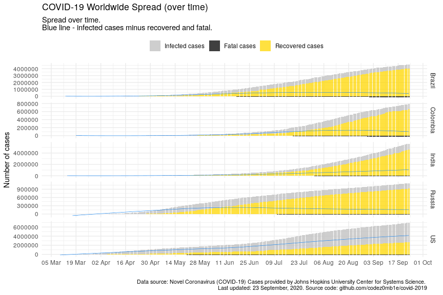

COVID-19 Analytics
================
04 May, 2020

#### Table of contents

  - [Load datasets](#load-datasets)
      - [Load COVID-19 spread data](#load-covid-19-spread-data)
      - [Load world population data](#load-world-population-data)
  - [Preprocessing datasets](#preprocessing-datasets)
      - [Preprocessing COVID-19 spread
        data](#preprocessing-covid-19-spread-data)
      - [Preprocessing world population
        data](#preprocessing-world-population-data)
  - [COVID-19 worldwide spread](#covid-19-worldwide-spread)
      - [Total infected, recovered, and fatal
        cases](#total-infected,-recovered,-and-fatal-cases)
      - [Dynamics of spread](#dynamics-of-spread)
      - [Disease cases structure](#disease-cases-structure)
      - [Dynamics of daily cases](#dynamics-of-daily-cases)
  - [COVID-19 spread by countries](#covid-19-spread-by-countries)
      - [Infected, recovered, fatal, and active
        cases](#infected,-recovered,-fatal,-and-active-cases)
      - [Dynamics of spread](#dynamics-of-spread)
      - [Dynamics of daily cases](#dynamics-of-daily-cases)
      - [Mortality rate](#mortality-rate)
  - [COVID-19 spread by countries
    population](#covid-19-spread-by-countries-population)
      - [TOPs countries by infected, active, and fatal
        cases](#tops-countries-by-infected,-active,-and-fatal-cases)
          - [by infected cases](#by-infected-cases)
          - [by active cases](#by-active-cases)
          - [by fatal cases](#by-fatal-cases)
      - [Active cases per 1 million population vs number of days since
        100th infected
        case](#active-cases-per-1-million-population-vs-number-of-days-since-100th-infected-case)
      - [Active cases per 1 million population vs number of days since
        10th fatal
        case](#active-cases-per-1-million-population-vs-number-of-days-since-10th-fatal-case)

## Load datasets

### Load COVID-19 spread data

Get list of files in datasets
    container:

    ## [1] "COVID19_line_list_data.csv"            "COVID19_open_line_list.csv"           
    ## [3] "covid_19_data.csv"                     "time_series_covid_19_confirmed.csv"   
    ## [5] "time_series_covid_19_confirmed_US.csv" "time_series_covid_19_deaths.csv"      
    ## [7] "time_series_covid_19_deaths_US.csv"    "time_series_covid_19_recovered.csv"

Load `covid_19_data.csv` dataset:

    ## # A tibble: 100 x 8
    ##      SNo ObservationDate Province.State Country.Region Last.Update        Confirmed Deaths Recovered
    ##    <int> <chr>           <chr>          <chr>          <chr>                  <dbl>  <dbl>     <dbl>
    ##  1  2844 03/01/2020      Guizhou        Mainland China 2020-02-27T00:43:…       146      2       112
    ##  2 11009 04/02/2020      <NA>           Burma          4/2/20 8:53               20      1         0
    ##  3 17534 04/22/2020      <NA>           Togo           2020-04-22 23:38:…        88      6        56
    ##  4 19975 04/30/2020      <NA>           Dominica       2020-05-01 02:32:…        16      0        13
    ##  5  2197 02/24/2020      Guangdong      Mainland China 2020-02-24T10:23:…      1345      6       786
    ##  6 11141 04/02/2020      <NA>           Taiwan         4/2/20 8:53              339      5        45
    ##  7  7089 03/20/2020      Guangxi        Mainland China 2020-03-20T00:43:…       254      2       250
    ##  8 20693 05/02/2020      <NA>           New Zealand    2020-05-03 02:32:…      1487     20      1266
    ##  9  3623 03/06/2020      <NA>           Iceland        2020-03-06T15:33:…        43      0         0
    ## 10  8782 03/25/2020      Shaanxi        Mainland China 2020-03-25 23:37:…       250      3       240
    ## # … with 90 more rows

### Load world population data

Get datasets
    list:

    ## [1] "countries.csv"            "__MACOSX/"                "__MACOSX/._countries.csv"

Load `countries.csv` dataset:

    ## # A tibble: 169 x 14
    ##    iso_alpha2 iso_alpha3 iso_numeric name  official_name ccse_name density fertility_rate land_area
    ##    <chr>      <chr>            <int> <chr> <chr>         <chr>       <int>          <dbl>     <int>
    ##  1 AF         AFG                  4 Afgh… Islamic Repu… Afghanis…      60            4.6    652860
    ##  2 AL         ALB                  8 Alba… Republic of … Albania       105            1.6     27400
    ##  3 DZ         DZA                 12 Alge… People's Dem… Algeria        18            3.1   2381740
    ##  4 AD         AND                 20 Ando… Principality… Andorra       164           NA         470
    ##  5 AO         AGO                 24 Ango… Republic of … Angola         26            5.6   1246700
    ##  6 AG         ATG                 28 Anti… Antigua and … Antigua …     223            2         440
    ##  7 AR         ARG                 32 Arge… Argentine Re… Argentina      17            2.3   2736690
    ##  8 AM         ARM                 51 Arme… Republic of … Armenia       104            1.8     28470
    ##  9 AU         AUS                 36 Aust… Australia     Australia       3            1.8   7682300
    ## 10 AT         AUT                 40 Aust… Republic of … Austria       109            1.5     82409
    ## # … with 159 more rows, and 5 more variables: median_age <dbl>, migrants <dbl>, population <int>,
    ## #   urban_pop_rate <dbl>, world_share <dbl>

## Preprocessing datasets

### Preprocessing COVID-19 spread data

Set `area` column, processing `province_state` columns, and format dates
columns:

    ## # A tibble: 21,220 x 5
    ##    area          country province_state observation_date confirmed
    ##    <fct>         <chr>   <chr>          <date>               <dbl>
    ##  1 US            US      New York       2020-05-03          316415
    ##  2 Rest of World Spain   <NA>           2020-05-03          217466
    ##  3 Rest of World Italy   <NA>           2020-05-03          210717
    ##  4 Rest of World UK      <NA>           2020-05-03          186599
    ##  5 Rest of World France  <NA>           2020-05-03          167272
    ##  6 Rest of World Germany <NA>           2020-05-03          165664
    ##  7 Rest of World Russia  <NA>           2020-05-03          134687
    ##  8 US            US      New Jersey     2020-05-03          126744
    ##  9 Rest of World Turkey  <NA>           2020-05-03          126045
    ## 10 Rest of World Brazil  <NA>           2020-05-03          101826
    ## # … with 21,210 more rows

### Preprocessing world population data

Get unmatched countries:

    ## # A tibble: 59 x 2
    ##    country                n
    ##    <chr>              <dbl>
    ##  1 Mainland China   6894239
    ##  2 UK               3756728
    ##  3 South Korea       604823
    ##  4 Czech Republic    233258
    ##  5 Hong Kong          42186
    ##  6 Diamond Princess   28480
    ##  7 Others             26228
    ##  8 Ivory Coast        26079
    ##  9 Taiwan             17730
    ## 10 Kosovo             14102
    ## # … with 49 more rows

Correct top of unmached countries.

And updated matching:

    ## # A tibble: 54 x 2
    ##    country                n
    ##    <chr>              <dbl>
    ##  1 Hong Kong          42186
    ##  2 Diamond Princess   28480
    ##  3 Others             26228
    ##  4 Ivory Coast        26079
    ##  5 Kosovo             14102
    ##  6 West Bank and Gaza 11516
    ##  7 Mali                7619
    ##  8 Burma               2920
    ##  9 Macau               2355
    ## 10 Guinea-Bissau       2312
    ## # … with 44 more rows

Much better :)

## COVID-19 worldwide spread

***Analyze COVID-19 worldwide spread.***

### Total infected, recovered, and fatal cases

View spread statistics:

    ## # A tibble: 103 x 9
    ##    observation_date active_total active_total_de… confirmed_total confirmed_total… recovered_total
    ##    <date>                  <dbl> <chr>                      <dbl> <chr>                      <dbl>
    ##  1 2020-05-03            2134023 2.09%                    3506729 2.32%                    1125236
    ##  2 2020-05-02            2090423 1.88%                    3427343 2.50%                    1093112
    ##  3 2020-05-01            2051800 2.15%                    3343777 2.67%                    1053327
    ##  4 2020-04-30            2008705 0.76%                    3256846 1.97%                    1014753
    ##  5 2020-04-29            1993529 1.16%                    3193886 2.49%                     972719
    ##  6 2020-04-28            1970587 1.75%                    3116398 2.45%                     928658
    ##  7 2020-04-27            1936630 1.97%                    3041764 2.37%                     893967
    ##  8 2020-04-26            1899198 1.17%                    2971475 2.58%                     865733
    ##  9 2020-04-25            1877215 3.14%                    2896746 3.06%                     816685
    ## 10 2020-04-24            1820144 2.28%                    2810715 3.76%                     793420
    ## # … with 93 more rows, and 3 more variables: recovered_total_delta <chr>, deaths_total <dbl>,
    ## #   deaths_total_delta <chr>

### Dynamics of spread

<!-- -->

<!-- -->

### Disease cases structure

<!-- -->

<!-- -->

### Dynamics of daily cases

Get daily dynamics of new infected and recovered cases.

World daily spread:

    ## # A tibble: 7 x 5
    ##   observation_date confirmed_total_per_… deaths_total_per_d… recovered_total_per… active_total_per_…
    ##   <date>                           <dbl>               <dbl>                <dbl>              <dbl>
    ## 1 2020-04-25                       86031                5695                23265              57071
    ## 2 2020-04-10                       96369                7070                22121              67178
    ## 3 2020-04-05                       74707                4768                13860              56079
    ## 4 2020-04-04                      101491                5819                20356              75316
    ## 5 2020-04-03                       82614                5804                15533              61277
    ## 6 2020-04-02                       80698                6174                17092              57432
    ## 7 2020-03-31                       75098                4525                13468              57105

<!-- -->

<!-- -->

## COVID-19 spread by countries

***Analyze COVID-19 spread y countries.***

### Infected, recovered, fatal, and active cases

Calculate number of infected, recovered, fatal, and active (infected
cases minus recovered and fatal) cases grouped by country:

Get countries ordered by total active cases:

    ## # A tibble: 5,949 x 10
    ##    country observation_date active_total active_total_de… confirmed_total confirmed_total…
    ##    <chr>   <date>                  <dbl> <chr>                      <dbl> <chr>           
    ##  1 US      2020-05-03             910206 2.18%                    1158040 2.25%           
    ##  2 United… 2020-05-03             158421 2.60%                     187842 2.37%           
    ##  3 Russia  2020-05-03             116768 8.30%                     134687 8.57%           
    ##  4 Italy   2020-05-03             100179 -0.52%                    210717 0.66%           
    ##  5 France  2020-05-03              93140 0.05%                     168925 0.24%           
    ##  6 Spain   2020-05-03              73300 -1.26%                    217466 0.41%           
    ##  7 Turkey  2020-05-03              59497 -5.23%                    126045 1.34%           
    ##  8 Brazil  2020-05-03              51784 4.82%                     101826 4.87%           
    ##  9 Nether… 2020-05-03              35559 0.75%                      40769 0.83%           
    ## 10 Canada  2020-05-03              31788 4.47%                      60504 4.45%           
    ## # … with 5,939 more rows, and 4 more variables: recovered_total <dbl>, recovered_total_delta <chr>,
    ## #   deaths_total <dbl>, deaths_total_delta <chr>

<!-- -->

### Dynamics of spread

<!-- -->

<!-- -->

### Dynamics of daily cases

Get daily dynamics of new infected and recovered cases by countries.

World daily spread:

    ## # A tibble: 5,949 x 6
    ## # Groups:   country [144]
    ##    country  observation_date confirmed_total_p… recovered_total_p… deaths_total_pe… active_total_pe…
    ##    <chr>    <date>                        <dbl>              <dbl>            <dbl>            <dbl>
    ##  1 Afghani… 2020-05-03                      235                 14               13              208
    ##  2 Albania  2020-05-03                        6                 12                0               -6
    ##  3 Algeria  2020-05-03                      179                 64                4              111
    ##  4 Andorra  2020-05-03                        1                 21                1              -21
    ##  5 Argenti… 2020-05-03                      102                 34                9               59
    ##  6 Armenia  2020-05-03                      113                 25                2               86
    ##  7 Austral… 2020-05-03                       23                 35                1              -13
    ##  8 Austria  2020-05-03                       39                 48                2              -11
    ##  9 Azerbai… 2020-05-03                       38                 30                0                8
    ## 10 Bahrain  2020-05-03                       99                150                0              -51
    ## # … with 5,939 more rows

<!-- -->

<!-- -->

### Mortality rate

    ## # A tibble: 55 x 8
    ##    country observation_date since_100_confi… since_10_deaths… recovered_total deaths_total
    ##    <chr>   <date>           <date>           <date>                     <dbl>        <dbl>
    ##  1 US      2020-05-03       2020-03-10       2020-03-04                180152        67682
    ##  2 US      2020-05-02       2020-03-10       2020-03-04                175382        66369
    ##  3 US      2020-05-01       2020-03-10       2020-03-04                164015        64943
    ##  4 US      2020-04-30       2020-03-10       2020-03-04                153947        62996
    ##  5 US      2020-04-29       2020-03-10       2020-03-04                120720        60967
    ##  6 US      2020-04-28       2020-03-10       2020-03-04                115936        58355
    ##  7 US      2020-04-27       2020-03-10       2020-03-04                111424        56259
    ##  8 US      2020-04-26       2020-03-10       2020-03-04                106988        54881
    ##  9 US      2020-04-25       2020-03-10       2020-03-04                100372        53755
    ## 10 US      2020-04-24       2020-03-10       2020-03-04                 99079        51949
    ## # … with 45 more rows, and 2 more variables: confirmed_deaths_rate <dbl>,
    ## #   recovered_deaths_rate <dbl>

<!-- -->

<!-- -->

<!-- -->

## COVID-19 spread by countries population

    ## # A tibble: 48 x 5
    ##    country n_days_since_100_confirmed population confirmed_total confirmed_total_per_1M
    ##    <chr>                        <dbl>      <int>           <dbl>                  <dbl>
    ##  1 Russia                          47  145934462          134687                   923.
    ##  2 Russia                          46  145934462          124054                   850.
    ##  3 Russia                          45  145934462          114431                   784.
    ##  4 Russia                          44  145934462          106498                   730.
    ##  5 Russia                          43  145934462           99399                   681.
    ##  6 Russia                          42  145934462           93558                   641.
    ##  7 Russia                          41  145934462           87147                   597.
    ##  8 Russia                          40  145934462           80949                   555.
    ##  9 Russia                          39  145934462           74588                   511.
    ## 10 Russia                          38  145934462           68622                   470.
    ## # … with 38 more rows

### TOPs countries by infected, active, and fatal cases

Calculate countries stats whose populations were most affected by the
virus:

#### …by infected cases

    ## # A tibble: 85 x 6
    ##    country    population confirmed_total confirmed_total_pe… n_days_since_100_c… n_days_since_10th_…
    ##    <chr>           <int>           <dbl>               <dbl>               <dbl>               <dbl>
    ##  1 Qatar         2881053           15551               5398.                  53                   2
    ##  2 Spain        46754778          217466               4651.                  62                  56
    ##  3 Ireland       4937786           21506               4355.                  50                  38
    ##  4 Belgium      11589623           49906               4306.                  58                  46
    ##  5 US          331002651         1158040               3499.                  54                  60
    ##  6 Italy        60461826          210717               3485.                  70                  67
    ##  7 Switzerla…    8654622           29905               3455.                  59                  51
    ##  8 Singapore     5850342           18205               3112.                  64                  16
    ##  9 United Ki…   67886011          187842               2767.                  59                  50
    ## 10 France       65273511          168925               2588.                  63                  57
    ## # … with 75 more rows

#### …by active cases

    ## # A tibble: 85 x 6
    ##    country     population active_total active_total_per_… n_days_since_100_con… n_days_since_10th_d…
    ##    <chr>            <int>        <dbl>              <dbl>                 <dbl>                <dbl>
    ##  1 Qatar          2881053        13875              4816.                    53                    2
    ##  2 Singapore      5850342        16779              2868.                    64                   16
    ##  3 US           331002651       910206              2750.                    54                   60
    ##  4 Belgium       11589623        29753              2567.                    58                   46
    ##  5 United Kin…   67886011       158421              2334.                    59                   50
    ##  6 Portugal      10196709        22550              2211.                    51                   43
    ##  7 Netherlands   17134872        35559              2075.                    58                   50
    ##  8 Sweden        10099265        18633              1845.                    58                   45
    ##  9 Italy         60461826       100179              1657.                    70                   67
    ## 10 Spain         46754778        73300              1568.                    62                   56
    ## # … with 75 more rows

#### …by fatal cases

    ## # A tibble: 85 x 6
    ##    country     population deaths_total deaths_total_per_… n_days_since_100_con… n_days_since_10th_d…
    ##    <chr>            <int>        <dbl>              <dbl>                 <dbl>                <dbl>
    ##  1 Belgium       11589623         7844               677.                    58                   46
    ##  2 Spain         46754778        25264               540.                    62                   56
    ##  3 Italy         60461826        28884               478.                    70                   67
    ##  4 United Kin…   67886011        28520               420.                    59                   50
    ##  5 France        65273511        24900               381.                    63                   57
    ##  6 Netherlands   17134872         5072               296.                    58                   50
    ##  7 Sweden        10099265         2679               265.                    58                   45
    ##  8 Ireland        4937786         1303               264.                    50                   38
    ##  9 US           331002651        67682               204.                    54                   60
    ## 10 Switzerland    8654622         1762               204.                    59                   51
    ## # … with 75 more rows

### Active cases per 1 million population vs number of days since 100th infected case

Select countries to
    monitoring:

    ##  [1] "Belgium"        "Italy"          "Netherlands"    "Portugal"       "Qatar"         
    ##  [6] "Singapore"      "Spain"          "Sweden"         "United Kingdom" "US"            
    ## [11] "Russia"         "Mainland China" "Korea, South"

<!-- -->

### Active cases per 1 million population vs number of days since 10th fatal case

<!-- -->

***Stay healthy. Help the sick.***
