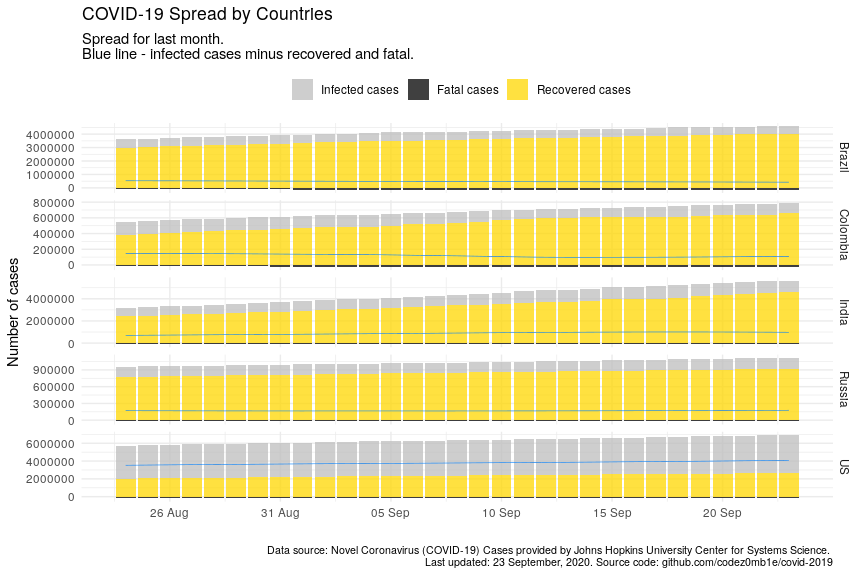

COVID-19 Analytics
================
11 June, 2020

#### Table of contents

  - [Load datasets](#load-datasets)
      - [Load COVID-19 spread data](#load-covid-19-spread-data)
      - [Load world population data](#load-world-population-data)
  - [Preprocessing datasets](#preprocessing-datasets)
      - [Preprocessing COVID-19 spread
        data](#preprocessing-covid-19-spread-data)
      - [Preprocessing world population
        data](#preprocessing-world-population-data)
  - [COVID-19 worldwide spread](#covid-19-worldwide-spread)
      - [Total infected, recovered, and fatal
        cases](#total-infected,-recovered,-and-fatal-cases)
      - [Dynamics of spread](#dynamics-of-spread)
      - [Disease cases structure](#disease-cases-structure)
      - [Dynamics of daily cases](#dynamics-of-daily-cases)
  - [COVID-19 spread by countries](#covid-19-spread-by-countries)
      - [Infected, recovered, fatal, and active
        cases](#infected,-recovered,-fatal,-and-active-cases)
      - [Dynamics of spread](#dynamics-of-spread)
      - [Dynamics of daily cases](#dynamics-of-daily-cases)
      - [Mortality rate](#mortality-rate)
  - [COVID-19 spread by countries
    population](#covid-19-spread-by-countries-population)
      - [TOPs countries by infected, active, and fatal
        cases](#tops-countries-by-infected,-active,-and-fatal-cases)
          - [by infected cases](#by-infected-cases)
          - [by active cases](#by-active-cases)
          - [by fatal cases](#by-fatal-cases)
      - [Active cases per 1 million population vs number of days since
        100th infected
        case](#active-cases-per-1-million-population-vs-number-of-days-since-100th-infected-case)
      - [Active cases per 1 million population vs number of days since
        10th fatal
        case](#active-cases-per-1-million-population-vs-number-of-days-since-10th-fatal-case)

## Load datasets

### Load COVID-19 spread data

Get list of files in datasets
    container:

    ## [1] "COVID19_line_list_data.csv"            "COVID19_open_line_list.csv"           
    ## [3] "covid_19_data.csv"                     "time_series_covid_19_confirmed.csv"   
    ## [5] "time_series_covid_19_confirmed_US.csv" "time_series_covid_19_deaths.csv"      
    ## [7] "time_series_covid_19_deaths_US.csv"    "time_series_covid_19_recovered.csv"

Load `covid_19_data.csv` dataset:

    ## # A tibble: 100 x 8
    ##      SNo ObservationDate Province.State     Country.Region Last.Update    Confirmed Deaths Recovered
    ##    <int> <chr>           <chr>              <chr>          <chr>              <dbl>  <dbl>     <dbl>
    ##  1 19220 04/27/2020      Missouri           US             2020-04-28 02…      7305    343         0
    ##  2 34098 06/03/2020      Belgorod Oblast    Russia         2020-06-04 02…      2548     22      1082
    ##  3   106 01/24/2020      Guizhou            Mainland China 1/24/20 17:00          3      0         0
    ##  4  1330 02/12/2020      <NA>               Finland        2020-02-12T00…         1      0         1
    ##  5 17243 04/21/2020      British Columbia   Canada         2020-04-21 23…      1724     87         0
    ##  6 39316 06/10/2020      Vichada            Colombia       2020-06-11 03…         1      0         0
    ##  7 19802 04/29/2020      British Virgin Is… UK             2020-04-30 02…         6      1         3
    ##  8 32223 05/31/2020      Calabria           Italy          2020-06-01 02…      1158     97       917
    ##  9 31726 05/30/2020      Gibraltar          UK             2020-05-31 02…       169      0       149
    ## 10 26164 05/18/2020      British Columbia   Canada         2020-05-19 02…      2444    143      1966
    ## # … with 90 more rows

### Load world population data

Get datasets
    list:

    ## [1] "countries.csv"            "__MACOSX/"                "__MACOSX/._countries.csv"

Load `countries.csv` dataset:

    ## # A tibble: 169 x 14
    ##    iso_alpha2 iso_alpha3 iso_numeric name  official_name ccse_name density fertility_rate land_area
    ##    <chr>      <chr>            <int> <chr> <chr>         <chr>       <int>          <dbl>     <int>
    ##  1 AF         AFG                  4 Afgh… Islamic Repu… Afghanis…      60            4.6    652860
    ##  2 AL         ALB                  8 Alba… Republic of … Albania       105            1.6     27400
    ##  3 DZ         DZA                 12 Alge… People's Dem… Algeria        18            3.1   2381740
    ##  4 AD         AND                 20 Ando… Principality… Andorra       164           NA         470
    ##  5 AO         AGO                 24 Ango… Republic of … Angola         26            5.6   1246700
    ##  6 AG         ATG                 28 Anti… Antigua and … Antigua …     223            2         440
    ##  7 AR         ARG                 32 Arge… Argentine Re… Argentina      17            2.3   2736690
    ##  8 AM         ARM                 51 Arme… Republic of … Armenia       104            1.8     28470
    ##  9 AU         AUS                 36 Aust… Australia     Australia       3            1.8   7682300
    ## 10 AT         AUT                 40 Aust… Republic of … Austria       109            1.5     82409
    ## # … with 159 more rows, and 5 more variables: median_age <dbl>, migrants <dbl>, population <int>,
    ## #   urban_pop_rate <dbl>, world_share <dbl>

## Preprocessing datasets

### Preprocessing COVID-19 spread data

Set `area` column, processing `province_state` columns, and format dates
columns:

    ## # A tibble: 39,347 x 5
    ##    area          country province_state observation_date confirmed
    ##    <fct>         <chr>   <chr>          <date>               <dbl>
    ##  1 US            US      New York       2020-06-10          380156
    ##  2 Rest of World UK      <NA>           2020-06-10          290143
    ##  3 Rest of World Russia  Moscow         2020-06-10          199785
    ##  4 Rest of World France  <NA>           2020-06-10          187996
    ##  5 Rest of World Iran    <NA>           2020-06-10          177938
    ##  6 Rest of World Turkey  <NA>           2020-06-10          173036
    ##  7 US            US      New Jersey     2020-06-10          165346
    ##  8 Rest of World Brazil  Sao Paulo      2020-06-10          156316
    ##  9 US            US      California     2020-06-10          139715
    ## 10 US            US      Illinois       2020-06-10          129837
    ## # … with 39,337 more rows

### Preprocessing world population data

Get unmatched countries:

    ## # A tibble: 60 x 2
    ##    country                 n
    ##    <chr>               <dbl>
    ##  1 UK               13363760
    ##  2 Mainland China   10047149
    ##  3 South Korea       1032846
    ##  4 Czech Republic     568558
    ##  5 Ivory Coast        120185
    ##  6 Tajikistan          95561
    ##  7 Hong Kong           82767
    ##  8 Diamond Princess    55536
    ##  9 Kosovo              52638
    ## 10 Mali                47344
    ## # … with 50 more rows

Correct top of unmached countries.

And updated matching:

    ## # A tibble: 55 x 2
    ##    country                 n
    ##    <chr>               <dbl>
    ##  1 Ivory Coast        120185
    ##  2 Tajikistan          95561
    ##  3 Hong Kong           82767
    ##  4 Diamond Princess    55536
    ##  5 Kosovo              52638
    ##  6 Mali                47344
    ##  7 Guinea-Bissau       42091
    ##  8 West Bank and Gaza  27357
    ##  9 Others              26228
    ## 10 Sierra Leone        25422
    ## # … with 45 more rows

Much better :)

## COVID-19 worldwide spread

***Analyze COVID-19 worldwide spread.***

### Total infected, recovered, and fatal cases

View spread statistics:

    ## # A tibble: 141 x 9
    ##    observation_date active_total active_total_de… confirmed_total confirmed_total… recovered_total
    ##    <date>                  <dbl> <chr>                      <dbl> <chr>                      <dbl>
    ##  1 2020-06-10            3489231 0.99%                    7360239 1.63%                    3454807
    ##  2 2020-06-09            3455131 1.06%                    7242235 1.73%                    3375668
    ##  3 2020-06-08            3419051 -1.38%                   7119002 1.55%                    3293408
    ##  4 2020-06-07            3466918 1.64%                    7010582 1.65%                    3140920
    ##  5 2020-06-06            3411085 1.49%                    6896917 1.87%                    3085833
    ##  6 2020-06-05            3360917 -0.33%                   6770170 2.07%                    3013132
    ##  7 2020-06-04            3371886 1.63%                    6632985 1.91%                    2869963
    ##  8 2020-06-03            3317706 1.51%                    6508635 2.04%                    2804982
    ##  9 2020-06-02            3268461 2.32%                    6378238 1.79%                    2729527
    ## 10 2020-06-01            3194300 1.29%                    6265852 1.60%                    2696009
    ## # … with 131 more rows, and 3 more variables: recovered_total_delta <chr>, deaths_total <dbl>,
    ## #   deaths_total_delta <chr>

### Dynamics of spread

<!-- -->

<!-- -->

### Disease cases structure

<!-- -->

<!-- -->

### Dynamics of daily cases

Get daily dynamics of new infected and recovered cases.

World daily spread:

    ## # A tibble: 7 x 5
    ##   observation_date confirmed_total_per_… deaths_total_per_d… recovered_total_per… active_total_per_…
    ##   <date>                           <dbl>               <dbl>                <dbl>              <dbl>
    ## 1 2020-06-02                      112386                4707                33518              74161
    ## 2 2020-05-30                      134742                4259                71158              59325
    ## 3 2020-04-10                       96369                7070                22121              67178
    ## 4 2020-04-04                      101491                5819                20356              75316
    ## 5 2020-04-03                       82614                5804                15533              61277
    ## 6 2020-04-02                       80698                6174                17092              57432
    ## 7 2020-03-31                       75098                4525                13468              57105

<!-- -->

<!-- -->

## COVID-19 spread by countries

***Analyze COVID-19 spread y countries.***

### Infected, recovered, fatal, and active cases

Calculate number of infected, recovered, fatal, and active (infected
cases minus recovered and fatal) cases grouped by country:

Get countries ordered by total active cases:

    ## # A tibble: 11,886 x 10
    ##    country observation_date active_total active_total_de… confirmed_total confirmed_total…
    ##    <chr>   <date>                  <dbl> <chr>                      <dbl> <chr>           
    ##  1 US      2020-06-10            1354036 0.85%                    2000464 1.06%           
    ##  2 Brazil  2020-06-10             318820 4.75%                     772416 4.45%           
    ##  3 United… 2020-06-10             249106 0.30%                     291588 0.35%           
    ##  4 Russia  2020-06-10             234378 -0.93%                    493023 1.73%           
    ##  5 India   2020-06-10             133632 -0.07%                    276583 0.16%           
    ##  6 Peru    2020-06-10             104889 -0.17%                    208823 2.50%           
    ##  7 France  2020-06-10              90794 0.22%                     192068 0.28%           
    ##  8 Pakist… 2020-06-10              75139 0.00%                     113702 0.00%           
    ##  9 Spain   2020-06-10              64768 0.49%                     242280 0.13%           
    ## 10 Bangla… 2020-06-10              57953 4.68%                      74865 4.45%           
    ## # … with 11,876 more rows, and 4 more variables: recovered_total <dbl>,
    ## #   recovered_total_delta <chr>, deaths_total <dbl>, deaths_total_delta <chr>

<!-- -->

### Dynamics of spread

<!-- -->

<!-- -->

### Dynamics of daily cases

Get daily dynamics of new infected and recovered cases by countries.

World daily spread:

    ## # A tibble: 11,886 x 6
    ## # Groups:   country [165]
    ##    country  observation_date confirmed_total_p… recovered_total_p… deaths_total_pe… active_total_pe…
    ##    <chr>    <date>                        <dbl>              <dbl>            <dbl>            <dbl>
    ##  1 Afghani… 2020-06-10                      683                362               21              300
    ##  2 Albania  2020-06-10                       42                 20                0               22
    ##  3 Algeria  2020-06-10                      102                123                8              -29
    ##  4 Andorra  2020-06-10                        0                  2                0               -2
    ##  5 Angola   2020-06-10                        0                  0                0                0
    ##  6 Argenti… 2020-06-10                     1226                423               18              785
    ##  7 Armenia  2020-06-10                      428                775               10             -357
    ##  8 Austral… 2020-06-10                       11                 19                0               -8
    ##  9 Austria  2020-06-10                       26                 35                1              -10
    ## 10 Azerbai… 2020-06-10                      339                114                4              221
    ## # … with 11,876 more rows

<!-- -->

<!-- -->

### Mortality rate

    ## # A tibble: 93 x 8
    ##    country observation_date since_100_confi… since_10_deaths… recovered_total deaths_total
    ##    <chr>   <date>           <date>           <date>                     <dbl>        <dbl>
    ##  1 US      2020-06-10       2020-03-10       2020-03-04                533504       112924
    ##  2 US      2020-06-09       2020-03-10       2020-03-04                524855       111989
    ##  3 US      2020-06-08       2020-03-10       2020-03-04                518522       111011
    ##  4 US      2020-06-07       2020-03-10       2020-03-04                506367       110528
    ##  5 US      2020-06-06       2020-03-10       2020-03-04                500849       110083
    ##  6 US      2020-06-05       2020-03-10       2020-03-04                491706       109373
    ##  7 US      2020-06-04       2020-03-10       2020-03-04                485002       108211
    ##  8 US      2020-06-03       2020-03-10       2020-03-04                479258       107175
    ##  9 US      2020-06-02       2020-03-10       2020-03-04                463868       106180
    ## 10 US      2020-06-01       2020-03-10       2020-03-04                458231       105149
    ## # … with 83 more rows, and 2 more variables: confirmed_deaths_rate <dbl>,
    ## #   recovered_deaths_rate <dbl>

<!-- -->

<!-- -->

<!-- -->

## COVID-19 spread by countries population

    ## # A tibble: 86 x 5
    ##    country n_days_since_100_confirmed population confirmed_total confirmed_total_per_1M
    ##    <chr>                        <dbl>      <int>           <dbl>                  <dbl>
    ##  1 Russia                          85  145934462          493023                  3378.
    ##  2 Russia                          84  145934462          484630                  3321.
    ##  3 Russia                          83  145934462          476043                  3262.
    ##  4 Russia                          82  145934462          467073                  3201.
    ##  5 Russia                          81  145934462          458102                  3139.
    ##  6 Russia                          80  145934462          449256                  3078.
    ##  7 Russia                          79  145934462          440538                  3019.
    ##  8 Russia                          78  145934462          431715                  2958.
    ##  9 Russia                          77  145934462          423186                  2900.
    ## 10 Russia                          76  145934462          414328                  2839.
    ## # … with 76 more rows

### TOPs countries by infected, active, and fatal cases

Calculate countries stats whose populations were most affected by the
virus:

#### …by infected cases

    ## # A tibble: 109 x 6
    ##    country  population confirmed_total confirmed_total_pe… n_days_since_100_con… n_days_since_10th_…
    ##    <chr>         <int>           <dbl>               <dbl>                 <dbl>               <dbl>
    ##  1 Qatar       2881053           73595              25544.                    91                  40
    ##  2 Bahrain     1701575           16200               9521.                    92                  26
    ##  3 Kuwait      4270571           33823               7920.                    88                  50
    ##  4 Chile      19116201          148456               7766.                    86                  71
    ##  5 Singapo…    5850342           38965               6660.                   102                  54
    ##  6 Peru       32971854          208823               6333.                    85                  75
    ##  7 US        331002651         2000464               6044.                    92                  98
    ##  8 Belarus     9449323           51066               5404.                    72                  65
    ##  9 Spain      46754778          242280               5182.                   100                  94
    ## 10 Belgium    11589623           59569               5140.                    96                  84
    ## # … with 99 more rows

#### …by active cases

    ## # A tibble: 109 x 6
    ##    country     population active_total active_total_per_… n_days_since_100_con… n_days_since_10th_d…
    ##    <chr>            <int>        <dbl>              <dbl>                 <dbl>                <dbl>
    ##  1 Qatar          2881053        24116              8371.                    91                   40
    ##  2 Sweden        10099265        42019              4161.                    96                   83
    ##  3 US           331002651      1354036              4091.                    92                   98
    ##  4 United Kin…   67886011       249106              3669.                    97                   88
    ##  5 Peru          32971854       104889              3181.                    85                   75
    ##  6 Bahrain        1701575         5060              2974.                    92                   26
    ##  7 Armenia        2963243         8650              2919.                    83                   61
    ##  8 Belgium       11589623        33548              2895.                    96                   84
    ##  9 Belarus        9449323        25111              2657.                    72                   65
    ## 10 Oman           5106626        13163              2578.                    76                   41
    ## # … with 99 more rows

#### …by fatal cases

    ## # A tibble: 109 x 6
    ##    country     population deaths_total deaths_total_per_… n_days_since_100_con… n_days_since_10th_d…
    ##    <chr>            <int>        <dbl>              <dbl>                 <dbl>                <dbl>
    ##  1 Belgium       11589623         9629               831.                    96                   84
    ##  2 United Kin…   67886011        41213               607.                    97                   88
    ##  3 Spain         46754778        27136               580.                   100                   94
    ##  4 Italy         60461826        34114               564.                   108                  105
    ##  5 Sweden        10099265         4795               475.                    96                   83
    ##  6 France        65273511        29322               449.                   101                   95
    ##  7 Netherlands   17134872         6061               354.                    96                   88
    ##  8 Ireland        4937786         1695               343.                    88                   76
    ##  9 US           331002651       112924               341.                    92                   98
    ## 10 Switzerland    8654622         1936               224.                    97                   89
    ## # … with 99 more rows

### Active cases per 1 million population vs number of days since 100th infected case

Select countries to
    monitoring:

    ##  [1] "Armenia"        "Bahrain"        "Belarus"        "Belgium"        "Oman"          
    ##  [6] "Peru"           "Qatar"          "Sweden"         "United Kingdom" "US"            
    ## [11] "Russia"         "Italy"          "Mainland China" "Korea, South"

<!-- -->

### Active cases per 1 million population vs number of days since 10th fatal case

<!-- -->

*Take Care and Stay Healthy\!*
