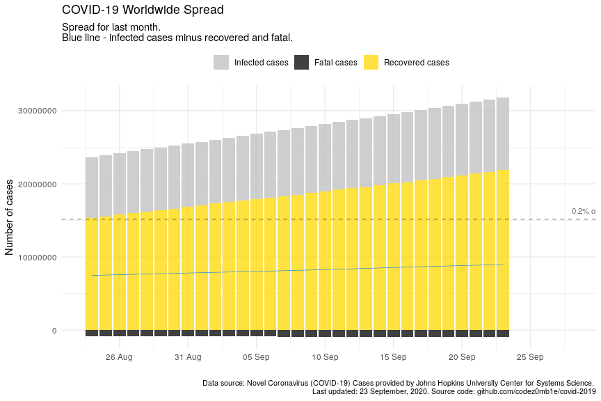
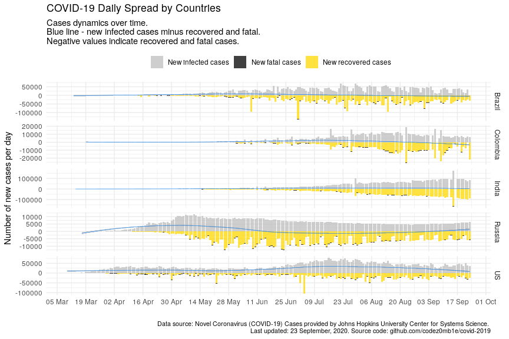
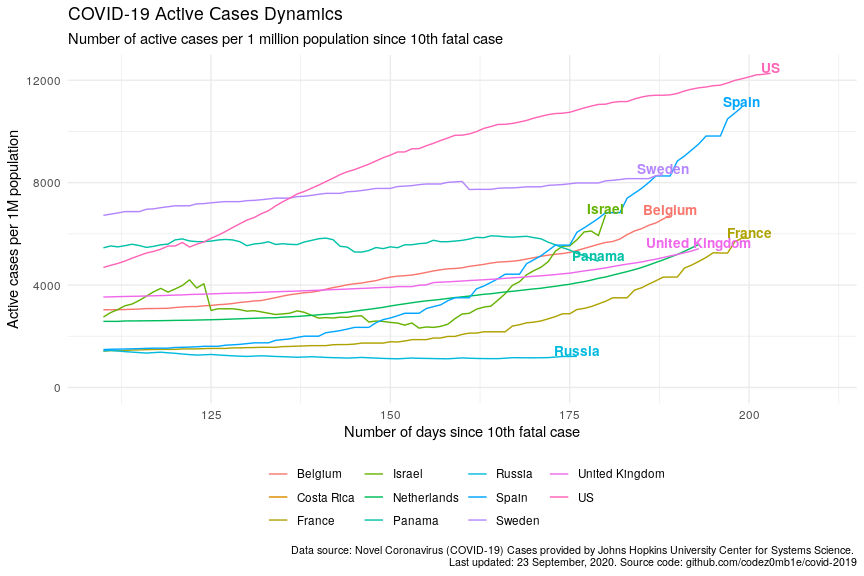

COVID-19 Analytics
================
24 June, 2020

#### Table of contents

  - [Load datasets](#load-datasets)
      - [Load COVID-19 spread data](#load-covid-19-spread-data)
      - [Load world population data](#load-world-population-data)
  - [Preprocessing datasets](#preprocessing-datasets)
      - [Preprocessing COVID-19 spread
        data](#preprocessing-covid-19-spread-data)
      - [Preprocessing world population
        data](#preprocessing-world-population-data)
  - [COVID-19 worldwide spread](#covid-19-worldwide-spread)
      - [Total infected, recovered, and fatal
        cases](#total-infected,-recovered,-and-fatal-cases)
      - [Dynamics of spread](#dynamics-of-spread)
      - [Disease cases structure](#disease-cases-structure)
      - [Dynamics of daily cases](#dynamics-of-daily-cases)
  - [COVID-19 spread by countries](#covid-19-spread-by-countries)
      - [Infected, recovered, fatal, and active
        cases](#infected,-recovered,-fatal,-and-active-cases)
      - [Dynamics of spread](#dynamics-of-spread)
      - [Dynamics of daily cases](#dynamics-of-daily-cases)
      - [Mortality rate](#mortality-rate)
  - [COVID-19 spread by countries
    population](#covid-19-spread-by-countries-population)
      - [TOPs countries by infected, active, and fatal
        cases](#tops-countries-by-infected,-active,-and-fatal-cases)
          - [by infected cases](#by-infected-cases)
          - [by active cases](#by-active-cases)
          - [by fatal cases](#by-fatal-cases)
      - [Active cases per 1 million population vs number of days since
        100th infected
        case](#active-cases-per-1-million-population-vs-number-of-days-since-100th-infected-case)
      - [Active cases per 1 million population vs number of days since
        10th fatal
        case](#active-cases-per-1-million-population-vs-number-of-days-since-10th-fatal-case)

## Load datasets

### Load COVID-19 spread data

Get list of files in datasets
    container:

    ## [1] "COVID19_line_list_data.csv"            "COVID19_open_line_list.csv"           
    ## [3] "covid_19_data.csv"                     "time_series_covid_19_confirmed.csv"   
    ## [5] "time_series_covid_19_confirmed_US.csv" "time_series_covid_19_deaths.csv"      
    ## [7] "time_series_covid_19_deaths_US.csv"    "time_series_covid_19_recovered.csv"

Load `covid_19_data.csv` dataset:

    ## # A tibble: 100 x 8
    ##      SNo ObservationDate Province.State Country.Region    Last.Update     Confirmed Deaths Recovered
    ##    <int> <chr>           <chr>          <chr>             <chr>               <dbl>  <dbl>     <dbl>
    ##  1 24953 05/15/2020      <NA>           Pakistan          2020-05-16 02:…     38799    834     10880
    ##  2 43165 06/16/2020      Aguascalientes Mexico            2020-06-17 04:…      1561     84      1130
    ##  3 32293 05/31/2020      Guerrero       Mexico            2020-06-01 02:…      1893    266      1285
    ##  4 42187 06/14/2020      Tocantins      Brazil            2020-06-15 03:…      6972    132      3780
    ##  5 26260 05/18/2020      New Mexico     US                2020-05-19 02:…      6096    270         0
    ##  6  1875 02/20/2020      Jiangsu        Mainland China    2020-02-20T12:…       631      0       356
    ##  7  7441 03/21/2020      <NA>           Dominican Republ… 2020-03-21T15:…       112      2         0
    ##  8 12174 04/05/2020      Martinique     France            2020-04-05 23:…       149      4        50
    ##  9 16100 04/18/2020      <NA>           Bahamas           2020-04-18 22:…        55      9        10
    ## 10  5047 03/12/2020      Virginia       US                2020-03-12T21:…        17      0         0
    ## # … with 90 more rows

### Load world population data

Get datasets
    list:

    ## [1] "countries.csv"            "__MACOSX/"                "__MACOSX/._countries.csv"

Load `countries.csv` dataset:

    ## # A tibble: 169 x 14
    ##    iso_alpha2 iso_alpha3 iso_numeric name  official_name ccse_name density fertility_rate land_area
    ##    <chr>      <chr>            <int> <chr> <chr>         <chr>       <int>          <dbl>     <int>
    ##  1 AF         AFG                  4 Afgh… Islamic Repu… Afghanis…      60            4.6    652860
    ##  2 AL         ALB                  8 Alba… Republic of … Albania       105            1.6     27400
    ##  3 DZ         DZA                 12 Alge… People's Dem… Algeria        18            3.1   2381740
    ##  4 AD         AND                 20 Ando… Principality… Andorra       164           NA         470
    ##  5 AO         AGO                 24 Ango… Republic of … Angola         26            5.6   1246700
    ##  6 AG         ATG                 28 Anti… Antigua and … Antigua …     223            2         440
    ##  7 AR         ARG                 32 Arge… Argentine Re… Argentina      17            2.3   2736690
    ##  8 AM         ARM                 51 Arme… Republic of … Armenia       104            1.8     28470
    ##  9 AU         AUS                 36 Aust… Australia     Australia       3            1.8   7682300
    ## 10 AT         AUT                 40 Aust… Republic of … Austria       109            1.5     82409
    ## # … with 159 more rows, and 5 more variables: median_age <dbl>, migrants <dbl>, population <int>,
    ## #   urban_pop_rate <dbl>, world_share <dbl>

## Preprocessing datasets

### Preprocessing COVID-19 spread data

Set `area` column, processing `province_state` columns, and format dates
columns:

    ## # A tibble: 48,095 x 5
    ##    area          country      province_state observation_date confirmed
    ##    <fct>         <chr>        <chr>          <date>               <dbl>
    ##  1 US            US           New York       2020-06-22          388488
    ##  2 Rest of World Brazil       Sao Paulo      2020-06-22          221973
    ##  3 Rest of World Russia       Moscow         2020-06-22          215014
    ##  4 Rest of World Iran         <NA>           2020-06-22          207525
    ##  5 Rest of World Chile        Metropolitana  2020-06-22          198392
    ##  6 Rest of World France       <NA>           2020-06-22          191442
    ##  7 Rest of World Turkey       <NA>           2020-06-22          188897
    ##  8 US            US           California     2020-06-22          184765
    ##  9 US            US           New Jersey     2020-06-22          169415
    ## 10 Rest of World Saudi Arabia <NA>           2020-06-22          161005
    ## # … with 48,085 more rows

### Preprocessing world population data

Get unmatched countries:

    ## # A tibble: 60 x 2
    ##    country                 n
    ##    <chr>               <dbl>
    ##  1 UK               16965188
    ##  2 Mainland China   11046224
    ##  3 South Korea       1179738
    ##  4 Czech Republic     690858
    ##  5 Ivory Coast        192149
    ##  6 Tajikistan         157767
    ##  7 Hong Kong           96212
    ##  8 Kosovo              70735
    ##  9 Mali                69694
    ## 10 Diamond Princess    64080
    ## # … with 50 more rows

Correct top of unmached countries.

And updated matching:

    ## # A tibble: 55 x 2
    ##    country                 n
    ##    <chr>               <dbl>
    ##  1 Ivory Coast        192149
    ##  2 Tajikistan         157767
    ##  3 Hong Kong           96212
    ##  4 Kosovo              70735
    ##  5 Mali                69694
    ##  6 Diamond Princess    64080
    ##  7 Guinea-Bissau       60007
    ##  8 South Sudan         45726
    ##  9 Sierra Leone        40107
    ## 10 West Bank and Gaza  34781
    ## # … with 45 more rows

Much better :)

## COVID-19 worldwide spread

***Analyze COVID-19 worldwide spread.***

### Total infected, recovered, and fatal cases

View spread statistics:

    ## # A tibble: 153 x 9
    ##    observation_date active_total active_total_de… confirmed_total confirmed_total… recovered_total
    ##    <date>                  <dbl> <chr>                      <dbl> <chr>                      <dbl>
    ##  1 2020-06-22            4100137 1.49%                    9098641 1.60%                    4526333
    ##  2 2020-06-21            4040085 2.30%                    8955536 1.86%                    4447086
    ##  3 2020-06-20            3949084 -0.26%                   8791804 1.46%                    4378255
    ##  4 2020-06-19            3959191 2.04%                    8664986 2.07%                    4245777
    ##  5 2020-06-18            3879893 1.38%                    8488977 1.67%                    4155099
    ##  6 2020-06-17            3827036 1.38%                    8349950 2.15%                    4073955
    ##  7 2020-06-16            3775086 0.93%                    8173940 1.74%                    3955169
    ##  8 2020-06-15            3740266 1.14%                    8034504 1.69%                    3857339
    ##  9 2020-06-14            3698146 1.63%                    7900924 1.72%                    3769712
    ## 10 2020-06-13            3638912 1.25%                    7766952 1.76%                    3698304
    ## # … with 143 more rows, and 3 more variables: recovered_total_delta <chr>, deaths_total <dbl>,
    ## #   deaths_total_delta <chr>

### Dynamics of spread

<!-- -->

<!-- -->

### Disease cases structure

<!-- -->

<!-- -->

### Dynamics of daily cases

Get daily dynamics of new infected and recovered cases.

World daily spread:

    ## # A tibble: 7 x 5
    ##   observation_date confirmed_total_per_… deaths_total_per_d… recovered_total_per… active_total_per_…
    ##   <date>                           <dbl>               <dbl>                <dbl>              <dbl>
    ## 1 2020-06-21                      163732                3900                68831              91001
    ## 2 2020-06-19                      176009                6033                90678              79298
    ## 3 2020-06-11                      154242                5257                85889              63096
    ## 4 2020-06-02                      112386                4707                33518              74161
    ## 5 2020-04-10                       96369                7070                22121              67178
    ## 6 2020-04-04                      101491                5819                20356              75316
    ## 7 2020-04-03                       82614                5804                15533              61277

<!-- -->

<!-- -->

## COVID-19 spread by countries

***Analyze COVID-19 spread y countries.***

### Infected, recovered, fatal, and active cases

Calculate number of infected, recovered, fatal, and active (infected
cases minus recovered and fatal) cases grouped by country:

Get countries ordered by total active cases:

    ## # A tibble: 13,870 x 10
    ##    country observation_date active_total active_total_de… confirmed_total confirmed_total…
    ##    <chr>   <date>                  <dbl> <chr>                      <dbl> <chr>           
    ##  1 US      2020-06-22            1551700 0.81%                    2312300 1.36%           
    ##  2 Brazil  2020-06-22             453463 4.52%                    1106470 1.98%           
    ##  3 United… 2020-06-22             262708 0.36%                     306761 0.31%           
    ##  4 Russia  2020-06-22             239422 1.18%                     591465 1.30%           
    ##  5 India   2020-06-22             178014 2.08%                     440215 3.51%           
    ##  6 Pakist… 2020-06-22             107868 1.72%                     185034 2.18%           
    ##  7 Peru    2020-06-22             103904 2.36%                     257447 2.43%           
    ##  8 France  2020-06-22              92979 0.12%                     197381 0.19%           
    ##  9 Spain   2020-06-22              67804 0.34%                     246504 0.09%           
    ## 10 Bangla… 2020-06-22              67529 2.68%                     115786 3.10%           
    ## # … with 13,860 more rows, and 4 more variables: recovered_total <dbl>,
    ## #   recovered_total_delta <chr>, deaths_total <dbl>, deaths_total_delta <chr>

<!-- -->

### Dynamics of spread

<!-- -->

<!-- -->

### Dynamics of daily cases

Get daily dynamics of new infected and recovered cases by countries.

World daily spread:

    ## # A tibble: 13,870 x 6
    ## # Groups:   country [168]
    ##    country  observation_date confirmed_total_p… recovered_total_p… deaths_total_pe… active_total_pe…
    ##    <chr>    <date>                        <dbl>              <dbl>            <dbl>            <dbl>
    ##  1 Afghani… 2020-06-22                      324                 77               17              230
    ##  2 Albania  2020-06-22                       33                 25                0                8
    ##  3 Algeria  2020-06-22                      149                137                7                5
    ##  4 Andorra  2020-06-22                        0                  4                0               -4
    ##  5 Angola   2020-06-22                        3                  0                1                2
    ##  6 Argenti… 2020-06-22                     2146                425               32             1689
    ##  7 Armenia  2020-06-22                      320                129               10              181
    ##  8 Austral… 2020-06-22                       18                 12                0                6
    ##  9 Austria  2020-06-22                       39                 44                0               -5
    ## 10 Azerbai… 2020-06-22                      478                369                7              102
    ## # … with 13,860 more rows

<!-- -->

<!-- -->

### Mortality rate

    ## # A tibble: 105 x 8
    ##    country observation_date since_100_confi… since_10_deaths… recovered_total deaths_total
    ##    <chr>   <date>           <date>           <date>                     <dbl>        <dbl>
    ##  1 US      2020-06-22       2020-03-10       2020-03-04                640198       120402
    ##  2 US      2020-06-21       2020-03-10       2020-03-04                622133       119977
    ##  3 US      2020-06-20       2020-03-10       2020-03-04                617460       119719
    ##  4 US      2020-06-19       2020-03-10       2020-03-04                606715       119125
    ##  5 US      2020-06-18       2020-03-10       2020-03-04                599115       118438
    ##  6 US      2020-06-17       2020-03-10       2020-03-04                592191       117717
    ##  7 US      2020-06-16       2020-03-10       2020-03-04                583503       116963
    ##  8 US      2020-06-15       2020-03-10       2020-03-04                576334       116127
    ##  9 US      2020-06-14       2020-03-10       2020-03-04                561816       115732
    ## 10 US      2020-06-13       2020-03-10       2020-03-04                556606       115436
    ## # … with 95 more rows, and 2 more variables: confirmed_deaths_rate <dbl>,
    ## #   recovered_deaths_rate <dbl>

<!-- -->

<!-- -->

<!-- -->

## COVID-19 spread by countries population

    ## # A tibble: 98 x 5
    ##    country n_days_since_100_confirmed population confirmed_total confirmed_total_per_1M
    ##    <chr>                        <dbl>      <int>           <dbl>                  <dbl>
    ##  1 Russia                          97  145934462          591465                  4053.
    ##  2 Russia                          96  145934462          583879                  4001.
    ##  3 Russia                          95  145934462          576162                  3948.
    ##  4 Russia                          94  145934462          568292                  3894.
    ##  5 Russia                          93  145934462          560321                  3840.
    ##  6 Russia                          92  145934462          552549                  3786.
    ##  7 Russia                          91  145934462          544725                  3733.
    ##  8 Russia                          90  145934462          536484                  3676.
    ##  9 Russia                          89  145934462          528267                  3620.
    ## 10 Russia                          88  145934462          519458                  3560.
    ## # … with 88 more rows

### TOPs countries by infected, active, and fatal cases

Calculate countries stats whose populations were most affected by the
virus:

#### …by infected cases

    ## # A tibble: 112 x 6
    ##    country  population confirmed_total confirmed_total_pe… n_days_since_100_con… n_days_since_10th_…
    ##    <chr>         <int>           <dbl>               <dbl>                 <dbl>               <dbl>
    ##  1 Qatar       2881053           88403              30684.                   103                  52
    ##  2 Bahrain     1701575           22407              13168.                   104                  38
    ##  3 Chile      19116201          246963              12919.                    98                  83
    ##  4 Kuwait      4270571           40291               9435.                   100                  62
    ##  5 Peru       32971854          257447               7808.                    97                  87
    ##  6 Singapo…    5850342           42313               7233.                   114                  66
    ##  7 US        331002651         2312300               6986.                   104                 110
    ##  8 Armenia     2963243           20588               6948.                    95                  73
    ##  9 Belarus     9449323           59023               6246.                    84                  77
    ## 10 Panama      4314767           26752               6200.                    95                  86
    ## # … with 102 more rows

#### …by active cases

    ## # A tibble: 112 x 6
    ##    country     population active_total active_total_per_… n_days_since_100_con… n_days_since_10th_d…
    ##    <chr>            <int>        <dbl>              <dbl>                 <dbl>                <dbl>
    ##  1 Qatar          2881053        18348              6369.                   103                   52
    ##  2 Sweden        10099265        53810              5328.                   108                   95
    ##  3 US           331002651      1551700              4688.                   104                  110
    ##  4 United Kin…   67886011       262708              3870.                   109                  100
    ##  5 Armenia        2963243        11097              3745.                    95                   73
    ##  6 Bahrain        1701575         5480              3221.                   104                   38
    ##  7 Peru          32971854       103904              3151.                    97                   87
    ##  8 Belgium       11589623        34083              2941.                   108                   96
    ##  9 Oman           5106626        14531              2846.                    88                   53
    ## 10 Panama         4314767        11567              2681.                    95                   86
    ## # … with 102 more rows

#### …by fatal cases

    ## # A tibble: 112 x 6
    ##    country     population deaths_total deaths_total_per_… n_days_since_100_con… n_days_since_10th_d…
    ##    <chr>            <int>        <dbl>              <dbl>                 <dbl>                <dbl>
    ##  1 Belgium       11589623         9696               837.                   108                   96
    ##  2 United Kin…   67886011        42731               629.                   109                  100
    ##  3 Spain         46754778        28324               606.                   112                  106
    ##  4 Italy         60461826        34657               573.                   120                  117
    ##  5 Sweden        10099265         5122               507.                   108                   95
    ##  6 France        65273511        29666               454.                   113                  107
    ##  7 US           331002651       120402               364.                   104                  110
    ##  8 Netherlands   17134872         6109               357.                   108                  100
    ##  9 Ireland        4937786         1717               348.                   100                   88
    ## 10 Peru          32971854         8223               249.                    97                   87
    ## # … with 102 more rows

### Active cases per 1 million population vs number of days since 100th infected case

Select countries to
    monitoring:

    ##  [1] "Armenia"        "Bahrain"        "Belgium"        "Oman"           "Panama"        
    ##  [6] "Peru"           "Qatar"          "Sweden"         "United Kingdom" "US"            
    ## [11] "Russia"         "Italy"          "Mainland China" "Korea, South"

<!-- -->

### Active cases per 1 million population vs number of days since 10th fatal case

<!-- -->

*Take Care and Stay Healthy\!*
