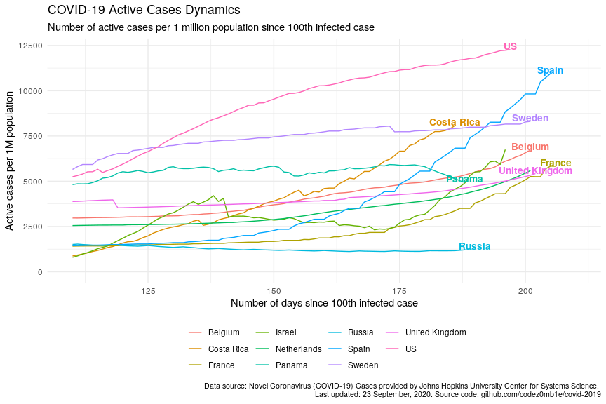

COVID-19 Analytics
================
26 August, 2020

  - [Table of contents](#toc)
  - [Load datasets](#load-datasets)
  - [Preprocessing datasets](#preprocessing-datasets)
  - [COVID-19 worldwide spread](#covid-19-worldwide-spread)
  - [COVID-19 spread by countries](#covid-19-spread-by-countries)
  - [COVID-19 spread by countries
    population](#covid-19-spread-by-countries-population)

#### Table of contents

  - [Load datasets](#load-datasets)
      - [Load COVID-19 spread data](#load-covid-19-spread-data)
      - [Load world population data](#load-world-population-data)
  - [Preprocessing datasets](#preprocessing-datasets)
      - [Preprocessing COVID-19 spread
        data](#preprocessing-covid-19-spread-data)
      - [Preprocessing world population
        data](#preprocessing-world-population-data)
  - [COVID-19 worldwide spread](#covid-19-worldwide-spread)
      - [Total infected, recovered, and fatal
        cases](#total-infected,-recovered,-and-fatal-cases)
      - [Dynamics of spread](#dynamics-of-spread)
      - [Disease cases structure](#disease-cases-structure)
      - [Dynamics of daily cases](#dynamics-of-daily-cases)
  - [COVID-19 spread by countries](#covid-19-spread-by-countries)
      - [Infected, recovered, fatal, and active
        cases](#infected,-recovered,-fatal,-and-active-cases)
      - [Dynamics of spread](#dynamics-of-spread)
      - [Dynamics of daily cases](#dynamics-of-daily-cases)
      - [Mortality rate](#mortality-rate)
  - [COVID-19 spread by countries
    population](#covid-19-spread-by-countries-population)
      - [TOPs countries by infected, active, and fatal
        cases](#tops-countries-by-infected,-active,-and-fatal-cases)
          - [by infected cases](#by-infected-cases)
          - [by active cases](#by-active-cases)
          - [by fatal cases](#by-fatal-cases)
      - [Active cases per 1 million population vs number of days since
        100th infected
        case](#active-cases-per-1-million-population-vs-number-of-days-since-100th-infected-case)
      - [Active cases per 1 million population vs number of days since
        10th fatal
        case](#active-cases-per-1-million-population-vs-number-of-days-since-10th-fatal-case)

## Load datasets

### Load COVID-19 spread data

Get list of files in datasets container:

    ## [1] "COVID19_line_list_data.csv"            "COVID19_open_line_list.csv"           
    ## [3] "covid_19_data.csv"                     "time_series_covid_19_confirmed.csv"   
    ## [5] "time_series_covid_19_confirmed_US.csv" "time_series_covid_19_deaths.csv"      
    ## [7] "time_series_covid_19_deaths_US.csv"    "time_series_covid_19_recovered.csv"

Load `covid_19_data.csv` dataset:

    ## # A tibble: 100 x 8
    ##      SNo ObservationDate Province.State   Country.Region Last.Update      Confirmed Deaths Recovered
    ##    <int> <chr>           <chr>            <chr>          <chr>                <dbl>  <dbl>     <dbl>
    ##  1 41199 06/13/2020      Karelia Republic Russia         2020-06-14 03:3…       732      2       279
    ##  2 79978 08/05/2020      Cordoba          Colombia       2020-08-06 04:3…      7774    773      2621
    ##  3 38531 06/09/2020      South Carolina   US             2020-06-10 04:0…     15228    568         0
    ##  4 23384 05/10/2020      Hainan           Mainland China 2020-05-11 02:3…       168      6       162
    ##  5 94315 08/24/2020      Noord-Brabant    Netherlands    2020-08-25 04:2…     11676   1547         0
    ##  6 56825 07/04/2020      West Virginia    US             2020-07-05 04:3…      3205     94         0
    ##  7 28030 05/22/2020      South Carolina   US             2020-05-23 02:3…      9638    419         0
    ##  8 72226 07/25/2020      Vasterbotten     Sweden         2020-07-26 04:3…       891     31         0
    ##  9 14514 04/13/2020      <NA>             Bulgaria       2020-04-13 23:1…       685     32        71
    ## 10 93071 08/23/2020      <NA>             Bangladesh     2020-08-24 04:2…    294598   3941    179091
    ## # … with 90 more rows

### Load world population data

Get datasets list:

    ## [1] "countries.csv"            "__MACOSX/"                "__MACOSX/._countries.csv"

Load `countries.csv` dataset:

    ## # A tibble: 169 x 14
    ##    iso_alpha2 iso_alpha3 iso_numeric name  official_name ccse_name density fertility_rate land_area
    ##    <chr>      <chr>            <int> <chr> <chr>         <chr>       <int>          <dbl>     <int>
    ##  1 AF         AFG                  4 Afgh… Islamic Repu… Afghanis…      60            4.6    652860
    ##  2 AL         ALB                  8 Alba… Republic of … Albania       105            1.6     27400
    ##  3 DZ         DZA                 12 Alge… People's Dem… Algeria        18            3.1   2381740
    ##  4 AD         AND                 20 Ando… Principality… Andorra       164           NA         470
    ##  5 AO         AGO                 24 Ango… Republic of … Angola         26            5.6   1246700
    ##  6 AG         ATG                 28 Anti… Antigua and … Antigua …     223            2         440
    ##  7 AR         ARG                 32 Arge… Argentine Re… Argentina      17            2.3   2736690
    ##  8 AM         ARM                 51 Arme… Republic of … Armenia       104            1.8     28470
    ##  9 AU         AUS                 36 Aust… Australia     Australia       3            1.8   7682300
    ## 10 AT         AUT                 40 Aust… Republic of … Austria       109            1.5     82409
    ## # … with 159 more rows, and 5 more variables: median_age <dbl>, migrants <dbl>, population <int>,
    ## #   urban_pop_rate <dbl>, world_share <dbl>

## Preprocessing datasets

### Preprocessing COVID-19 spread data

Set `area` column, processing `province_state` columns, and format dates
columns:

    ## # A tibble: 95,284 x 5
    ##    area          country      province_state observation_date confirmed
    ##    <fct>         <chr>        <chr>          <date>               <dbl>
    ##  1 Rest of World Brazil       Sao Paulo      2020-08-25          765670
    ##  2 Rest of World India        Maharashtra    2020-08-25          703823
    ##  3 US            US           California     2020-08-25          681032
    ##  4 Rest of World South Africa <NA>           2020-08-25          613017
    ##  5 US            US           Florida        2020-08-25          605502
    ##  6 US            US           Texas          2020-08-25          604328
    ##  7 US            US           New York       2020-08-25          430774
    ##  8 Rest of World India        Tamil Nadu     2020-08-25          391303
    ##  9 Rest of World Iran         <NA>           2020-08-25          363363
    ## 10 Rest of World India        Andhra Pradesh 2020-08-25          361712
    ## # … with 95,274 more rows

### Preprocessing world population data

Get unmatched countries:

    ## # A tibble: 60 x 2
    ##    country                   n
    ##    <chr>                 <dbl>
    ##  1 UK                 36525609
    ##  2 Mainland China     16427847
    ##  3 South Korea         2093072
    ##  4 Czech Republic      1697166
    ##  5 Ivory Coast         1096369
    ##  6 West Bank and Gaza   670470
    ##  7 Tajikistan           610707
    ##  8 Kosovo               523019
    ##  9 Hong Kong            268646
    ## 10 Mali                 226878
    ## # … with 50 more rows

Correct top of unmached countries.

And updated matching:

    ## # A tibble: 55 x 2
    ##    country                  n
    ##    <chr>                <dbl>
    ##  1 Ivory Coast        1096369
    ##  2 West Bank and Gaza  670470
    ##  3 Tajikistan          610707
    ##  4 Kosovo              523019
    ##  5 Hong Kong           268646
    ##  6 Mali                226878
    ##  7 Malawi              226811
    ##  8 South Sudan         189834
    ##  9 Guinea-Bissau       182871
    ## 10 Sierra Leone        151250
    ## # … with 45 more rows

Much better :)

## COVID-19 worldwide spread

***Analyze COVID-19 worldwide spread.***

### Total infected, recovered, and fatal cases

View spread statistics:

    ## # A tibble: 217 x 9
    ##    observation_date active_total active_total_de… confirmed_total confirmed_total… recovered_total
    ##    <date>                  <dbl> <chr>                      <dbl> <chr>                      <dbl>
    ##  1 2020-08-25            7499545 0.03%                   23889150 1.02%                   15570191
    ##  2 2020-08-24            7497103 0.30%                   23647377 0.97%                   15337252
    ##  3 2020-08-23            7474539 -0.18%                  23420418 0.93%                   15137203
    ##  4 2020-08-22            7487797 0.67%                   23203532 1.11%                   14911319
    ##  5 2020-08-21            7437730 1.29%                   22949234 1.19%                   14712252
    ##  6 2020-08-20            7343212 0.73%                   22678483 1.19%                   14541573
    ##  7 2020-08-19            7289714 0.68%                   22411300 1.23%                   14333914
    ##  8 2020-08-18            7240567 0.29%                   22137926 1.17%                   14116451
    ##  9 2020-08-17            7219523 -0.01%                  21881858 0.97%                   13888301
    ## 10 2020-08-16            7220074 -0.31%                  21672186 0.99%                   13676868
    ## # … with 207 more rows, and 3 more variables: recovered_total_delta <chr>, deaths_total <dbl>,
    ## #   deaths_total_delta <chr>

### Dynamics of spread

<!-- -->

<!-- -->

### Disease cases structure

<!-- -->

<!-- -->

### Dynamics of daily cases

Get daily dynamics of new infected and recovered cases.

World daily spread:

    ## # A tibble: 7 x 5
    ##   observation_date confirmed_total_per_… deaths_total_per_d… recovered_total_per… active_total_per_…
    ##   <date>                           <dbl>               <dbl>                <dbl>              <dbl>
    ## 1 2020-08-21                      270751                5554               170679              94518
    ## 2 2020-08-13                      275227                6001               164494             104732
    ## 3 2020-07-29                      337628                7389               236976              93263
    ## 4 2020-07-23                      281417                9953               169899             101565
    ## 5 2020-07-22                      282312                7000               176997              98315
    ## 6 2020-07-19                      214569                4029                87836             122704
    ## 7 2020-07-16                      250819                5787               152273              92759

<!-- -->

<!-- -->

## COVID-19 spread by countries

***Analyze COVID-19 spread y countries.***

### Infected, recovered, fatal, and active cases

Calculate number of infected, recovered, fatal, and active (infected
cases minus recovered and fatal) cases grouped by country:

Get countries ordered by total active cases:

    ## # A tibble: 24,922 x 10
    ##    country observation_date active_total active_total_de… confirmed_total confirmed_total…
    ##    <chr>   <date>                  <dbl> <chr>                      <dbl> <chr>           
    ##  1 US      2020-08-25            3545525 0.11%                    5777710 0.66%           
    ##  2 India   2020-08-25             706851 0.36%                    3224547 1.81%           
    ##  3 Brazil  2020-08-25             520864 -1.96%                   3669995 1.30%           
    ##  4 United… 2020-08-25             286735 0.41%                     329821 0.37%           
    ##  5 Spain   2020-08-25             233253 3.12%                     412553 1.76%           
    ##  6 France  2020-08-25             169596 1.84%                     285902 1.24%           
    ##  7 Russia  2020-08-25             169171 -1.22%                    963655 0.48%           
    ##  8 Peru    2020-08-25             158048 -5.53%                    600438 1.03%           
    ##  9 Colomb… 2020-08-25             148761 -0.77%                    562113 1.89%           
    ## 10 Bangla… 2020-08-25             108844 -1.25%                    299628 0.86%           
    ## # … with 24,912 more rows, and 4 more variables: recovered_total <dbl>,
    ## #   recovered_total_delta <chr>, deaths_total <dbl>, deaths_total_delta <chr>

<!-- -->

### Dynamics of spread

<!-- -->

<!-- -->

### Dynamics of daily cases

Get daily dynamics of new infected and recovered cases by countries.

World daily spread:

    ## # A tibble: 24,922 x 6
    ## # Groups:   country [178]
    ##    country  observation_date confirmed_total_p… recovered_total_p… deaths_total_pe… active_total_pe…
    ##    <chr>    <date>                        <dbl>              <dbl>            <dbl>            <dbl>
    ##  1 Afghani… 2020-08-25                       16                 80                8              -72
    ##  2 Albania  2020-08-25                      154                117                5               32
    ##  3 Algeria  2020-08-25                      370                218               10              142
    ##  4 Andorra  2020-08-25                        0                  0                0                0
    ##  5 Angola   2020-08-25                       61                100                2              -41
    ##  6 Argenti… 2020-08-25                     8771               6413              197             2161
    ##  7 Armenia  2020-08-25                      111                426                4             -319
    ##  8 Austral… 2020-08-25                      151                497               24             -370
    ##  9 Austria  2020-08-25                      211                231                0              -20
    ## 10 Azerbai… 2020-08-25                      133                 86                2               45
    ## # … with 24,912 more rows

<!-- -->

<!-- -->

### Mortality rate

    ## # A tibble: 169 x 8
    ##    country observation_date since_100_confi… since_10_deaths… recovered_total deaths_total
    ##    <chr>   <date>           <date>           <date>                     <dbl>        <dbl>
    ##  1 US      2020-08-25       2020-03-10       2020-03-04               2053699       178486
    ##  2 US      2020-08-24       2020-03-10       2020-03-04               2020774       177252
    ##  3 US      2020-08-23       2020-03-10       2020-03-04               1997761       176802
    ##  4 US      2020-08-22       2020-03-10       2020-03-04               1985484       176353
    ##  5 US      2020-08-21       2020-03-10       2020-03-04               1965056       175370
    ##  6 US      2020-08-20       2020-03-10       2020-03-04               1947035       174255
    ##  7 US      2020-08-19       2020-03-10       2020-03-04               1925049       173177
    ##  8 US      2020-08-18       2020-03-10       2020-03-04               1898159       171821
    ##  9 US      2020-08-17       2020-03-10       2020-03-04               1865580       170497
    ## 10 US      2020-08-16       2020-03-10       2020-03-04               1833067       170052
    ## # … with 159 more rows, and 2 more variables: confirmed_deaths_rate <dbl>,
    ## #   recovered_deaths_rate <dbl>

<!-- -->

<!-- -->

<!-- -->

## COVID-19 spread by countries population

    ## # A tibble: 162 x 5
    ##    country n_days_since_100_confirmed population confirmed_total confirmed_total_per_1M
    ##    <chr>                        <dbl>      <int>           <dbl>                  <dbl>
    ##  1 Russia                         161  145934462          963655                  6603.
    ##  2 Russia                         160  145934462          959016                  6572.
    ##  3 Russia                         159  145934462          954328                  6539.
    ##  4 Russia                         158  145934462          949531                  6507.
    ##  5 Russia                         157  145934462          944671                  6473.
    ##  6 Russia                         156  145934462          939833                  6440.
    ##  7 Russia                         155  145934462          935066                  6407.
    ##  8 Russia                         154  145934462          930276                  6375.
    ##  9 Russia                         153  145934462          925558                  6342.
    ## 10 Russia                         152  145934462          920719                  6309.
    ## # … with 152 more rows

### TOPs countries by infected, active, and fatal cases

Calculate countries stats whose populations were most affected by the
virus:

#### …by infected cases

    ## # A tibble: 132 x 6
    ##    country population confirmed_total confirmed_total_pe… n_days_since_100_con… n_days_since_10th_d…
    ##    <chr>        <int>           <dbl>               <dbl>                 <dbl>                <dbl>
    ##  1 Qatar      2881053          117498              40783.                   167                  116
    ##  2 Bahrain    1701575           50076              29429.                   168                  102
    ##  3 Chile     19116201          400985              20976.                   162                  147
    ##  4 Panama     4314767           88381              20483.                   159                  150
    ##  5 Kuwait     4270571           81573              19101.                   164                  126
    ##  6 Peru      32971854          600438              18211.                   161                  151
    ##  7 US       331002651         5777710              17455.                   168                  174
    ##  8 Brazil   212559417         3669995              17266.                   165                  158
    ##  9 Oman       5106626           84652              16577.                   152                  117
    ## 10 Armenia    2963243           42936              14490.                   159                  137
    ## # … with 122 more rows

#### …by active cases

    ## # A tibble: 132 x 6
    ##    country     population active_total active_total_per_… n_days_since_100_con… n_days_since_10th_d…
    ##    <chr>            <int>        <dbl>              <dbl>                 <dbl>                <dbl>
    ##  1 US           331002651      3545525             10711.                   168                  174
    ##  2 Sweden        10099265        81077              8028.                   172                  159
    ##  3 Panama         4314767        23703              5493.                   159                  150
    ##  4 Spain         46754778       233253              4989.                   176                  170
    ##  5 Bolivia       11673021        57460              4922.                   147                  141
    ##  6 Peru          32971854       158048              4793.                   161                  151
    ##  7 Belgium       11589623        54160              4673.                   172                  160
    ##  8 Honduras       9904607        45050              4548.                   149                  145
    ##  9 Costa Rica     5094118        21856              4290.                   157                   78
    ## 10 United Kin…   67886011       286735              4224.                   173                  164
    ## # … with 122 more rows

#### …by fatal cases

    ## # A tibble: 132 x 6
    ##    country     population deaths_total deaths_total_per_… n_days_since_100_con… n_days_since_10th_d…
    ##    <chr>            <int>        <dbl>              <dbl>                 <dbl>                <dbl>
    ##  1 Belgium       11589623         9996               862.                   172                  160
    ##  2 Peru          32971854        27813               844.                   161                  151
    ##  3 Spain         46754778        28924               619.                   176                  170
    ##  4 United Kin…   67886011        41535               612.                   173                  164
    ##  5 Italy         60461826        35445               586.                   184                  181
    ##  6 Sweden        10099265         5814               576.                   172                  159
    ##  7 Chile         19116201        10958               573.                   162                  147
    ##  8 Brazil       212559417       116580               548.                   165                  158
    ##  9 US           331002651       178486               539.                   168                  174
    ## 10 Mexico       128932753        61450               477.                   159                  150
    ## # … with 122 more rows

### Active cases per 1 million population vs number of days since 100th infected case

Select countries to monitoring:

    ##  [1] "Belgium"        "Bolivia"        "Costa Rica"     "Honduras"       "Panama"        
    ##  [6] "Peru"           "Spain"          "Sweden"         "United Kingdom" "US"            
    ## [11] "Russia"         "Italy"          "Mainland China" "Korea, South"

<!-- -->

### Active cases per 1 million population vs number of days since 10th fatal case

<!-- -->

*Take Care and Stay Healthy\!*
