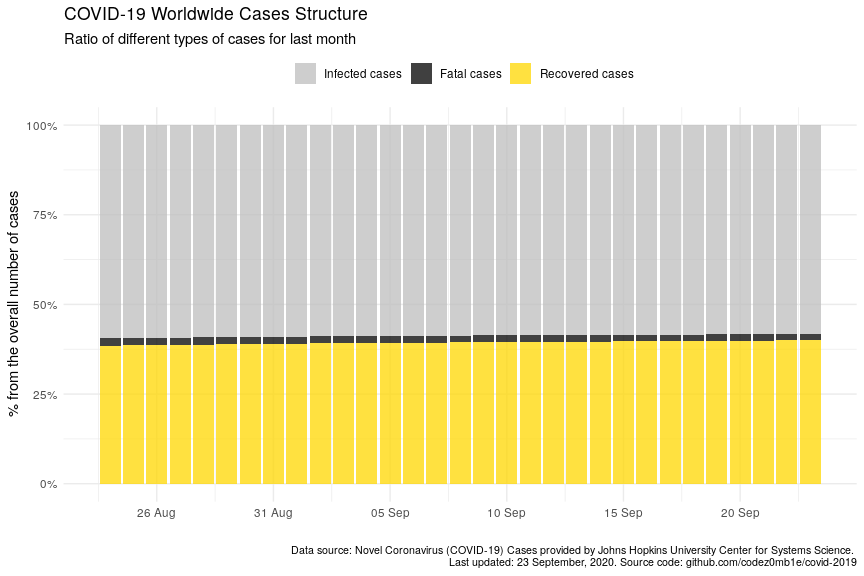
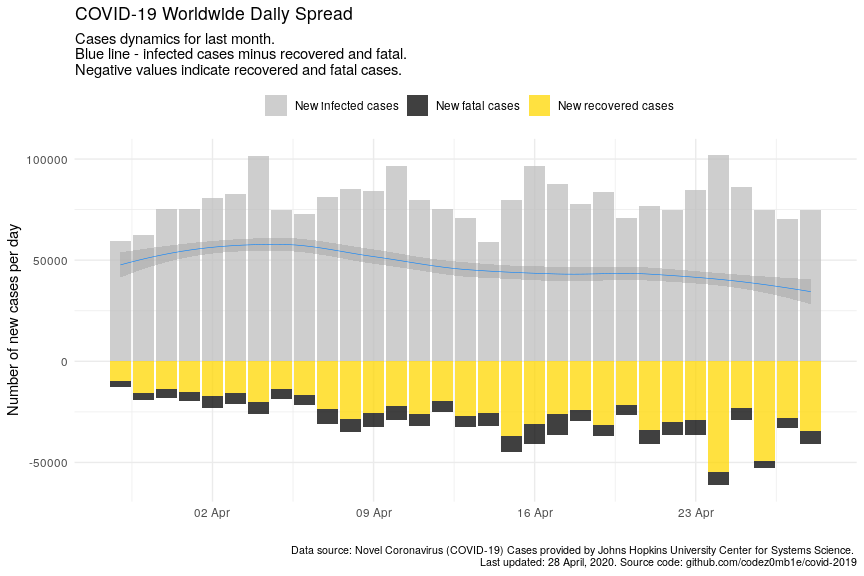
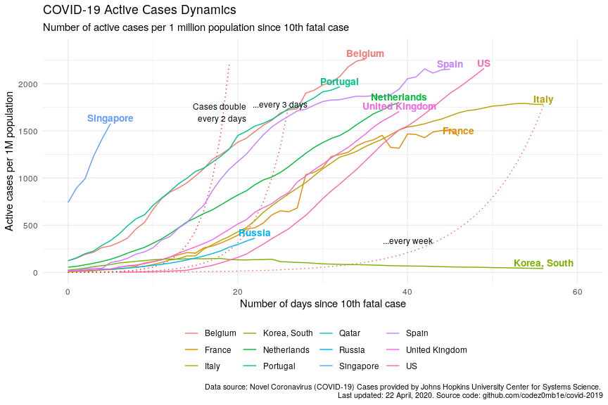

COVID-19 Analytics
================
24 April, 2020

#### Table of contents

  - [Load datasets](#load-datasets)
      - [Load COVID-19 spread data](#load-covid-19-spread-data)
      - [Load world population data](#load-world-population-data)
  - [Preprocessing datasets](#preprocessing-datasets)
      - [Preprocessing COVID-19 spread
        data](#preprocessing-covid-19-spread-data)
      - [Preprocessing world population
        data](#preprocessing-world-population-data)
  - [COVID-19 worldwide spread](#covid-19-worldwide-spread)
      - [Total infected, recovered, and fatal
        cases](#total-infected,-recovered,-and-fatal-cases)
      - [Dynamics of spread](#dynamics-of-spread)
      - [Disease cases structure](#disease-cases-structure)
      - [Dynamics of daily cases](#dynamics-of-daily-cases)
  - [COVID-19 spread by countries](#covid-19-spread-by-countries)
      - [Infected, recovered, fatal, and active
        cases](#infected,-recovered,-fatal,-and-active-cases)
      - [Dynamics of spread](#dynamics-of-spread)
      - [Dynamics of daily cases](#dynamics-of-daily-cases)
      - [Mortality rate](#mortality-rate)
  - [COVID-19 spread by countries
    population](#covid-19-spread-by-countries-population)
      - [TOPs countries by infected, active, and fatal
        cases](#tops-countries-by-infected,-active,-and-fatal-cases)
          - [by infected cases](#by-infected-cases)
          - [by active cases](#by-active-cases)
          - [by fatal cases](#by-fatal-cases)
      - [Active cases per 1 million population vs number of days since
        100th infected
        case](#active-cases-per-1-million-population-vs-number-of-days-since-100th-infected-case)
      - [Active cases per 1 million population vs number of days since
        10th fatal
        case](#active-cases-per-1-million-population-vs-number-of-days-since-10th-fatal-case)

## Load datasets

### Load COVID-19 spread data

Get list of files in datasets
    container:

    ## [1] "COVID19_line_list_data.csv"            "COVID19_open_line_list.csv"           
    ## [3] "covid_19_data.csv"                     "time_series_covid_19_confirmed.csv"   
    ## [5] "time_series_covid_19_confirmed_US.csv" "time_series_covid_19_deaths.csv"      
    ## [7] "time_series_covid_19_deaths_US.csv"    "time_series_covid_19_recovered.csv"

Load `covid_19_data.csv` dataset:

    ## # A tibble: 100 x 8
    ##      SNo ObservationDate Province.State Country.Region Last.Update        Confirmed Deaths Recovered
    ##    <int> <chr>           <chr>          <chr>          <chr>                  <dbl>  <dbl>     <dbl>
    ##  1  5975 03/16/2020      Jilin          Mainland China 2020-03-16T00:22:…        93      1        92
    ##  2  8499 03/24/2020      Virginia       US             2020-03-24 23:41:…       293      9         0
    ##  3  1279 02/12/2020      Sichuan        Mainland China 2020-02-12T12:43:…       436      1        92
    ##  4  3180 03/03/2020      <NA>           Senegal        2020-03-03T23:53:…         2      0         0
    ##  5 11953 04/05/2020      <NA>           Bulgaria       2020-04-05 23:13:…       531     20        37
    ##  6  2610 02/28/2020      Hainan         Mainland China 2020-02-28T08:53:…       168      5       133
    ##  7 14447 04/12/2020      Pennsylvania   US             2020-04-12 23:25:…     22938    557         0
    ##  8 10300 03/30/2020      New Mexico     US             3/8/20 5:31              237      2         0
    ##  9  4974 03/12/2020      <NA>           Bahrain        2020-03-11T22:33:…       195      0        35
    ## 10 16045 04/17/2020      Ontario        Canada         2020-04-17 23:38:…     10456    524         0
    ## # … with 90 more rows

### Load world population data

Get datasets
    list:

    ## [1] "countries.csv"            "__MACOSX/"                "__MACOSX/._countries.csv"

Load `countries.csv` dataset:

    ## # A tibble: 169 x 14
    ##    iso_alpha2 iso_alpha3 iso_numeric name  official_name ccse_name density fertility_rate land_area
    ##    <chr>      <chr>            <int> <chr> <chr>         <chr>       <int>          <dbl>     <int>
    ##  1 AF         AFG                  4 Afgh… Islamic Repu… Afghanis…      60            4.6    652860
    ##  2 AL         ALB                  8 Alba… Republic of … Albania       105            1.6     27400
    ##  3 DZ         DZA                 12 Alge… People's Dem… Algeria        18            3.1   2381740
    ##  4 AD         AND                 20 Ando… Principality… Andorra       164           NA         470
    ##  5 AO         AGO                 24 Ango… Republic of … Angola         26            5.6   1246700
    ##  6 AG         ATG                 28 Anti… Antigua and … Antigua …     223            2         440
    ##  7 AR         ARG                 32 Arge… Argentine Re… Argentina      17            2.3   2736690
    ##  8 AM         ARM                 51 Arme… Republic of … Armenia       104            1.8     28470
    ##  9 AU         AUS                 36 Aust… Australia     Australia       3            1.8   7682300
    ## 10 AT         AUT                 40 Aust… Republic of … Austria       109            1.5     82409
    ## # … with 159 more rows, and 5 more variables: median_age <dbl>, migrants <dbl>, population <int>,
    ## #   urban_pop_rate <dbl>, world_share <dbl>

## Preprocessing datasets

### Preprocessing COVID-19 spread data

Set `area` column, processing `province_state` columns, and format dates
columns:

    ## # A tibble: 17,688 x 5
    ##    area          country        province_state observation_date confirmed
    ##    <fct>         <chr>          <chr>          <date>               <dbl>
    ##  1 US            US             New York       2020-04-22          263292
    ##  2 Rest of World Spain          <NA>           2020-04-22          208389
    ##  3 Rest of World Italy          <NA>           2020-04-22          187327
    ##  4 Rest of World France         <NA>           2020-04-22          155860
    ##  5 Rest of World Germany        <NA>           2020-04-22          150648
    ##  6 Rest of World UK             <NA>           2020-04-22          133495
    ##  7 Rest of World Turkey         <NA>           2020-04-22           98674
    ##  8 US            US             New Jersey     2020-04-22           95914
    ##  9 Rest of World Iran           <NA>           2020-04-22           85996
    ## 10 Hubei         Mainland China Hubei          2020-04-22           68128
    ## # … with 17,678 more rows

Get dataset structure after preprocessing:

|                                                  |            |
| :----------------------------------------------- | :--------- |
| Name                                             | Piped data |
| Number of rows                                   | 17688      |
| Number of columns                                | 9          |
| \_\_\_\_\_\_\_\_\_\_\_\_\_\_\_\_\_\_\_\_\_\_\_   |            |
| Column type frequency:                           |            |
| character                                        | 2          |
| Date                                             | 1          |
| factor                                           | 1          |
| numeric                                          | 4          |
| POSIXct                                          | 1          |
| \_\_\_\_\_\_\_\_\_\_\_\_\_\_\_\_\_\_\_\_\_\_\_\_ |            |
| Group variables                                  | None       |

Data summary

**Variable type:
character**

| skim\_variable  | n\_missing | complete\_rate | min | max | empty | n\_unique | whitespace |
| :-------------- | ---------: | -------------: | --: | --: | ----: | --------: | ---------: |
| province\_state |       8918 |            0.5 |   2 |  43 |     0 |       295 |          0 |
| country         |          0 |            1.0 |   2 |  32 |     0 |       220 |          1 |

**Variable type:
Date**

| skim\_variable    | n\_missing | complete\_rate | min        | max        | median     | n\_unique |
| :---------------- | ---------: | -------------: | :--------- | :--------- | :--------- | --------: |
| observation\_date |          0 |              1 | 2020-01-22 | 2020-04-22 | 2020-03-26 |        92 |

**Variable type:
factor**

| skim\_variable | n\_missing | complete\_rate | ordered | n\_unique | top\_counts                              |
| :------------- | ---------: | -------------: | :------ | --------: | :--------------------------------------- |
| area           |          0 |              1 | FALSE   |         4 | Res: 11414, US: 3424, Chi: 2758, Hub: 92 |

**Variable type:
numeric**

| skim\_variable | n\_missing | complete\_rate |    mean |       sd | p0 |     p25 |    p50 |      p75 |   p100 | hist  |
| :------------- | ---------: | -------------: | ------: | -------: | -: | ------: | -----: | -------: | -----: | :---- |
| sno            |          0 |              1 | 8844.50 |  5106.23 |  1 | 4422.75 | 8844.5 | 13266.25 |  17688 | ▇▇▇▇▇ |
| confirmed      |          0 |              1 | 2827.38 | 14360.52 |  0 |    9.00 |   94.0 |   633.25 | 263292 | ▇▁▁▁▁ |
| deaths         |          0 |              1 |  165.27 |  1273.77 |  0 |    0.00 |    1.0 |     7.00 |  25085 | ▇▁▁▁▁ |
| recovered      |          0 |              1 |  705.55 |  5277.00 |  0 |    0.00 |    1.0 |    64.25 |  99400 | ▇▁▁▁▁ |

**Variable type:
POSIXct**

| skim\_variable | n\_missing | complete\_rate | min                 | max                 | median              | n\_unique |
| :------------- | ---------: | -------------: | :------------------ | :------------------ | :------------------ | --------: |
| last\_update   |          0 |              1 | 2020-01-22 17:00:00 | 2020-04-22 23:38:57 | 2020-03-21 23:13:18 |      1832 |

### Preprocessing world population data

Get unmatched countries:

    ## # A tibble: 57 x 2
    ##    country                  n
    ##    <chr>                <dbl>
    ##  1 Mainland China     5982899
    ##  2 UK                 1959589
    ##  3 South Korea         486505
    ##  4 Czech Republic      150559
    ##  5 Hong Kong            30777
    ##  6 Others               26228
    ##  7 Diamond Princess     20648
    ##  8 Taiwan               13004
    ##  9 Ivory Coast          12818
    ## 10 West Bank and Gaza    7436
    ## # … with 47 more rows

Correct top of unmached countries.

And updated matching:

    ## # A tibble: 52 x 2
    ##    country                n
    ##    <chr>              <dbl>
    ##  1 Hong Kong          30777
    ##  2 Others             26228
    ##  3 Diamond Princess   20648
    ##  4 Ivory Coast        12818
    ##  5 West Bank and Gaza  7436
    ##  6 Kosovo              7253
    ##  7 Mali                2807
    ##  8 Macau               1860
    ##  9 Burma               1291
    ## 10 Guinea-Bissau        778
    ## # … with 42 more rows

Much better :)

## COVID-19 worldwide spread

***Analyze COVID-19 worldwide spread.***

### Total infected, recovered, and fatal cases

View spread statistics:

    ## # A tibble: 92 x 9
    ##    observation_date active_total active_total_de… confirmed_total confirmed_total… recovered_total
    ##    <date>                  <dbl> <chr>                      <dbl> <chr>                      <dbl>
    ##  1 2020-04-22            1730694 2.23%                    2623415 2.91%                     709694
    ##  2 2020-04-21            1692892 2.19%                    2549294 3.12%                     679819
    ##  3 2020-04-20            1656535 2.74%                    2472259 2.95%                     645738
    ##  4 2020-04-19            1612432 2.97%                    2401379 3.61%                     623903
    ##  5 2020-04-18            1565930 3.16%                    2317759 3.46%                     592319
    ##  6 2020-04-17            1518026 3.50%                    2240191 4.07%                     568343
    ##  7 2020-04-16            1466739 3.96%                    2152647 4.70%                     542107
    ##  8 2020-04-15            1410859 2.54%                    2056055 4.04%                     511019
    ##  9 2020-04-14            1375947 1.98%                    1976192 3.07%                     474261
    ## 10 2020-04-13            1349183 2.92%                    1917320 3.83%                     448655
    ## # … with 82 more rows, and 3 more variables: recovered_total_delta <chr>, deaths_total <dbl>,
    ## #   deaths_total_delta <chr>

### Dynamics of spread

    ## `geom_smooth()` using formula 'y ~ x'

<!-- -->

    ## `geom_smooth()` using formula 'y ~ x'

<!-- -->

### Disease cases structure

<!-- -->

<!-- -->

### Dynamics of daily cases

Get daily dynamics of new infected and recovered cases.

World daily spread:

    ## Selecting by active_total_per_day

    ## # A tibble: 7 x 5
    ##   observation_date confirmed_total_per_… deaths_total_per_d… recovered_total_per… active_total_per_…
    ##   <date>                           <dbl>               <dbl>                <dbl>              <dbl>
    ## 1 2020-04-16                       96592                9624                31088              55880
    ## 2 2020-04-10                       96369                7070                22121              67178
    ## 3 2020-04-05                       74707                4768                13860              56079
    ## 4 2020-04-04                      101491                5819                20356              75316
    ## 5 2020-04-03                       82614                5804                15533              61277
    ## 6 2020-04-02                       80698                6174                17092              57432
    ## 7 2020-03-31                       75098                4525                13468              57105

    ## `geom_smooth()` using formula 'y ~ x'

<!-- -->

    ## `geom_smooth()` using formula 'y ~ x'

<!-- -->

## COVID-19 spread by countries

***Analyze COVID-19 spread y countries.***

### Infected, recovered, fatal, and active cases

Calculate number of infected, recovered, fatal, and active (infected
cases minus recovered and fatal) cases grouped by country:

Get countries ordered by total active cases:

    ## # A tibble: 4,431 x 10
    ##    country observation_date active_total active_total_de… confirmed_total confirmed_total…
    ##    <chr>   <date>                  <dbl> <chr>                      <dbl> <chr>           
    ##  1 US      2020-04-22             715726 3.37%                     839675 3.40%           
    ##  2 United… 2020-04-22             115804 3.25%                     134638 3.43%           
    ##  3 Italy   2020-04-22             107699 -0.01%                    187327 1.83%           
    ##  4 Spain   2020-04-22             100757 0.37%                     208389 2.06%           
    ##  5 France  2020-04-22              94426 -4.28%                    157125 -1.36%          
    ##  6 Turkey  2020-04-22              79821 1.79%                      98674 3.23%           
    ##  7 Russia  2020-04-22              53066 9.56%                      57999 9.92%           
    ##  8 Germany 2020-04-22              45969 -4.35%                    150648 1.59%           
    ##  9 Nether… 2020-04-22              30863 1.81%                      35032 2.08%           
    ## 10 Belgium 2020-04-22              26194 0.92%                      41889 2.28%           
    ## # … with 4,421 more rows, and 4 more variables: recovered_total <dbl>, recovered_total_delta <chr>,
    ## #   deaths_total <dbl>, deaths_total_delta <chr>

<!-- -->

### Dynamics of spread

    ## `geom_smooth()` using formula 'y ~ x'

<!-- -->

    ## `geom_smooth()` using formula 'y ~ x'

<!-- -->

### Dynamics of daily cases

Get daily dynamics of new infected and recovered cases by countries.

World daily spread:

    ## # A tibble: 4,431 x 6
    ## # Groups:   country [134]
    ##    country  observation_date confirmed_total_p… recovered_total_p… deaths_total_pe… active_total_pe…
    ##    <chr>    <date>                        <dbl>              <dbl>            <dbl>            <dbl>
    ##  1 Afghani… 2020-04-22                       84                 16                4               64
    ##  2 Albania  2020-04-22                       25                 11                1               13
    ##  3 Algeria  2020-04-22                       99                 52               10               37
    ##  4 Andorra  2020-04-22                        6                 27                0              -21
    ##  5 Argenti… 2020-04-22                      113                 32                5               76
    ##  6 Armenia  2020-04-22                       72                 24                0               48
    ##  7 Austral… 2020-04-22                        0                  0                0                0
    ##  8 Austria  2020-04-22                       52                357               19             -324
    ##  9 Azerbai… 2020-04-22                       38                 42                0               -4
    ## 10 Bahrain  2020-04-22                       54                242                0             -188
    ## # … with 4,421 more rows

    ## `geom_smooth()` using formula 'y ~ x'

<!-- -->

    ## `geom_smooth()` using formula 'y ~ x'

<!-- -->

### Mortality rate

    ## # A tibble: 44 x 8
    ##    country observation_date since_100_confi… since_10_deaths… recovered_total deaths_total
    ##    <chr>   <date>           <date>           <date>                     <dbl>        <dbl>
    ##  1 US      2020-04-22       2020-03-10       2020-03-04                 77366        46583
    ##  2 US      2020-04-21       2020-03-10       2020-03-04                 75204        44444
    ##  3 US      2020-04-20       2020-03-10       2020-03-04                 72329        42094
    ##  4 US      2020-04-19       2020-03-10       2020-03-04                 70337        40661
    ##  5 US      2020-04-18       2020-03-10       2020-03-04                 64840        38664
    ##  6 US      2020-04-17       2020-03-10       2020-03-04                 58545        36773
    ##  7 US      2020-04-16       2020-03-10       2020-03-04                 54703        32916
    ##  8 US      2020-04-15       2020-03-10       2020-03-04                 52096        28325
    ##  9 US      2020-04-14       2020-03-10       2020-03-04                 47763        25831
    ## 10 US      2020-04-13       2020-03-10       2020-03-04                 43482        23528
    ## # … with 34 more rows, and 2 more variables: confirmed_deaths_rate <dbl>,
    ## #   recovered_deaths_rate <dbl>

<!-- -->

<!-- -->

<!-- -->

## COVID-19 spread by countries population

    ## # A tibble: 37 x 5
    ##    country n_days_since_100_confirmed population confirmed_total confirmed_total_per_1M
    ##    <chr>                        <dbl>      <int>           <dbl>                  <dbl>
    ##  1 Russia                          36  145934462           57999                   397.
    ##  2 Russia                          35  145934462           52763                   362.
    ##  3 Russia                          34  145934462           47121                   323.
    ##  4 Russia                          33  145934462           42853                   294.
    ##  5 Russia                          32  145934462           36793                   252.
    ##  6 Russia                          31  145934462           32008                   219.
    ##  7 Russia                          30  145934462           27938                   191.
    ##  8 Russia                          29  145934462           24490                   168.
    ##  9 Russia                          28  145934462           21102                   145.
    ## 10 Russia                          27  145934462           18328                   126.
    ## # … with 27 more rows

### TOPs countries by infected, active, and fatal cases

Calculate countries stats whose populations were most affected by the
virus:

#### …by infected cases

    ## # A tibble: 79 x 6
    ##    country   population confirmed_total confirmed_total_pe… n_days_since_100_co… n_days_since_10th_…
    ##    <chr>          <int>           <dbl>               <dbl>                <dbl>               <dbl>
    ##  1 Spain       46754778          208389               4457.                   51                  45
    ##  2 Belgium     11589623           41889               3614.                   47                  35
    ##  3 Ireland      4937786           16671               3376.                   39                  27
    ##  4 Switzerl…    8654622           28268               3266.                   48                  40
    ##  5 Italy       60461826          187327               3098.                   59                  56
    ##  6 US         331002651          839675               2537.                   43                  49
    ##  7 Qatar        2881053            7141               2479.                   42                  NA
    ##  8 France      65273511          157125               2407.                   52                  46
    ##  9 Portugal    10196709           21982               2156.                   40                  32
    ## 10 Netherla…   17134872           35032               2044.                   47                  39
    ## # … with 69 more rows

#### …by active cases

    ## # A tibble: 79 x 6
    ##    country     population active_total active_total_per_… n_days_since_100_con… n_days_since_10th_d…
    ##    <chr>            <int>        <dbl>              <dbl>                 <dbl>                <dbl>
    ##  1 Belgium       11589623        26194              2260.                    47                   35
    ##  2 Qatar          2881053         6442              2236.                    42                   NA
    ##  3 US           331002651       715726              2162.                    43                   49
    ##  4 Spain         46754778       100757              2155.                    51                   45
    ##  5 Portugal      10196709        20054              1967.                    40                   32
    ##  6 Netherlands   17134872        30863              1801.                    47                   39
    ##  7 Italy         60461826       107699              1781.                    59                   56
    ##  8 United Kin…   67886011       115804              1706.                    48                   39
    ##  9 Singapore      5850342         9233              1578.                    53                    5
    ## 10 France        65273511        94426              1447.                    52                   46
    ## # … with 69 more rows

#### …by fatal cases

    ## # A tibble: 79 x 6
    ##    country     population deaths_total deaths_total_per_… n_days_since_100_con… n_days_since_10th_d…
    ##    <chr>            <int>        <dbl>              <dbl>                 <dbl>                <dbl>
    ##  1 Belgium       11589623         6262               540.                    47                   35
    ##  2 Spain         46754778        21717               464.                    51                   45
    ##  3 Italy         60461826        25085               415.                    59                   56
    ##  4 France        65273511        21373               327.                    52                   46
    ##  5 United Kin…   67886011        18151               267.                    48                   39
    ##  6 Netherlands   17134872         4068               237.                    47                   39
    ##  7 Sweden        10099265         1937               192.                    47                   34
    ##  8 Switzerland    8654622         1509               174.                    48                   40
    ##  9 Ireland        4937786          769               156.                    39                   27
    ## 10 US           331002651        46583               141.                    43                   49
    ## # … with 69 more rows

### Active cases per 1 million population vs number of days since 100th infected case

Select countries to
    monitoring:

    ##  [1] "Belgium"        "France"         "Italy"          "Netherlands"    "Portugal"      
    ##  [6] "Qatar"          "Singapore"      "Spain"          "United Kingdom" "US"            
    ## [11] "Russia"         "Mainland China" "Korea, South"

<!-- -->

### Active cases per 1 million population vs number of days since 10th fatal case

<!-- -->

***Stay healthy. Help the sick.***
