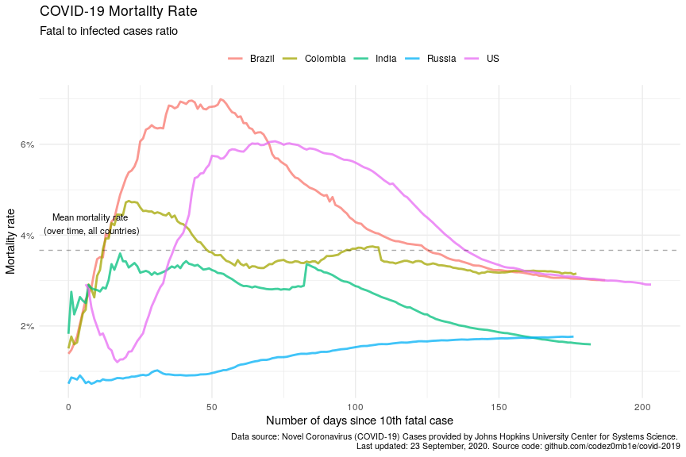

COVID-19 Analytics
================
05 May, 2020

#### Table of contents

  - [Load datasets](#load-datasets)
      - [Load COVID-19 spread data](#load-covid-19-spread-data)
      - [Load world population data](#load-world-population-data)
  - [Preprocessing datasets](#preprocessing-datasets)
      - [Preprocessing COVID-19 spread
        data](#preprocessing-covid-19-spread-data)
      - [Preprocessing world population
        data](#preprocessing-world-population-data)
  - [COVID-19 worldwide spread](#covid-19-worldwide-spread)
      - [Total infected, recovered, and fatal
        cases](#total-infected,-recovered,-and-fatal-cases)
      - [Dynamics of spread](#dynamics-of-spread)
      - [Disease cases structure](#disease-cases-structure)
      - [Dynamics of daily cases](#dynamics-of-daily-cases)
  - [COVID-19 spread by countries](#covid-19-spread-by-countries)
      - [Infected, recovered, fatal, and active
        cases](#infected,-recovered,-fatal,-and-active-cases)
      - [Dynamics of spread](#dynamics-of-spread)
      - [Dynamics of daily cases](#dynamics-of-daily-cases)
      - [Mortality rate](#mortality-rate)
  - [COVID-19 spread by countries
    population](#covid-19-spread-by-countries-population)
      - [TOPs countries by infected, active, and fatal
        cases](#tops-countries-by-infected,-active,-and-fatal-cases)
          - [by infected cases](#by-infected-cases)
          - [by active cases](#by-active-cases)
          - [by fatal cases](#by-fatal-cases)
      - [Active cases per 1 million population vs number of days since
        100th infected
        case](#active-cases-per-1-million-population-vs-number-of-days-since-100th-infected-case)
      - [Active cases per 1 million population vs number of days since
        10th fatal
        case](#active-cases-per-1-million-population-vs-number-of-days-since-10th-fatal-case)

## Load datasets

### Load COVID-19 spread data

Get list of files in datasets
    container:

    ## [1] "COVID19_line_list_data.csv"            "COVID19_open_line_list.csv"           
    ## [3] "covid_19_data.csv"                     "time_series_covid_19_confirmed.csv"   
    ## [5] "time_series_covid_19_confirmed_US.csv" "time_series_covid_19_deaths.csv"      
    ## [7] "time_series_covid_19_deaths_US.csv"    "time_series_covid_19_recovered.csv"

Load `covid_19_data.csv` dataset:

    ## # A tibble: 100 x 8
    ##      SNo ObservationDate Province.State   Country.Region Last.Update      Confirmed Deaths Recovered
    ##    <int> <chr>           <chr>            <chr>          <chr>                <dbl>  <dbl>     <dbl>
    ##  1    45 01/23/2020      Guangxi          Mainland China 1/23/20 17:00            5      0         0
    ##  2 17142 04/21/2020      <NA>             Lebanon        2020-04-21 23:3…       677     21       108
    ##  3 17616 04/22/2020      Maryland         US             2020-04-22 23:3…     14775    698         0
    ##  4  7745 03/22/2020      <NA>             Saudi Arabia   3/8/20 5:31            511      0        17
    ##  5 15388 04/15/2020      New Brunswick    Canada         2020-04-15 23:0…       117      0         0
    ##  6 19480 04/28/2020      British Columbia Canada         2020-04-29 02:3…      2053    106         0
    ##  7 19250 04/27/2020      Recovered        Canada         2020-04-28 02:3…         0      0     18268
    ##  8 19113 04/27/2020      <NA>             Slovakia       2020-04-28 02:3…      1381     18       403
    ##  9 18591 04/25/2020      New South Wales  Australia      2020-04-26 02:3…      2994     33      2193
    ## 10 19218 04/27/2020      Minnesota        US             2020-04-28 02:3…      3811    286         0
    ## # … with 90 more rows

### Load world population data

Get datasets
    list:

    ## [1] "countries.csv"            "__MACOSX/"                "__MACOSX/._countries.csv"

Load `countries.csv` dataset:

    ## # A tibble: 169 x 14
    ##    iso_alpha2 iso_alpha3 iso_numeric name  official_name ccse_name density fertility_rate land_area
    ##    <chr>      <chr>            <int> <chr> <chr>         <chr>       <int>          <dbl>     <int>
    ##  1 AF         AFG                  4 Afgh… Islamic Repu… Afghanis…      60            4.6    652860
    ##  2 AL         ALB                  8 Alba… Republic of … Albania       105            1.6     27400
    ##  3 DZ         DZA                 12 Alge… People's Dem… Algeria        18            3.1   2381740
    ##  4 AD         AND                 20 Ando… Principality… Andorra       164           NA         470
    ##  5 AO         AGO                 24 Ango… Republic of … Angola         26            5.6   1246700
    ##  6 AG         ATG                 28 Anti… Antigua and … Antigua …     223            2         440
    ##  7 AR         ARG                 32 Arge… Argentine Re… Argentina      17            2.3   2736690
    ##  8 AM         ARM                 51 Arme… Republic of … Armenia       104            1.8     28470
    ##  9 AU         AUS                 36 Aust… Australia     Australia       3            1.8   7682300
    ## 10 AT         AUT                 40 Aust… Republic of … Austria       109            1.5     82409
    ## # … with 159 more rows, and 5 more variables: median_age <dbl>, migrants <dbl>, population <int>,
    ## #   urban_pop_rate <dbl>, world_share <dbl>

## Preprocessing datasets

### Preprocessing COVID-19 spread data

Set `area` column, processing `province_state` columns, and format dates
columns:

    ## # A tibble: 21,543 x 5
    ##    area          country province_state observation_date confirmed
    ##    <fct>         <chr>   <chr>          <date>               <dbl>
    ##  1 US            US      New York       2020-05-04          318953
    ##  2 Rest of World Spain   <NA>           2020-05-04          218011
    ##  3 Rest of World Italy   <NA>           2020-05-04          211938
    ##  4 Rest of World UK      <NA>           2020-05-04          190584
    ##  5 Rest of World France  <NA>           2020-05-04          167886
    ##  6 Rest of World Germany <NA>           2020-05-04          166152
    ##  7 Rest of World Russia  <NA>           2020-05-04          145268
    ##  8 US            US      New Jersey     2020-05-04          128269
    ##  9 Rest of World Turkey  <NA>           2020-05-04          127659
    ## 10 Rest of World Brazil  <NA>           2020-05-04          108620
    ## # … with 21,533 more rows

### Preprocessing world population data

Get unmatched countries:

    ## # A tibble: 59 x 2
    ##    country                n
    ##    <chr>              <dbl>
    ##  1 Mainland China   6977120
    ##  2 UK               3948560
    ##  3 South Korea       615627
    ##  4 Czech Republic    241077
    ##  5 Hong Kong          43226
    ##  6 Diamond Princess   29192
    ##  7 Ivory Coast        27511
    ##  8 Others             26228
    ##  9 Taiwan             18168
    ## 10 Kosovo             14957
    ## # … with 49 more rows

Correct top of unmached countries.

And updated matching:

    ## # A tibble: 54 x 2
    ##    country                n
    ##    <chr>              <dbl>
    ##  1 Hong Kong          43226
    ##  2 Diamond Princess   29192
    ##  3 Ivory Coast        27511
    ##  4 Others             26228
    ##  5 Kosovo             14957
    ##  6 West Bank and Gaza 11878
    ##  7 Mali                8199
    ##  8 Burma               3081
    ##  9 Guinea-Bissau       2725
    ## 10 Macau               2400
    ## # … with 44 more rows

Much better :)

## COVID-19 worldwide spread

***Analyze COVID-19 worldwide spread.***

### Total infected, recovered, and fatal cases

View spread statistics:

    ## # A tibble: 104 x 9
    ##    observation_date active_total active_total_de… confirmed_total confirmed_total… recovered_total
    ##    <date>                  <dbl> <chr>                      <dbl> <chr>                      <dbl>
    ##  1 2020-05-04            2168794 1.63%                    3583055 2.18%                    1162724
    ##  2 2020-05-03            2134023 2.09%                    3506729 2.32%                    1125236
    ##  3 2020-05-02            2090423 1.88%                    3427343 2.50%                    1093112
    ##  4 2020-05-01            2051800 2.15%                    3343777 2.67%                    1053327
    ##  5 2020-04-30            2008705 0.76%                    3256846 1.97%                    1014753
    ##  6 2020-04-29            1993529 1.16%                    3193886 2.49%                     972719
    ##  7 2020-04-28            1970587 1.75%                    3116398 2.45%                     928658
    ##  8 2020-04-27            1936630 1.97%                    3041764 2.37%                     893967
    ##  9 2020-04-26            1899198 1.17%                    2971475 2.58%                     865733
    ## 10 2020-04-25            1877215 3.14%                    2896746 3.06%                     816685
    ## # … with 94 more rows, and 3 more variables: recovered_total_delta <chr>, deaths_total <dbl>,
    ## #   deaths_total_delta <chr>

### Dynamics of spread

<!-- -->

<!-- -->

### Disease cases structure

<!-- -->

<!-- -->

### Dynamics of daily cases

Get daily dynamics of new infected and recovered cases.

World daily spread:

    ## # A tibble: 7 x 5
    ##   observation_date confirmed_total_per_… deaths_total_per_d… recovered_total_per… active_total_per_…
    ##   <date>                           <dbl>               <dbl>                <dbl>              <dbl>
    ## 1 2020-04-25                       86031                5695                23265              57071
    ## 2 2020-04-10                       96369                7070                22121              67178
    ## 3 2020-04-05                       74707                4768                13860              56079
    ## 4 2020-04-04                      101491                5819                20356              75316
    ## 5 2020-04-03                       82614                5804                15533              61277
    ## 6 2020-04-02                       80698                6174                17092              57432
    ## 7 2020-03-31                       75098                4525                13468              57105

<!-- -->

<!-- -->

## COVID-19 spread by countries

***Analyze COVID-19 spread y countries.***

### Infected, recovered, fatal, and active cases

Calculate number of infected, recovered, fatal, and active (infected
cases minus recovered and fatal) cases grouped by country:

Get countries ordered by total active cases:

    ## # A tibble: 6,092 x 10
    ##    country observation_date active_total active_total_de… confirmed_total confirmed_total…
    ##    <chr>   <date>                  <dbl> <chr>                      <dbl> <chr>           
    ##  1 US      2020-05-04             924273 1.55%                    1180375 1.93%           
    ##  2 United… 2020-05-04             162113 2.33%                     191832 2.12%           
    ##  3 Russia  2020-05-04             125817 7.75%                     145268 7.86%           
    ##  4 Italy   2020-05-04              99980 -0.20%                    211938 0.58%           
    ##  5 France  2020-05-04              92903 -0.25%                    169583 0.39%           
    ##  6 Spain   2020-05-04              71240 -2.81%                    218011 0.25%           
    ##  7 Turkey  2020-05-04              56032 -5.82%                    127659 1.28%           
    ##  8 Brazil  2020-05-04              55438 7.06%                     108620 6.67%           
    ##  9 Nether… 2020-05-04              35732 0.49%                      40968 0.49%           
    ## 10 India   2020-05-04              32024 9.15%                      46437 9.25%           
    ## # … with 6,082 more rows, and 4 more variables: recovered_total <dbl>, recovered_total_delta <chr>,
    ## #   deaths_total <dbl>, deaths_total_delta <chr>

<!-- -->

### Dynamics of spread

<!-- -->

<!-- -->

### Dynamics of daily cases

Get daily dynamics of new infected and recovered cases by countries.

World daily spread:

    ## # A tibble: 6,092 x 6
    ## # Groups:   country [144]
    ##    country  observation_date confirmed_total_p… recovered_total_p… deaths_total_pe… active_total_pe…
    ##    <chr>    <date>                        <dbl>              <dbl>            <dbl>            <dbl>
    ##  1 Afghani… 2020-05-04                      190                 52                5              133
    ##  2 Albania  2020-05-04                        8                 12                0               -4
    ##  3 Algeria  2020-05-04                      174                 62                2              110
    ##  4 Andorra  2020-05-04                        2                  6                0               -4
    ##  5 Argenti… 2020-05-04                      104                 88               14                2
    ##  6 Armenia  2020-05-04                      121                 36                4               81
    ##  7 Austral… 2020-05-04                       25                 38                1              -14
    ##  8 Austria  2020-05-04                       24                 88                2              -66
    ##  9 Azerbai… 2020-05-04                       52                 39                1               12
    ## 10 Bahrain  2020-05-04                      150                 26                0              124
    ## # … with 6,082 more rows

<!-- -->

<!-- -->

### Mortality rate

    ## # A tibble: 56 x 8
    ##    country observation_date since_100_confi… since_10_deaths… recovered_total deaths_total
    ##    <chr>   <date>           <date>           <date>                     <dbl>        <dbl>
    ##  1 US      2020-05-04       2020-03-10       2020-03-04                187180        68922
    ##  2 US      2020-05-03       2020-03-10       2020-03-04                180152        67682
    ##  3 US      2020-05-02       2020-03-10       2020-03-04                175382        66369
    ##  4 US      2020-05-01       2020-03-10       2020-03-04                164015        64943
    ##  5 US      2020-04-30       2020-03-10       2020-03-04                153947        62996
    ##  6 US      2020-04-29       2020-03-10       2020-03-04                120720        60967
    ##  7 US      2020-04-28       2020-03-10       2020-03-04                115936        58355
    ##  8 US      2020-04-27       2020-03-10       2020-03-04                111424        56259
    ##  9 US      2020-04-26       2020-03-10       2020-03-04                106988        54881
    ## 10 US      2020-04-25       2020-03-10       2020-03-04                100372        53755
    ## # … with 46 more rows, and 2 more variables: confirmed_deaths_rate <dbl>,
    ## #   recovered_deaths_rate <dbl>

<!-- -->

<!-- -->

<!-- -->

## COVID-19 spread by countries population

    ## # A tibble: 49 x 5
    ##    country n_days_since_100_confirmed population confirmed_total confirmed_total_per_1M
    ##    <chr>                        <dbl>      <int>           <dbl>                  <dbl>
    ##  1 Russia                          48  145934462          145268                   995.
    ##  2 Russia                          47  145934462          134687                   923.
    ##  3 Russia                          46  145934462          124054                   850.
    ##  4 Russia                          45  145934462          114431                   784.
    ##  5 Russia                          44  145934462          106498                   730.
    ##  6 Russia                          43  145934462           99399                   681.
    ##  7 Russia                          42  145934462           93558                   641.
    ##  8 Russia                          41  145934462           87147                   597.
    ##  9 Russia                          40  145934462           80949                   555.
    ## 10 Russia                          39  145934462           74588                   511.
    ## # … with 39 more rows

### TOPs countries by infected, active, and fatal cases

Calculate countries stats whose populations were most affected by the
virus:

#### …by infected cases

    ## # A tibble: 85 x 6
    ##    country    population confirmed_total confirmed_total_pe… n_days_since_100_c… n_days_since_10th_…
    ##    <chr>           <int>           <dbl>               <dbl>               <dbl>               <dbl>
    ##  1 Qatar         2881053           16191               5620.                  54                   3
    ##  2 Spain        46754778          218011               4663.                  63                  57
    ##  3 Ireland       4937786           21772               4409.                  51                  39
    ##  4 Belgium      11589623           50267               4337.                  59                  47
    ##  5 US          331002651         1180375               3566.                  55                  61
    ##  6 Italy        60461826          211938               3505.                  71                  68
    ##  7 Switzerla…    8654622           29981               3464.                  60                  52
    ##  8 Singapore     5850342           18778               3210.                  65                  17
    ##  9 United Ki…   67886011          191832               2826.                  60                  51
    ## 10 France       65273511          169583               2598.                  64                  58
    ## # … with 75 more rows

#### …by active cases

    ## # A tibble: 85 x 6
    ##    country     population active_total active_total_per_… n_days_since_100_con… n_days_since_10th_d…
    ##    <chr>            <int>        <dbl>              <dbl>                 <dbl>                <dbl>
    ##  1 Qatar          2881053        14369              4987.                    54                    3
    ##  2 Singapore      5850342        17303              2958.                    65                   17
    ##  3 US           331002651       924273              2792.                    55                   61
    ##  4 Belgium       11589623        29965              2586.                    59                   47
    ##  5 United Kin…   67886011       162113              2388.                    60                   51
    ##  6 Portugal      10196709        22749              2231.                    52                   44
    ##  7 Netherlands   17134872        35732              2085.                    59                   51
    ##  8 Italy         60461826        99980              1654.                    71                   68
    ##  9 Sweden        10099265        15878              1572.                    59                   46
    ## 10 Spain         46754778        71240              1524.                    63                   57
    ## # … with 75 more rows

#### …by fatal cases

    ## # A tibble: 85 x 6
    ##    country     population deaths_total deaths_total_per_… n_days_since_100_con… n_days_since_10th_d…
    ##    <chr>            <int>        <dbl>              <dbl>                 <dbl>                <dbl>
    ##  1 Belgium       11589623         7924               684.                    59                   47
    ##  2 Spain         46754778        25428               544.                    63                   57
    ##  3 Italy         60461826        29079               481.                    71                   68
    ##  4 United Kin…   67886011        28809               424.                    60                   51
    ##  5 France        65273511        25204               386.                    64                   58
    ##  6 Netherlands   17134872         5098               298.                    59                   51
    ##  7 Sweden        10099265         2769               274.                    59                   46
    ##  8 Ireland        4937786         1319               267.                    51                   39
    ##  9 US           331002651        68922               208.                    55                   61
    ## 10 Switzerland    8654622         1784               206.                    60                   52
    ## # … with 75 more rows

### Active cases per 1 million population vs number of days since 100th infected case

Select countries to
    monitoring:

    ##  [1] "Belgium"        "Italy"          "Netherlands"    "Portugal"       "Qatar"         
    ##  [6] "Singapore"      "Spain"          "Sweden"         "United Kingdom" "US"            
    ## [11] "Russia"         "Mainland China" "Korea, South"

<!-- -->

### Active cases per 1 million population vs number of days since 10th fatal case

<!-- -->

*Take Care and Stay Healthy\!*
