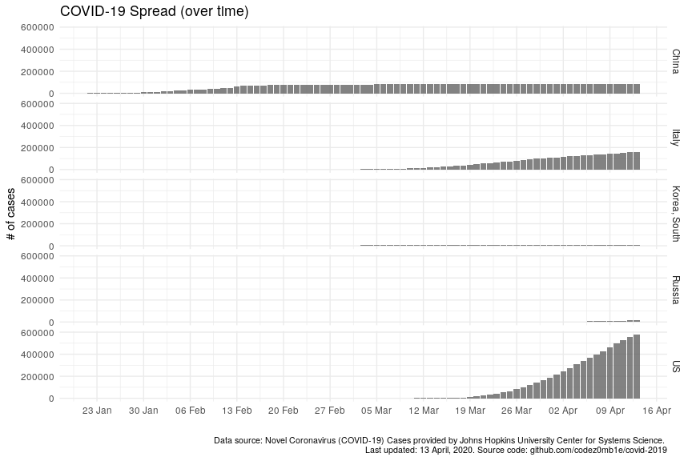
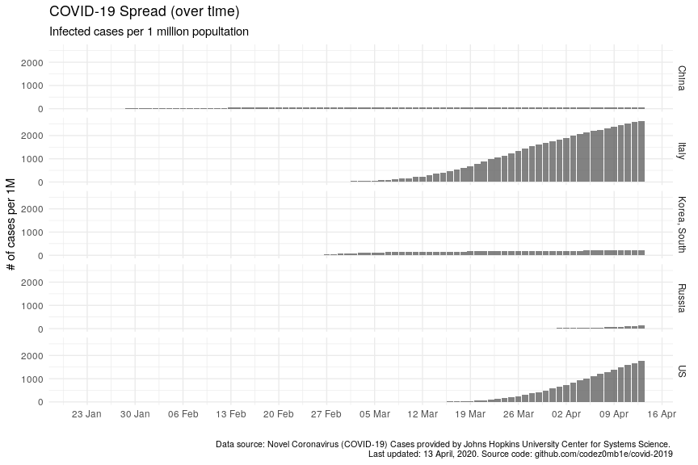
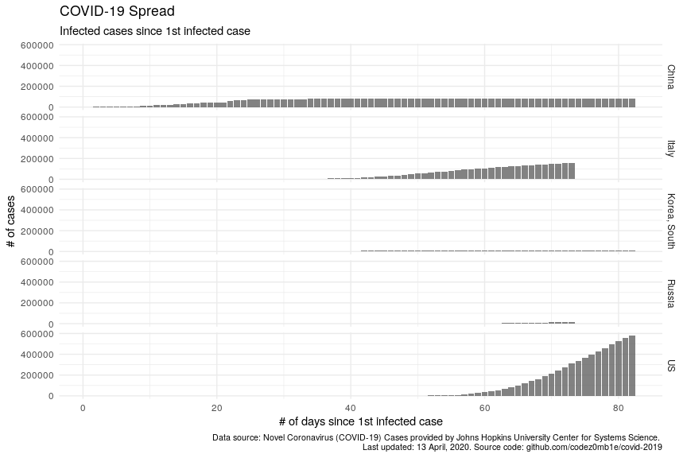
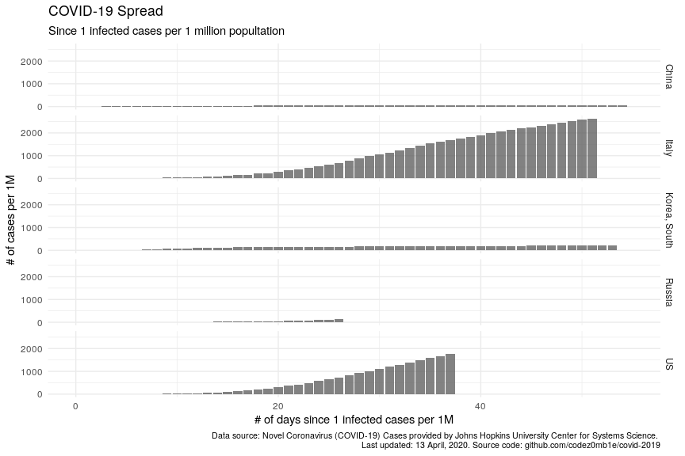
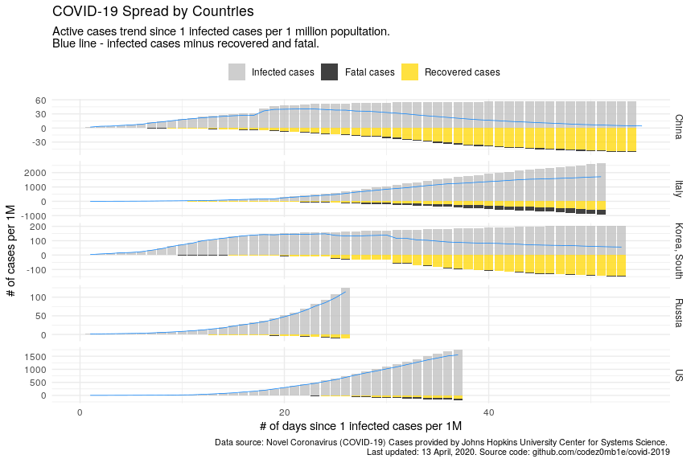
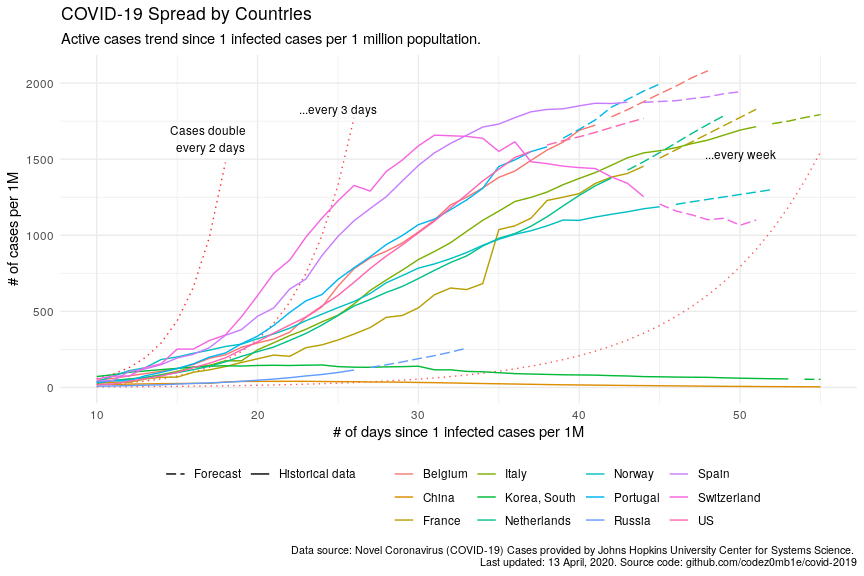

Escape from COVID’s News Train
================
14 April, 2020

#### Table of contents

  - [Load datasets](#load-datasets)
      - [Load COVID spread datasets](#load-covid-spread-datasets)
      - [Load countries stats](#load-countries-stats)
  - [Preprocessing](#preprocessing)
  - [Absolute vs relative](#absolute-vs-relative)
  - [Reference point selection](#reference-point-selection)
  - [Infected vs active cases](#infected-vs-active-cases)
  - [It happened a long time ago](#it-happened-a-long-time-ago)

## Load datasets

### Load COVID spread datasets

    ## Loading required package: data.table

    ## 
    ## Attaching package: 'data.table'

    ## The following objects are masked from 'package:xts':
    ## 
    ##     first, last

    ## The following objects are masked from 'package:lubridate':
    ## 
    ##     hour, isoweek, mday, minute, month, quarter, second, wday, week, yday, year

    ## The following object is masked from 'package:purrr':
    ## 
    ##     transpose

    ## The following objects are masked from 'package:dplyr':
    ## 
    ##     between, first, last

    ## # A tibble: 10 x 5
    ##    country         date       confirmed_n recovered_n deaths_n
    ##    <chr>           <date>           <int>       <int>    <int>
    ##  1 Hungary         2020-02-07           0           0        0
    ##  2 Egypt           2020-03-25         456          95       21
    ##  3 Mozambique      2020-02-17           0           0        0
    ##  4 North Macedonia 2020-02-14           0           0        0
    ##  5 Venezuela       2020-03-09           0           0        0
    ##  6 Philippines     2020-03-20         230           8       18
    ##  7 Japan           2020-02-23         147          22        1
    ##  8 Somalia         2020-03-04           0           0        0
    ##  9 Ethiopia        2020-03-16           5           0        0
    ## 10 Spain           2020-03-04         222           2        2

### Load countries stats

    ##    iso_alpha3    ccse_name density fertility_rate land_area median_age migrants population
    ## 1         TUR       Turkey     110            2.1    769630         32   283922   84339067
    ## 2         CUB         Cuba     106            1.6    106440         42   -14400   11326616
    ## 3         KOR Korea, South     527            1.1     97230         44    11731   51269185
    ## 4         UGA       Uganda     229            5.0    199810         17   168694   45741007
    ## 5         GTM    Guatemala     167            2.9    107160         23    -9215   17915568
    ## 6         GEO      Georgia      57            2.1     69490         38   -10000    3989167
    ## 7         LTU    Lithuania      43            1.7     62674         45   -32780    2722289
    ## 8         URY      Uruguay      20            2.0    175020         36    -3000    3473730
    ## 9         MDV     Maldives    1802            1.9       300         30    11370     540544
    ## 10        NPL        Nepal     203            1.9    143350         25    41710   29136808
    ##    urban_pop_rate world_share
    ## 1            0.76      0.0108
    ## 2            0.78      0.0015
    ## 3            0.82      0.0066
    ## 4            0.26      0.0059
    ## 5            0.52      0.0023
    ## 6            0.58      0.0005
    ## 7            0.71      0.0003
    ## 8            0.96      0.0004
    ## 9            0.35      0.0001
    ## 10           0.21      0.0037

## Preprocessing

    ## Note: Using an external vector in selections is ambiguous.
    ## ℹ Use `all_of(.case_type)` instead of `.case_type` to silence this message.
    ## ℹ See <https://tidyselect.r-lib.org/reference/faq-external-vector.html>.
    ## This message is displayed once per session.

## Absolute vs relative

<!-- -->

<!-- -->

## Reference point selection

<!-- -->

<!-- -->

## Infected vs active cases

<!-- -->

## It happened a long time ago

<!-- -->
