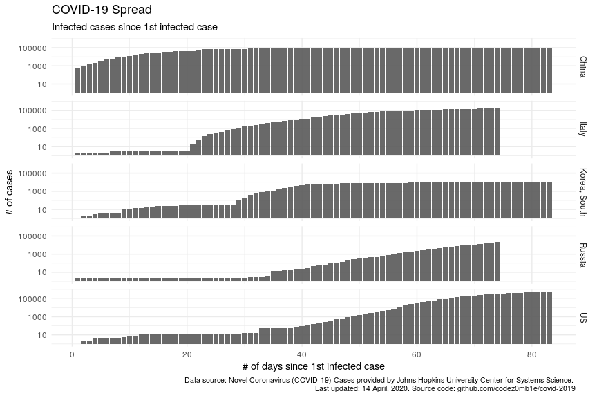
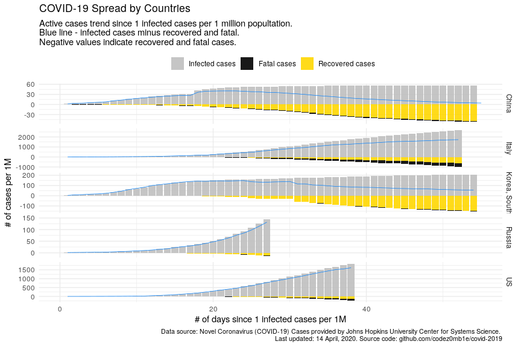
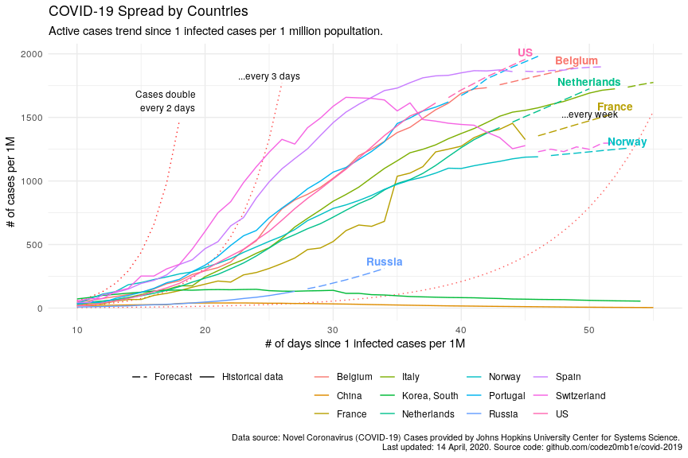

Escape from COVID’s News Train
================
15 April, 2020

#### Table of contents

  - [Load datasets](#load-datasets)
      - [Load COVID spread datasets](#load-covid-spread-datasets)
      - [Load countries stats](#load-countries-stats)
  - [Preprocessing](#preprocessing)
  - [Absolute vs relative](#absolute-vs-relative)
  - [Reference point selection](#reference-point-selection)
  - [Infected vs active cases](#infected-vs-active-cases)
  - [It happened a long time ago](#it-happened-a-long-time-ago)

## Load datasets

### Load COVID spread datasets

``` r
#'
#' Load COVID-19 spread: infected, recovered, and fatal cases
#' Source: https://github.com/CSSEGISandData/COVID-19/tree/master/csse_covid_19_data/csse_covid_19_time_series
#'
load_covid_spread <- function() {
  require(dplyr)
  require(data.table)
  require(purrr)
  require(tidyr)
  
  load_time_series <- function(.case_type) {
    
    path_pattern <- "https://raw.githubusercontent.com/CSSEGISandData/COVID-19/master/csse_covid_19_data/csse_covid_19_time_series/time_series_covid19_%s_global.csv"
    
    fread(sprintf(path_pattern, .case_type)) %>% 
      rename(country = `Country/Region`) %>% 
      select(-c(`Province/State`, Lat, Long)) %>% 
      group_by(country) %>% 
      summarise_if(is.numeric, sum) %>% 
      ungroup %>% 
      gather(key = "date", value = "n", -country) %>% 
      mutate(date = mdy(date))
  }
  
  
  dt <- load_time_series("confirmed") %>% rename(confirmed_n = n) %>% 
    inner_join(
      load_time_series("recovered") %>% rename(recovered_n = n),
      by = c("country", "date")
    ) %>% 
    inner_join(
      load_time_series("deaths") %>% rename(deaths_n = n),
      by = c("country", "date")
    ) 
  
  
  stopifnot(nrow(dt) > 0)
  
  
  return(dt)
}


spread_raw <- load_covid_spread()
```

    ## Loading required package: data.table

    ## 
    ## Attaching package: 'data.table'

    ## The following objects are masked from 'package:xts':
    ## 
    ##     first, last

    ## The following objects are masked from 'package:lubridate':
    ## 
    ##     hour, isoweek, mday, minute, month, quarter, second, wday, week, yday, year

    ## The following object is masked from 'package:purrr':
    ## 
    ##     transpose

    ## The following objects are masked from 'package:dplyr':
    ## 
    ##     between, first, last

``` r
spread_raw %>% sample_n(10)
```

    ## # A tibble: 10 x 5
    ##    country     date       confirmed_n recovered_n deaths_n
    ##    <chr>       <date>           <int>       <int>    <int>
    ##  1 Japan       2020-04-14        7645         799      143
    ##  2 Georgia     2020-03-30         103          20        0
    ##  3 Mozambique  2020-02-11           0           0        0
    ##  4 Bolivia     2020-03-10           0           0        0
    ##  5 Malawi      2020-02-29           0           0        0
    ##  6 Philippines 2020-03-12          52           2        2
    ##  7 Angola      2020-03-31           7           1        2
    ##  8 Latvia      2020-01-24           0           0        0
    ##  9 Ukraine     2020-01-29           0           0        0
    ## 10 Nicaragua   2020-03-15           0           0        0

### Load countries stats

``` r
#'
#' Load countries stats
#' Source: https://ods.ai/competitions/sberbank-covid19-forecast
#'
load_countries_stats <- function() {
  require(dplyr)
  require(magrittr)
  
  dt <- fread("https://raw.githubusercontent.com/codez0mb1e/covid-2019/master/data/countries.csv")
  
  dt %<>%
    select(-c(iso_alpha2, iso_numeric, name, official_name))
  
  stopifnot(nrow(dt) > 0)
  
  
  return(dt)
}


countries_raw <- load_countries_stats()
countries_raw %>% sample_n(10)
```

    ##    iso_alpha3              ccse_name density fertility_rate land_area median_age migrants
    ## 1         BIH Bosnia and Herzegovina      64            1.3     51000         43   -21585
    ## 2         CZE                Czechia     139            1.6     77240         43    22011
    ## 3         LCA            Saint Lucia     301            1.4       610         34        0
    ## 4         CMR               Cameroon      56            4.6    472710         19    -4800
    ## 5         BGR               Bulgaria      64            1.6    108560         45    -4800
    ## 6         KEN                  Kenya      94            3.5    569140         20   -10000
    ## 7         LTU              Lithuania      43            1.7     62674         45   -32780
    ## 8         VEN              Venezuela      32            2.3    882050         30  -653249
    ## 9         GEO                Georgia      57            2.1     69490         38   -10000
    ## 10        ECU                Ecuador      71            2.4    248360         28    36400
    ##    population urban_pop_rate world_share
    ## 1     3280819           0.52      0.0004
    ## 2    10708981           0.74      0.0014
    ## 3      183627           0.19      0.0000
    ## 4    26545863           0.56      0.0034
    ## 5     6948445           0.76      0.0009
    ## 6    53771296           0.28      0.0069
    ## 7     2722289           0.71      0.0003
    ## 8    28435940             NA      0.0036
    ## 9     3989167           0.58      0.0005
    ## 10   17643054           0.63      0.0023

## Preprocessing

``` r
stopifnot(
  nrow(spread_raw %>% group_by(country, date) %>% filter(n() > 1)) == 0
)

data <- spread_raw %>% 
  # add country population
  inner_join(
    countries_raw %>% transmute(ccse_name, country_iso = iso_alpha3, population) %>% filter(!is.na(country_iso)), 
    by = c("country" = "ccse_name")
  ) %>% 
  # calculate active cases
  mutate(
    active_n = confirmed_n - recovered_n - deaths_n
  ) %>% 
  # calculate cases per 1M population
  mutate_at(
    vars(ends_with("_n")),
    list("per_1M" = ~ ./population*1e6)
  )


## Calculte number of days since...
get_date_since <- function(dt, .case_type, .n) {
  dt %>% 
    group_by(country) %>% 
    filter_at(vars(.case_type), ~ . > .n) %>% 
    summarise(since_date = min(date))
}


data %<>% 
  inner_join(
    data %>% get_date_since("confirmed_n", 0) %>% rename(since_1st_confirmed_date = since_date),
    by = "country"
  ) %>% 
  inner_join(
    data %>% get_date_since("confirmed_n_per_1M", 1) %>% rename(since_1_confirmed_per_1M_date = since_date),
    by = "country"
  ) %>% 
  inner_join(
    data %>% get_date_since("deaths_n_per_1M", .1) %>% rename(since_dot1_deaths_per_1M_date = since_date),
    by = "country"
  ) %>% 
  mutate_at(
    vars(starts_with("since_")), 
    list("n_days" = ~ difftime(date, ., units = "days") %>% as.numeric)
  ) %>% 
  mutate_at(
    vars(ends_with("n_days")),
    list(~ if_else(. > 0, ., NA_real_))
  )
```

    ## Note: Using an external vector in selections is ambiguous.
    ## ℹ Use `all_of(.case_type)` instead of `.case_type` to silence this message.
    ## ℹ See <https://tidyselect.r-lib.org/reference/faq-external-vector.html>.
    ## This message is displayed once per session.

## Absolute vs relative

``` r
ggplot(data %>% filter_countries, aes(x = date)) +
  geom_col(aes(y = confirmed_n), alpha = .9) +
  
  scale_x_date(date_labels = "%d %b", date_breaks = "7 days") +

  facet_grid(country ~ .) +
  
  labs(x = "", y = "# of cases", 
       title = "COVID-19 Spread (over time)", 
       caption = lab_caption) +
  
  theme(plot.caption = element_text(size = 8))
```

<!-- -->

``` r
ggplot(data %>% filter_countries, aes(x = date)) +
  geom_col(aes(y = confirmed_n), alpha = .9) +
  
  scale_x_date(date_labels = "%d %b", date_breaks = "7 days") +
  scale_y_log10() +
  
  facet_grid(country ~ .) +
  
  labs(x = "", y = "# of cases", 
       title = "COVID-19 Spread (over time)", 
       caption = lab_caption) +
  
  theme(plot.caption = element_text(size = 8))
```

<!-- -->

``` r
ggplot(data  %>% filter_countries, aes(x = date)) +
  geom_col(aes(y = confirmed_n_per_1M), alpha = .9) +
  
  scale_x_date(date_labels = "%d %b", date_breaks = "7 days") +
  
  facet_grid(country ~ .) +
  
  labs(x = "", y = "# of cases per 1M", 
       subtitle = "Infected cases per 1 million popultation",
       title = "COVID-19 Spread (over time)", 
       caption = lab_caption) +
  
  theme(plot.caption = element_text(size = 8))
```

<!-- -->

``` r
ggplot(data  %>% filter_countries, aes(x = date)) +
  geom_col(aes(y = confirmed_n_per_1M), alpha = .9) +
  
  scale_x_date(date_labels = "%d %b", date_breaks = "7 days") +
  scale_y_log10() +
  
  facet_grid(country ~ .) +
  
  labs(x = "", y = "# of cases per 1M", 
       subtitle = "Infected cases per 1 million popultation",
       title = "COVID-19 Spread (over time)", 
       caption = lab_caption) +
  
  theme(plot.caption = element_text(size = 8))
```

<!-- -->

## Reference point selection

``` r
ggplot(
  data %>% filter_countries %>% filter(!is.na(since_1st_confirmed_date_n_days)), 
  aes(x = since_1st_confirmed_date_n_days)
  ) +
  
  geom_col(aes(y = confirmed_n), alpha = .9) +
  scale_y_log10() +
  
  facet_grid(country ~ .) +
  
  labs(x = "# of days since 1st infected case", y = "# of cases", 
       subtitle = "Infected cases since 1st infected case",
       title = "COVID-19 Spread", 
       caption = lab_caption) +
  
  theme(plot.caption = element_text(size = 8))
```

<!-- -->

``` r
ggplot(
  data %>% filter_countries %>% filter(!is.na(since_1_confirmed_per_1M_date_n_days)), 
  aes(x = since_1_confirmed_per_1M_date_n_days)
  ) +
  
  geom_col(aes(y = confirmed_n_per_1M), alpha = .9) +
  
  scale_y_log10() +
  xlim(c(0, 55)) +
  
  facet_grid(country ~ .) +
  
  labs(x = "# of days since 1 infected cases per 1M", y = "# of cases per 1M", 
       title = "COVID-19 Spread", 
       subtitle = "Since 1 infected cases per 1 million popultation",
       caption = lab_caption) +
  
  theme(plot.caption = element_text(size = 8))
```

<!-- -->

## Infected vs active cases

``` r
plot_data <- data %>% 
  filter_countries %>% 
  filter(!is.na(since_1_confirmed_per_1M_date_n_days)) %>% 
  mutate(
    confirmed_n_per_1M = confirmed_n_per_1M, 
    recovered_n_per_1M = -recovered_n_per_1M,
    deaths_n_per_1M = -deaths_n_per_1M
  ) %>% 
  select(
    country, since_1_confirmed_per_1M_date_n_days, ends_with("_n_per_1M")
  ) %>% 
  gather(
    key = "case_state", value = "n_per_1M", -c(country, since_1_confirmed_per_1M_date_n_days, active_n_per_1M)
  )
```

``` r
ggplot(plot_data, aes(x = since_1_confirmed_per_1M_date_n_days)) +
  
  geom_col(aes(y = n_per_1M, fill = case_state), alpha = .9) +
  geom_line(aes(y = active_n_per_1M), color = "#0080FF", size = .25) +
  

  scale_fill_manual(element_blank(), 
                    labels = c("confirmed_n_per_1M" = "Infected cases", "recovered_n_per_1M" = "Recovered cases", "deaths_n_per_1M" = "Fatal cases"),
                    values = c("confirmed_n_per_1M" = "grey", "recovered_n_per_1M" = "gold", "deaths_n_per_1M" = "black")) +
  
  xlim(c(0, 55)) +
  
  facet_grid(country ~ ., scales = "free") +
  
  labs(x = "# of days since 1 infected cases per 1M", y = "# of cases per 1M", 
       title = "COVID-19 Spread by Countries", 
       subtitle = "Active cases trend since 1 infected cases per 1 million popultation. \nBlue line - infected cases minus recovered and fatal.\nNegative values indicate recovered and fatal cases.", 
       caption = lab_caption) +
  
  theme(
    legend.position = "top",
    plot.caption = element_text(size = 8)
  )
```

<!-- -->

## It happened a long time ago

``` r
forecast_cases <- function(.country, .after_date, .forecast_horizont, .fun, ...) {
  
  dt <- data %>% 
    # filter rows and cols
    filter(
      country == .country & 
      date < .after_date
    ) %>%
    # convert to time-series
    arrange(date) %>% 
    select(active_n_per_1M)
  
  dt %>%  
    ts(frequency = 7) %>% 
    # ARIMA model
    .fun(...) %>% 
    # forecast
    forecast(h = .forecast_horizont)
}


forecast_horizont <- 7
after_date <- max(data$date) + days()

countries_list <- c("Belgium", "France", "Italy", "Netherlands", "Norway", "Portugal", "Spain", "Switzerland", "US", "Russia", "China", "Korea, South")

pred <- countries_list  %>% 
  map_dfr(
    function(.x) {
      
      m <- forecast_cases(.x, after_date, forecast_horizont, auto.arima)
      
      n_days_max <- max(data[data$country == .x, ]$since_1_confirmed_per_1M_date_n_days, na.rm = T)
      
      tibble(
        country = rep(.x, forecast_horizont),
        since_1_confirmed_per_1M_date_n_days = seq(n_days_max + 1, n_days_max + forecast_horizont, by = 1),
        pred = m$mean %>% as.numeric %>% round %>% as.integer,
        data_type = "Forecast"
      )
    }
  )


plot_data <- data %>% 
  filter(country %in% countries_list) %>% 
  transmute(
    country, active_n_per_1M, since_1_confirmed_per_1M_date_n_days, 
    data_type = "Historical data"
  ) %>% 
  bind_rows(
    pred %>% rename(active_n_per_1M = pred)
  ) %>% 
  mutate(
    double_every_14d = (1 + 1/14)^since_1_confirmed_per_1M_date_n_days, # double every 2 weeks
    double_every_7d = (1 + 1/7)^since_1_confirmed_per_1M_date_n_days, # double every week
    double_every_3d = (1 + 1/3)^since_1_confirmed_per_1M_date_n_days, # double every 3 days
    double_every_2d = (1 + 1/2)^since_1_confirmed_per_1M_date_n_days # double every 2 days
  )


active_n_per_1M_last <- plot_data %>% 
  group_by(country) %>% 
  arrange(desc(since_1_confirmed_per_1M_date_n_days)) %>% 
  filter(row_number() == 1) %>% 
  ungroup

plot_data %<>% 
  left_join(
    active_n_per_1M_last %>% transmute(country, active_n_per_1M_last = active_n_per_1M, since_1_confirmed_per_1M_date_n_days),
    by = c("country", "since_1_confirmed_per_1M_date_n_days")
  )
```

``` r
ggplot(plot_data, aes(x = since_1_confirmed_per_1M_date_n_days)) +
  
  geom_line(aes(y = double_every_7d), linetype = "dotted", color = "red", alpha = .65) +
  geom_line(aes(y = double_every_3d), linetype = "dotted", color = "red", alpha = .75) + 
  geom_line(aes(y = double_every_2d), linetype = "dotted", color = "red", alpha = .85) + 
  
  geom_line(aes(y = active_n_per_1M, color = country, linetype = data_type), show.legend = T) +
  geom_text(aes(y = active_n_per_1M_last + 20, label = country, color = country), 
            hjust = 0.5, vjust = 0, check_overlap = T, show.legend = F, fontface = "bold", size = 3.6) +

  annotate(geom = "text", label = "Cases double \n every 2 days", x = 17, y = 1550, vjust = 0, size = 3.1) +
  annotate(geom = "text", label = "...every 3 days", x = 25, y = 1800, vjust = 0, size = 3.1) +
  annotate(geom = "text", label = "...every week", x = 50, y = 1500, vjust = 0, size = 3.1) +
  
  scale_linetype_manual(values = c("longdash", "solid")) +
  
  xlim(c(10, 55)) +
  ylim(c(0, max(plot_data$active_n_per_1M))) +
  
  labs(x = "# of days since 1 infected cases per 1M", y = "# of cases per 1M", 
       title = "COVID-19 Spread by Countries", 
       subtitle = "Active cases trend since 1 infected cases per 1 million popultation.", 
       caption = lab_caption) +
  
  theme(
    legend.position = "bottom",
    legend.title = element_blank(),
    plot.caption = element_text(size = 8)
  )
```

<!-- -->
